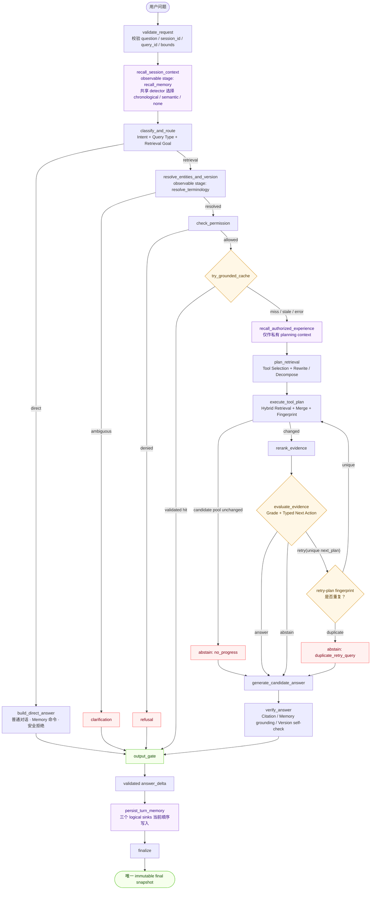

# Agentic RAG Flow

Status: aligned with [`specs/12-agent-workflow.md`](./specs/12-agent-workflow.md) · Last updated: 2026-07-30

本文是当前实现的导览图；节点契约、状态不变量和安全边界以
[`specs/`](./specs/index.md) 为准。Local runtime 与 LangGraph runtime
共享同一套 fail-closed transition contract，不各自维护另一份分支逻辑。

## 精简版：目标 Flow

## 详细版：阶段与分支

```mermaid
flowchart TD
    START([提交问题]) --> VALIDATE["validate_request<br/>创建 AgentState<br/>绑定 query_id + active session_id"]
    VALIDATE --> DIRECTIVE{"共享 directive detector"}

    subgraph SESSION["一、Session context"]
        DIRECTIVE -- "recent questions" --> CHRONO["Chronological recall<br/>live short_term/user · newest first · 1..20"]
        DIRECTIVE -- "explicit recall / referential follow-up" --> SEMANTIC["Semantic recall<br/>live session_summary / task_state · bounded Top-K"]
        DIRECTIVE -- "not applicable" --> SKIP["Conversation Memory lookup skipped<br/>Selective Memory router may still run"]

        MEMORY_STORE[("Conversation Memory")]
        SELECTIVE_STORE[("Selective Memory<br/>events / facts / working state")]
        MEMORY_STORE -. "session + TTL filter" .-> CHRONO
        MEMORY_STORE -. "session + TTL filter" .-> SEMANTIC
        SELECTIVE_STORE -. "typed MemoryPack" .-> SEMANTIC
        SELECTIVE_STORE -. "typed MemoryPack" .-> SKIP

        CHRONO --> CLASSIFY
        SEMANTIC --> CLASSIFY
        SKIP --> CLASSIFY
    end

    subgraph ROUTING["二、Understand and route"]
        CLASSIFY["classify_and_route<br/>intent / query_type / retrieval_goal"]
        CLASSIFY -- direct --> DIRECT["构造 direct / Memory-only / refusal answer"]
        CLASSIFY -- retrieval --> ENTITY["resolve_terminology<br/>Entity catalog + Version scope"]

        ENTITY_CATALOG[("Predefined Entity Catalog")]
        ENTITY_CATALOG -. "trusted terminology, not evidence" .-> ENTITY

        ENTITY --> VERSION["current / exact / comparison<br/>Milvus 3.0 → exact v3.0"]
        VERSION --> AMBIGUOUS{"实体或版本歧义？"}
        AMBIGUOUS -- 是 --> CLARIFY["clarification_required"]
        AMBIGUOUS -- 否 --> PERMISSION["check_permission"]
        PERMISSION --> ALLOWED{"允许当前知识域？"}
        ALLOWED -- 否 --> DENIED["permission_denied<br/>零 KB/cache search"]
    end

    subgraph CACHE_AND_EXPERIENCE["三、Cache and authorized experience"]
        ALLOWED -- 是 --> CACHE["try_grounded_cache<br/>same-session exact / semantic lookup"]
        CACHE --> CACHE_VALID{"权限、query constraints、TTL、KB revision<br/>live version/checksum/citations 都有效？"}
        CACHE_VALID -- 是 --> CACHE_HIT["answered_from_cache<br/>跳过 experience / retrieval / rerank / generation"]
        CACHE_VALID -- 否 --> EXPERIENCE["recall_authorized_experience<br/>permission-scope hash 下的 reusable facts / episodes"]

        RESPONSE_CACHE[("Grounded Response Cache")]
        EXPERIENCE_STORE[("Selective Experience Store")]
        RESPONSE_CACHE -.-> CACHE
        EXPERIENCE_STORE -. "planning hint only" .-> EXPERIENCE
    end

    subgraph RETRIEVAL["四、Plan and execute retrieval"]
        EXPERIENCE --> PLAN["plan_retrieval<br/>选择最小工具集合 + 1..3 个 bounded plan items"]
        PLAN --> PLAN_RULES["保留原始 product / feature / version 术语<br/>记录 dependencies + version scope"]
        PLAN_RULES --> READY{"ready items 是否独立<br/>且 adapter 声明 supports_parallel_search？"}
        READY -- 是 --> PARALLEL["bounded parallel read"]
        READY -- 否 --> SEQUENTIAL["deterministic sequential read"]
        PARALLEL --> EXECUTE
        SEQUENTIAL --> EXECUTE

        EXECUTE["execute_tool_plan<br/>Dense + Sparse + Metadata/Version Filters"]
        KB[("Milvus kb_chunks")]
        KB -.-> EXECUTE

        EXECUTE --> MERGE["按 chunk_id merge / dedupe<br/>保留 tool + subquery provenance"]
        MERGE --> EXPAND["Exhaustive query: bounded document sibling expansion"]
        EXPAND --> CANDIDATE_FP["candidate_pool_fingerprint<br/>chunk/version/checksum/provenance/expansion"]
        CANDIDATE_FP --> PROGRESS{"supplementary round 有进展？"}
        PROGRESS -- 否 --> NO_PROGRESS["terminal abstain<br/>stop_reason = no_progress"]
        PROGRESS -- 是 --> RERANK["rerank_evidence<br/>完整 bounded candidate pool"]
    end

    subgraph EVIDENCE["五、Evidence loop"]
        RERANK --> GRADE["evaluate_evidence<br/>Grade + Retry Planning"]
        GRADE --> BASIS{"Evidence basis"}

        BASIS -- "single_strong_chunk" --> SINGLE["Focused atomic feature only<br/>score ≥ 0.80 + direct section match<br/>single tool/aspect + version isolated"]
        BASIS -- "multi_chunk_coverage" --> MULTI["≥2 relevant chunks<br/>完整 tool/version coverage"]
        BASIS -- "insufficient_evidence" --> GAP["真实 missing_aspects<br/>weak / indirect / multi-aspect / tool / version / exhaustive"]

        SINGLE --> ANSWER_ACTION["action = answer"]
        MULTI --> ANSWER_ACTION
        GAP --> RETRY_BUDGET{"仍有 retry budget？"}
        RETRY_BUDGET -- 否 --> EXHAUSTED["action = abstain<br/>retry_exhausted"]
        RETRY_BUDGET -- 是 --> RETRY_PLAN["构造 next_plan<br/>原始 query + bounded evidence hints"]
        RETRY_PLAN --> RETRY_FP{"(tool, normalized query, version scope)<br/>fingerprint 是否已存在？"}
        RETRY_FP -- 是 --> DUPLICATE["action = abstain<br/>duplicate_retry_query<br/>不 append、不调用工具、不增加 retry_count"]
        RETRY_FP -- 否 --> EXECUTE
    end

    subgraph ANSWER["六、Answer and output gate"]
        ANSWER_ACTION --> GENERATE["generate_candidate_answer<br/>只使用 selected live KB chunks"]
        EXHAUSTED --> GENERATE
        NO_PROGRESS --> GENERATE
        DUPLICATE --> GENERATE
        GENERATE --> VERIFY["verify_answer<br/>inline markers + structured citations<br/>selected context + version policy"]
        VERIFY --> OUTPUT["output_gate"]

        DIRECT --> OUTPUT
        CLARIFY --> OUTPUT
        DENIED --> OUTPUT
        CACHE_HIT --> OUTPUT
    end

    subgraph TERMINAL["七、Streaming, persistence and final"]
        EVENTS["sanitized trace_event stream<br/>节点完成即发送，strict sequence + same query_id"]
        OUTPUT --> DELTA["validated answer_delta"]
        DELTA --> CONSUMER{"消费者请求 final？"}
        CONSUMER -- "取消 / 中断" --> CANCEL["incomplete stream<br/>当前 turn 不持久化"]
        CONSUMER -- 是 --> PERSIST["persist_turn_memory"]

        PERSIST --> CONVERSATION_SINK["Conversation Memory"]
        CONVERSATION_SINK --> SELECTIVE_SINK["Selective Memory"]
        SELECTIVE_SINK --> CACHE_SINK["Grounded Response Cache"]
        CACHE_SINK --> FINALIZE["finalize metrics + immutable snapshot"]
        FINALIZE --> FINAL([final])
    end

    CLASSIFY -.-> EVENTS
    CACHE -.-> EVENTS
    EXECUTE -.-> EVENTS
    GRADE -.-> EVENTS
    VERIFY -.-> EVENTS

    SEMANTIC -. "只辅助分类、指代和 rewrite" .-> PLAN_RULES
    SEMANTIC -. "不能授权、构造 filter、成为 citation 或补足 evidence" .-> GRADE
    EXPERIENCE -. "不能回答或成为 citation" .-> GRADE

    classDef decision fill:#fff7e6,stroke:#d48806,color:#5c3b00;
    classDef storage fill:#e6f4ff,stroke:#1677ff,color:#003a8c;
    classDef terminal fill:#f6ffed,stroke:#52c41a,color:#135200;
    classDef failure fill:#fff1f0,stroke:#ff4d4f,color:#820014;
    classDef memory fill:#f9f0ff,stroke:#9254de,color:#391085;

    class DIRECTIVE,AMBIGUOUS,ALLOWED,CACHE_VALID,READY,PROGRESS,BASIS,RETRY_BUDGET,RETRY_FP,CONSUMER decision;
    class MEMORY_STORE,SELECTIVE_STORE,ENTITY_CATALOG,RESPONSE_CACHE,EXPERIENCE_STORE,KB storage;
    class FINAL,OUTPUT terminal;
    class CLARIFY,DENIED,NO_PROGRESS,EXHAUSTED,DUPLICATE,CANCEL failure;
    class CHRONO,SEMANTIC,SKIP,EXPERIENCE,PERSIST,CONVERSATION_SINK,SELECTIVE_SINK,CACHE_SINK memory;
```

## Evidence 判定规则

| 问题形态 | 最低回答条件 | 不满足时 |
| --- | --- | --- |
| Focused、单一命名功能 | 恰好一条 relevant chunk，rerank score `≥ 0.80`，section 名直接出现在问题中，单工具、单方面、版本匹配且无冲突 | `single_weak_chunk`、`single_indirect_chunk`、`multi_aspect_requires_coverage` 或 coverage gap |
| 普通多证据问题 | 至少两条 relevant chunks，并覆盖全部 selected tools 与 version scopes | `incomplete_multi_evidence`、`tool:<name>` 或 `version:<scope>` |
| Exhaustive | 普通多证据条件 + bounded sibling expansion 完整覆盖 | `incomplete_exhaustive_coverage` |
| Comparison | 每个请求 side 都有证据，同一 document family 的版本覆盖完整 | 缺失 side/tool/version 后 retry 或 abstain |

`single_strong_chunk` 只缩窄 atomic feature explanation 的证据数量要求，不降低
generation、citation 或 version self-check。Conversation Memory、Selective
Experience 和 Entity catalog 都不能替代 live KB chunk。

## Retry 与无进展终止

系统使用两个不同 fingerprint：

- `candidate_pool_fingerprint`：判断一次补充检索是否增加了 chunk、版本、
  checksum、provenance 或 exhaustive expansion 覆盖；完全不变时立即
  `no_progress`，不再 rerank。
- `retry_plan_fingerprint`：在 append/执行补充计划前，对
  `(tool, NFKC/casefold/whitespace-normalized query, canonical version scope)`
  计算指纹；重复时立即 `duplicate_retry_query`，且不增加 `retry_count`。

同一 query 的 reranker provider 一旦失败，会 sticky 到 deterministic fallback，
后续 retry 不再重复等待同一 primary provider。`retry_count` 只统计真正执行的
supplementary rounds，最大为 3。

## Memory、Cache 与持久化边界

- Conversation Memory：同 session、TTL-aware；最近问题使用严格时间排序，
  指代型追问使用 bounded semantic context。
- Selective Memory：working state、durable facts、episodes 与 conflicts 形成
  typed `MemoryPack`；permission-scoped experience 只在 cache miss 后召回。
- Grounded Response Cache：独立 sibling store；只有当前权限、query constraints、
  KB revision 和 live citation lineage 全部有效才可短路 RAG。
- 三个 terminal sinks 当前顺序写入。只有 adapter 明确证明 thread safety、
  deterministic failure precedence 和 cancellation semantics 后才允许并行。
- `answer_delta` 在验证后、持久化前输出；消费者未请求 `final` 时，本轮不写入。

## UI 对应关系

- **Chat**：validated answer、citation markers 和 terminal state。
- **Evidence**：tool recall、rerank、selected context、version 与 coverage。
- **Agent Trace**：同一 `query_id` 下的真实 stage/tool/retry events；Raw JSON
  仅在 Advanced expander。
- **Memory**：本轮 recall/write/cache 状态、live session records、retention /
  selection distributions，以及只暴露 opaque ids 的完整 lineage。
