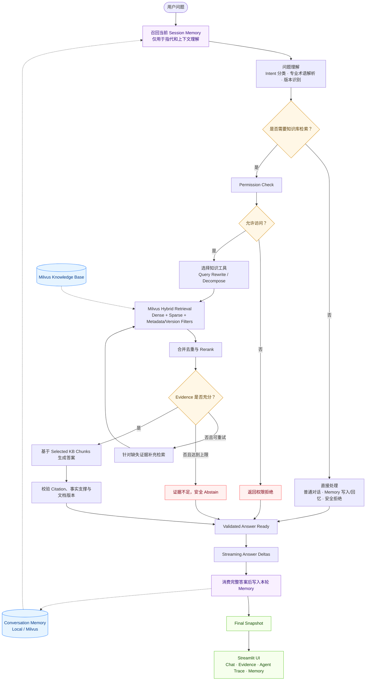

# Agentic RAG Flow

## 精简版：主要流程

```mermaid
flowchart TD
    START([用户问题]) --> MEMORY["召回当前 Session Memory<br/>仅用于指代和上下文理解"]
    MEMORY --> UNDERSTAND["问题理解<br/>Intent 分类 · 专业术语解析 · 版本识别"]

    UNDERSTAND --> ROUTE{"是否需要知识库检索？"}

    ROUTE -- 否 --> DIRECT["直接处理<br/>普通对话 · Memory 写入/回忆 · 安全拒绝"]

    ROUTE -- 是 --> PERMISSION["Permission Check"]
    PERMISSION --> ALLOWED{"允许访问？"}
    ALLOWED -- 否 --> DENIED["返回权限拒绝"]

    ALLOWED -- 是 --> PLAN["选择知识工具<br/>Query Rewrite / Decompose"]
    PLAN --> RETRIEVE["Milvus Hybrid Retrieval<br/>Dense + Sparse + Metadata/Version Filters"]
    RETRIEVE --> RERANK["合并去重与 Rerank"]
    RERANK --> GRADE{"Evidence 是否充分？"}

    GRADE -- 否且可重试 --> RETRY["针对缺失证据补充检索"]
    RETRY --> RETRIEVE
    GRADE -- 否且达到上限 --> ABSTAIN["证据不足，安全 Abstain"]

    GRADE -- 是 --> GENERATE["基于 Selected KB Chunks 生成答案"]
    GENERATE --> VERIFY["校验 Citation、事实支撑与文档版本"]

    DIRECT --> READY["Validated Answer Ready"]
    DENIED --> READY
    ABSTAIN --> READY
    VERIFY --> READY

    READY --> STREAM["Streaming Answer Deltas"]
    STREAM --> PERSIST["消费完整答案后写入本轮 Memory"]
    PERSIST --> FINAL["Final Snapshot"]

    FINAL --> UI["Streamlit UI<br/>Chat · Evidence · Agent Trace · Memory"]

    MEMORY_STORE[("Conversation Memory<br/>Local / Milvus")]
    KB_STORE[("Milvus Knowledge Base")]

    MEMORY_STORE -.-> MEMORY
    PERSIST -.-> MEMORY_STORE
    KB_STORE -.-> RETRIEVE

    classDef decision fill:#fff7e6,stroke:#d48806,color:#5c3b00;
    classDef storage fill:#e6f4ff,stroke:#1677ff,color:#003a8c;
    classDef terminal fill:#f6ffed,stroke:#52c41a,color:#135200;
    classDef failure fill:#fff1f0,stroke:#ff4d4f,color:#820014;
    classDef memory fill:#f9f0ff,stroke:#9254de,color:#391085;

    class ROUTE,ALLOWED,GRADE decision;
    class MEMORY_STORE,KB_STORE storage;
    class FINAL,UI terminal;
    class DENIED,ABSTAIN failure;
    class MEMORY,PERSIST memory;
```

## 详细版：完整流程

```mermaid
flowchart TD
    START([用户提交问题]) --> INIT["创建 AgentState<br/>生成 query_id / 绑定 session_id<br/>校验问题与搜索参数"]

    %% ==================== Memory Recall ====================
    subgraph MEMORY_RECALL["阶段一：会话 Memory 召回"]
        INIT --> RECALL_CHECK{"是否为显式回忆<br/>或指代型追问？"}

        RECALL_CHECK -- 否 --> NO_MEMORY["不注入历史 Memory"]
        RECALL_CHECK -- 是 --> RECALL["Recall Memory<br/>按 session_id + TTL + memory_type 过滤<br/>Semantic Top-K，默认 Top 3"]

        MEMORY_STORE[("Conversation Memory<br/>Local / Milvus")]
        MEMORY_STORE -. "session_summary / task_state" .-> RECALL

        RECALL --> RECALL_RESULT{"召回结果"}
        RECALL_RESULT -- 找到 --> MEMORY_CONTEXT["构造 bounded memory_context<br/>最多约 2,000 字符"]
        RECALL_RESULT -- 无结果 --> MEMORY_EMPTY["memory_status = empty"]
        RECALL_RESULT -- Store 异常 --> MEMORY_FAILED["memory_status = recall_failed<br/>安全降级，不影响后续 RAG"]

        NO_MEMORY --> CLASSIFY
        MEMORY_CONTEXT --> CLASSIFY
        MEMORY_EMPTY --> CLASSIFY
        MEMORY_FAILED --> CLASSIFY
    end

    %% ==================== Understanding ====================
    subgraph UNDERSTANDING["阶段二：问题理解与路由"]
        CLASSIFY["Intent / Query Type 分类"]

        CLASSIFY --> INTENT["识别 Intent<br/>private_knowledge / comparison<br/>permission_sensitive / conversation<br/>operation / memory_write / memory_recall"]

        INTENT --> QUERY_TYPE["识别 Query Type<br/>architecture / policy / product<br/>general / unknown"]

        QUERY_TYPE --> ENTITY["专业术语解析<br/>匹配 predefined entity catalog<br/>识别 GO按钮等行业词与同义词"]

        ENTITY_CATALOG[("Predefined Entity Catalog<br/>entity / aliases / comment / domain")]
        ENTITY_CATALOG -. "可信术语定义" .-> ENTITY

        ENTITY --> VERSION["文档版本范围解析<br/>current / exact / comparison"]

        VERSION --> AMBIGUOUS{"术语或版本<br/>是否存在歧义？"}
    end

    AMBIGUOUS -- 是 --> CLARIFY["生成澄清问题<br/>terminal_status = clarification_required"]
    AMBIGUOUS -- 否 --> RETRIEVAL_DECISION{"是否需要<br/>知识库检索？"}

    %% ==================== Non-Retrieval Branches ====================
    subgraph DIRECT_BRANCHES["阶段三 A：非知识库分支"]
        RETRIEVAL_DECISION -- "memory_write" --> MEMORY_WRITE["提取需要记住的 statement<br/>准备非承诺式 Memory 处理结果"]

        RETRIEVAL_DECISION -- "memory_recall" --> MEMORY_ANSWER{"是否召回到有效 Memory？"}
        MEMORY_ANSWER -- 是 --> MEMORY_GROUNDED["根据同 session Memory 回答<br/>不生成 KB citation"]
        MEMORY_ANSWER -- 否 --> MEMORY_NOT_FOUND["提示当前会话没有匹配记忆"]

        RETRIEVAL_DECISION -- "conversation" --> DIRECT_ANSWER["普通对话直接回答"]

        RETRIEVAL_DECISION -- "operation" --> SAFE_REFUSAL["拒绝修改、删除、审批等操作<br/>Workshop 只支持只读查询"]
    end

    %% ==================== RAG Branch ====================
    subgraph RAG["阶段三 B：Agentic RAG 检索流程"]
        RETRIEVAL_DECISION -- "需要检索" --> PERMISSION["Permission Check<br/>在任何私有知识搜索之前执行"]

        PERMISSION --> PERMISSION_RESULT{"是否允许访问？"}
        PERMISSION_RESULT -- 否 --> PERMISSION_DENIED["返回安全拒绝<br/>不执行检索与生成"]
        PERMISSION_RESULT -- 是 --> TOOL_SELECTION["Tool Selection<br/>选择最小相关工具集合"]

        TOOL_SELECTION --> TOOL_LIST["可用工具<br/>search_policy_docs<br/>search_product_docs<br/>search_meeting_notes<br/>search_code_docs<br/>summarize_document"]

        TOOL_LIST --> PLAN["Query Rewrite / Decompose<br/>生成 1～3 个 bounded subqueries"]

        PLAN --> PLAN_CONTEXT["改写依据<br/>原始问题 + Entity definitions<br/>Version scope + bounded Memory context"]

        PLAN_CONTEXT --> DEPENDENCY{"是否存在<br/>Multi-hop 依赖？"}
        DEPENDENCY -- 是 --> DEPENDENT_PLAN["先执行无依赖 subquery<br/>根据第一跳证据补全后续 query"]
        DEPENDENCY -- 否 --> READY_PLAN["所有 subquery 可并行执行"]

        DEPENDENT_PLAN --> RETRIEVE
        READY_PLAN --> RETRIEVE

        RETRIEVE["执行知识工具<br/>Milvus Hybrid Retrieval"]

        MILVUS[("Milvus KB Chunks")]
        MILVUS -.-> DENSE["Dense Vector Search"]
        MILVUS -.-> SPARSE["Sparse / BM25 Search"]
        MILVUS -.-> FILTER["Metadata Filter<br/>department / doc_type<br/>doc_version / is_current"]
        DENSE --> RETRIEVE
        SPARSE --> RETRIEVE
        FILTER --> RETRIEVE

        RETRIEVE --> MERGE["合并多工具候选结果<br/>按 chunk_id 去重<br/>保留 tool/query provenance"]

        MERGE --> VERSION_GUARD["版本隔离检查<br/>普通查询只保留一个版本<br/>Comparison 按版本分区"]

        VERSION_GUARD --> RERANK["Rerank Evidence<br/>计算 rerank_score<br/>选择候选上下文"]

        RERANK --> GRADE["Grade Evidence<br/>评估 covered / missing aspects<br/>contradictions / version coverage"]

        GRADE --> ENOUGH{"Evidence 是否充分？"}

        ENOUGH -- 是 --> GENERATE
        ENOUGH -- 否 --> RETRY_CHECK{"retry_count<br/>是否小于 3？"}

        RETRY_CHECK -- 是 --> SUPPLEMENT["Prepare Supplementary Retrieval<br/>只针对 missing aspects<br/>保留之前已找到的证据"]
        SUPPLEMENT --> RETRIEVE

        RETRY_CHECK -- 否 --> ABSTAIN["生成证据不足的 Abstention<br/>不编造答案"]
        ABSTAIN --> VERIFY

        GENERATE["Generate Answer<br/>最多使用 5 个 selected chunks"]

        GENERATE_CONTEXT["生成上下文<br/>user_query<br/>entity_info：仅用于术语理解<br/>memory_context：仅用于指代消解<br/>KB contexts：唯一 citation source<br/>version_scope"]

        GENERATE_CONTEXT --> GENERATE
        GENERATE --> VERIFY["Verify Answer / Self-check<br/>校验 citation、selected context<br/>版本范围、inline marker 与事实支撑"]

        VERIFY --> VALID{"答案验证是否通过？"}
        VALID -- 否 --> GENERATION_FAILURE["拒绝暴露未验证答案<br/>返回安全错误或 fallback"]
        VALID -- 是 --> ANSWER_READY["Validated Answer Ready"]
    end

    %% ==================== Direct Answer Validation ====================
    CLARIFY --> DIRECT_VALIDATED["构造并标记合法 Terminal Answer"]
    MEMORY_WRITE --> DIRECT_VALIDATED
    MEMORY_GROUNDED --> DIRECT_VALIDATED
    MEMORY_NOT_FOUND --> DIRECT_VALIDATED
    DIRECT_ANSWER --> DIRECT_VALIDATED
    SAFE_REFUSAL --> DIRECT_VALIDATED
    PERMISSION_DENIED --> DIRECT_VALIDATED

    DIRECT_VALIDATED --> ANSWER_READY

    %% ==================== Streaming and Persistence ====================
    subgraph STREAMING["阶段四：安全 Streaming 与 Memory 持久化"]
        ANSWER_READY --> TRACE_DONE["完成可公开 Agent Trace<br/>只包含安全状态、数量与耗时<br/>不包含 prompt / Memory content / CoT"]

        TRACE_DONE --> ANSWER_DELTA["Streaming answer_delta<br/>输出已经验证的答案分块"]

        ANSWER_DELTA --> CONSUMER{"消费者是否继续<br/>请求 final？"}

        CONSUMER -- "取消或连接中断" --> CANCELLED["结束 incomplete stream<br/>不写入当前 turn Memory"]

        CONSUMER -- 是 --> PERSIST["Persist Turn Memory<br/>在生成 final 的同一次推进中执行"]

        PERSIST --> BUILD_MEMORY["构建本轮记录<br/>user short_term<br/>assistant short_term<br/>session_summary<br/>可选 task_state"]

        BUILD_MEMORY --> MEMORY_UPSERT["按 session_id + query_id<br/>幂等 Upsert"]

        MEMORY_UPSERT --> MEMORY_STORE

        MEMORY_UPSERT --> WRITE_RESULT{"Memory 写入结果"}
        WRITE_RESULT -- 成功 --> SAVED["memory_status = saved"]
        WRITE_RESULT -- "普通回答写入失败" --> WRITE_FAILED["memory_status = write_failed<br/>保留已验证回答"]
        WRITE_RESULT -- "显式记忆请求写入失败" --> MEMORY_WRITE_FAILED["terminal_status = memory_write_failed<br/>不向用户误报保存成功"]

        SAVED --> FINAL
        WRITE_FAILED --> FINAL
        MEMORY_WRITE_FAILED --> FINAL
    end

    %% ==================== Final Response ====================
    subgraph FINAL_OUTPUT["阶段五：Final Snapshot 与 UI"]
        FINAL["输出唯一 final envelope<br/>Immutable Response Snapshot"]

        FINAL --> RESPONSE["最终结果<br/>answer / citations<br/>terminal_status / version_scope<br/>tool_calls / retrieval provenance<br/>reranked evidence / grading<br/>Memory status / metrics / trace"]

        RESPONSE --> UI["Streamlit UI"]

        UI --> CHAT_TAB["Chat<br/>多轮问题与回答"]
        UI --> EVIDENCE_TAB["Evidence<br/>召回、Rerank、Citation、版本"]
        UI --> TRACE_TAB["Agent Trace<br/>动态安全执行时间线"]
        UI --> MEMORY_TAB["Memory<br/>召回记录、写入状态、TTL<br/>清除当前 session Memory"]
    end

    %% ==================== Trust Boundaries ====================
    MEMORY_CONTEXT -. "只能辅助分类、指代消解和 Query Rewrite" .-> PLAN_CONTEXT
    MEMORY_CONTEXT -. "不能授权工具或修改 filters" .-> PERMISSION
    MEMORY_CONTEXT -. "不能成为 citation 或补足 KB evidence" .-> GRADE

    ENTITY -. "只提供术语解释，不是证据" .-> GENERATE_CONTEXT
    VERSION -. "控制检索和引用的版本边界" .-> FILTER

    classDef decision fill:#fff7e6,stroke:#d48806,color:#5c3b00;
    classDef storage fill:#e6f4ff,stroke:#1677ff,color:#003a8c;
    classDef terminal fill:#f6ffed,stroke:#52c41a,color:#135200;
    classDef failure fill:#fff1f0,stroke:#ff4d4f,color:#820014;
    classDef memory fill:#f9f0ff,stroke:#9254de,color:#391085;
    classDef process fill:#f5f5f5,stroke:#595959,color:#262626;

    class RECALL_CHECK,RECALL_RESULT,AMBIGUOUS,RETRIEVAL_DECISION,MEMORY_ANSWER,PERMISSION_RESULT,DEPENDENCY,ENOUGH,RETRY_CHECK,VALID,CONSUMER,WRITE_RESULT decision;
    class MEMORY_STORE,ENTITY_CATALOG,MILVUS storage;
    class FINAL,RESPONSE,UI,CHAT_TAB,EVIDENCE_TAB,TRACE_TAB,MEMORY_TAB terminal;
    class MEMORY_FAILED,PERMISSION_DENIED,GENERATION_FAILURE,WRITE_FAILED,MEMORY_WRITE_FAILED,CANCELLED failure;
    class RECALL,MEMORY_CONTEXT,MEMORY_WRITE,MEMORY_GROUNDED,MEMORY_NOT_FOUND,PERSIST,BUILD_MEMORY,MEMORY_UPSERT,SAVED memory;
```
