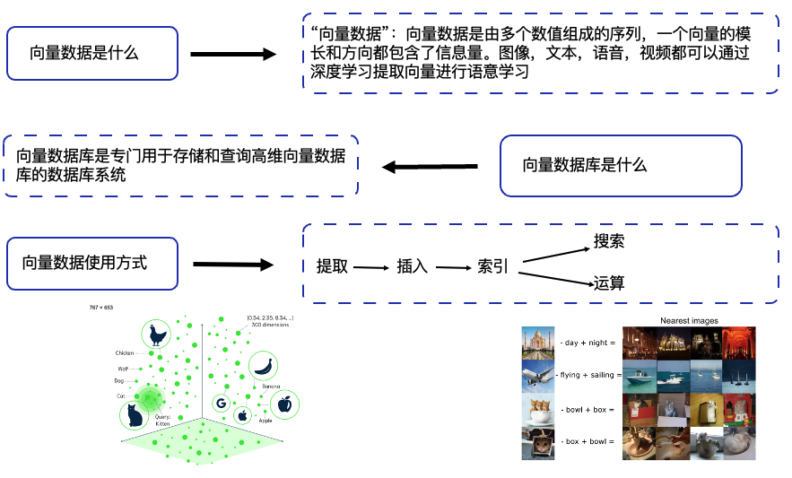
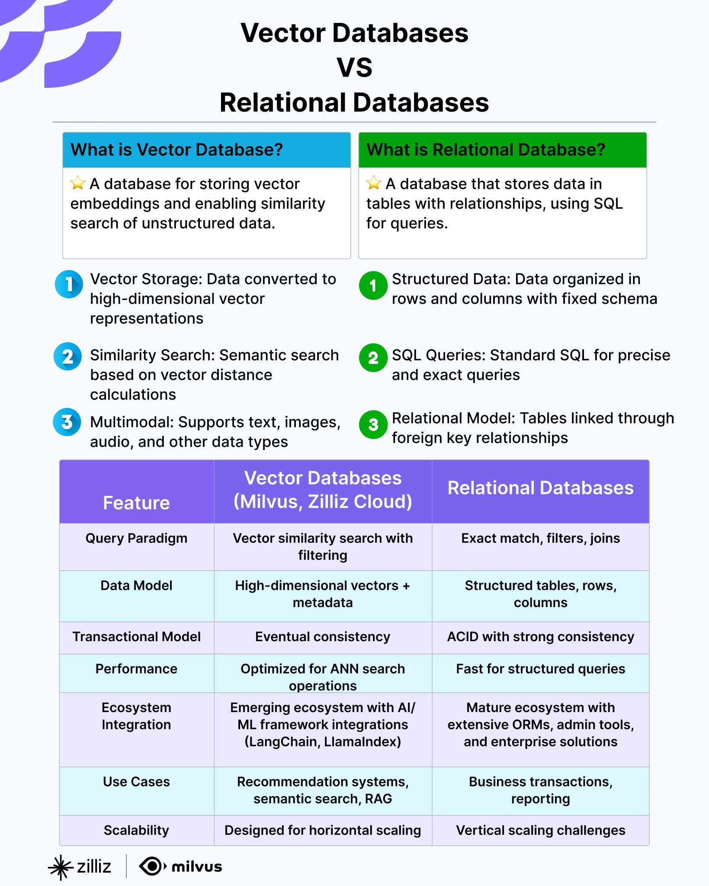
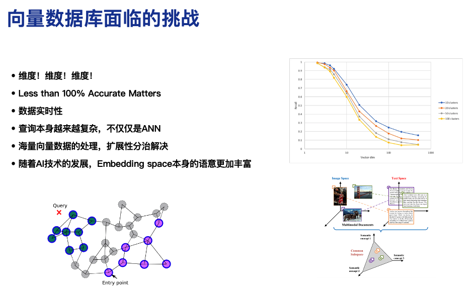

# Part One: Milvus Primer - Installation, Concepts, and Core Components

Welcome to Part 1 of the Milvus Workshop! In this part, we'll learn the fundamental concepts of Milvus and hands-on installation. Before we begin, please ensure you have:
1. Install [Docker](https://docs.docker.com/get-started/get-docker/)
2. [Check the requirements for hardware and software](https://milvus.io/docs/zh/prerequisite-docker.md)
3. Install Python 3.9+
4. Install pip

## 1.1 Overview of the Vector Database Milvus
### What is a Vector Embedding?
In the fields of machine learning and deep learning, most models can only process numerical data. However, in real-world scenarios, vast amounts of data, such as text, images, audio, and more are non-numerical. To input these data into models, it is necessary to convert them into "numbers", which is the role of vector embeddings.

Through embedding, raw data is transformed into a vector format that is more amenable to manipulation. This vector representation allows the semantic similarity of the original data to be quantified by the proximity of their corresponding points in the vector space.

In summary, vector embedding is a technique that maps high-dimensional, discrete, or complex data, such as text, images, or audio into a low-dimensional continuous vector space. Its essence lies in converting data into a form that is more manageable for machines while preserving its intrinsic patterns. It stands as one of the cornerstones of modern AI systems.

### Why do we need a vector database?
Vector databases are designed to efficiently store and manage massive amounts of unstructured data and enable efficient similarity searches.
+ Limitations of Traditional Databases

> Traditional databases focus on exact matching, while vector databases emphasize **semantic search** (finding vectors that are “most similar” to the query vector based on a specific distance metric).
>

| Feature | Traditional Database | Vector Database |
| --- | --- | --- |
| Data Type | Structured data (numeric, string) | High-dimensional floating-point vectors |
| Query Method | Exact match, range query | Similarity query (based on Euclidean distance, cosine similarity, etc.) |
| Indexing Mechanism | B+ trees, hash indexes, etc. | ANN indexes like HNSW, IVF, SCANN |
| Query Performance | Low efficiency for finding similar vectors | Fast lookup in millions to billions of vectors |

+ Typical Application Scenarios

> Approximate Nearest Neighbor (ANN) search is the most fundamental query method in vector databases. It achieves significantly improved search speed and efficiency by sacrificing a certain degree of precision.
> 
> The ANN search capabilities of vector databases make them critical infrastructure in the AI era. 
>

| Scenario | Issues with Traditional Databases | Vector Database Solutions |
| --- | --- | --- |
| Semantic Search | Keyword matching only; cannot understand semantics | Use Embedding vectors to search for text with similar meanings |
| Recommendation Systems | Relies on manual rules; struggles to capture user interests | Use user behavior vectors to recommend similar products/content |
| Image/Video Retrieval | Cannot directly search for similar images | Use vectors to extract image features for retrieving similar images |
| Anomaly Detection | High false negative rate in rule engines | Use vector distance to identify anomalous behavior (e.g., financial fraud) |

### What is Milvus?   
Milvus is an open-source vector database specifically designed for the efficient storage, retrieval, and analysis of large-scale vector data. It supports vector embeddings generated by various machine learning models and is widely used in AI, deep learning, recommendation systems, image/video retrieval, natural language processing (NLP), and other scenarios.  

Milvus offers the following core features:
+ High-Performance Vector Retrieval: 
    - Supports vector data at the hundred-million scale
    - Provides fast Approximate Nearest Neighbor (ANN) search, significantly boosting retrieval efficiency
    - Optimized algorithms (IVF, HNSW, etc.) accelerate queries while balancing accuracy and speed
+ Support for Multiple Data Types: 
    - Handles common numeric and string types, various vector types, arrays, sets, and JSON
+ High Scalability: 
    - A highly decoupled system architecture that can scale continuously as data grows
    - Cloud-native design, compatible with containerized deployments such as Kubernetes
+ Multi-Language SDKs and Tools:  
    - Provides SDKs for Python, Java, Go, C++, and more.
    - Integrated toolchain including Milvus CLI and Attu visualization tools
+ Open Source + Enterprise Support:  
    - Developed and maintained by Zilliz
    - Licensed under Apache 2.0; commercial edition (Zilliz Cloud) available

### Analysis of Milvus Core Concepts
#### Collection
A Collection is a two-dimensional table with columns and rows. Each column represents a field, and each row represents an entity. It is analogous to a table in a relational database.

#### Schema
A Schema defines the data structure of a Collection, similar to the table structure definition in a relational database. Before creating a Collection, its Schema must be defined first.

A complete Collection Schema consists of the following three parts:
+ Fields: Defines field names, data types, dimensions (vector), and other properties; can contain up to four vector fields and several scalar fields.
+ Primary Key: Specifies a field as the primary key (INT64 or VARCHAR) to uniquely identify data.
+ Description: Optional collection description information (text string).

#### Entity
An Entity is a data record within a Collection, analogous to a row in a relational database. Each Entity contains a set of field values defined by the Collection Schema, including ID, vector fields, and scalar fields.

#### Index
Indexes are the core mechanism for optimizing vector similarity search (ANN, approximate nearest neighbor search) performance. In Milvus, indexes are field-specific, and the applicable index type varies depending on the data type of the target field.

Milvus supports multiple index types:

| Index Type | Applicable Scenarios |
| --- | --- |
| FLAT | Small-scale datasets (millions of records), 100% recall, precise search |
| IVF_FLAT | High-speed query, balanced accuracy and speed |
| IVF_SQ8 | Very high-speed query, limited memory resources, accepts minor compromise in recall rate |
| HNSW | Very high-speed query, requires a recall rate as high as possible, large memory resources |
| DISKANN | Disk-based retrieval, large datasets |

#### Search/Query 
Milvus supports high-performance **ANN (Approximate Nearest Neighbor) search** and **scalar field-based filtering query**, and can combine both to handle complex search scenarios.

**Approximate Nearest Neighbor (ANN) search:**

Based on an index file recording the sorted order of vector embeddings, the Approximate Nearest Neighbor (ANN) search locates a subset of vector embeddings based on the query vector carried in a received search request, compares the query vector with those in the subgroup, and returns the most similar results. With ANN search, Milvus provides an efficient search experience.

ANN search supports:
+ **Single-vector search**: A single-vector search refers to a search that involves only one query vector. Based on the pre-built index and the metric type carried in the search request, Milvus will find the top-K vectors most similar to the query vector.
+ **Bulk-Vector Search**: A search request includes multiple query vectors. Milvus will conduct ANN searches for the query vectors in parallel and return multiple sets of results.
+ **ANN Search in Partition**: If a Collection has multiple partitions, you can include the target partition names in the search request to restrict the search scope within the specified partitions. Reducing the number of partitions involved in the search improves search performance.
+ **Use Output Fields**: In a search result, Milvus includes the primary field values and similarity distances/scores of the entities that contain the top-K vector embeddings by default. You can include the names of the target fields, including both the vector and scalar fields, in a search request as the output fields to make the search results carry the values from other fields in these entities.
+ **Use Limit and Offset**: The parameter limit carried in the search requests determines the number of entities to include in the search results. This parameter specifies the maximum number of entities to return in a single search, and it is usually termed top-K. If you wish to perform paginated queries, you can use a loop to send multiple Search requests, with the Limit and Offset parameters carried in each query request. Specifically, you can set the Limit parameter to the number of Entities you want to include in the current query results, and set the Offset to the total number of Entities that have already been returned.
+ **Enhancing ANN Search**: By reducing the search scope, improving search result relevancy, and diversifying the search results, Milvus implements search enhancements such as filtered search, range search, grouping search and hybrid search.

**Filtering Queries Based on Scalar Fields**：

In addition to ANN searches, Milvus also supports metadata filtering through queries. A Collection can store various types of scalar fields. You can have Milvus filter Entities based on one or more scalar fields.

Milvus provides three query types:
+ Query: Finds entities that hold the specified primary keys by primary key filtering.
+ Get: Finds all entities or a specified number of entities that meet custom filtering criteria by filtering expressions.
+ Query Iterator: Finds all entities that meet custom filtering conditions in paginated queries by filtering expressions.

**Combining ANN Search with Scalar Field Filtering**:

Milvus allows the combination of both query methods, delivering more flexible search capabilities.
+ Pre-search filtering: Filter scalar fields first, then perform ANN search on the resulting subset.
+ Post-search filtering: Execute ANN search first, then filter scalar fields in the results.

#### Consistency Level
As a distributed vector database, Milvus offers multiple levels of consistency to meet varying data consistency requirements across different scenarios. These levels provide distinct trade-offs between data visibility, system performance, and availability.

| Consistency Level | Features |
| --- | --- |
| Strong | · Highest consistency guarantee · After a write operation completes, all subsequent reads immediately see the latest data · Highest performance overhead, longest query latency |
| Bounded | · Default consistency level · Allows data to be delayed within a configurable time window, ensuring all subsequent reads see the latest data after a specified period · Balances performance and consistency |
| Session | · Ensure read consistency within a single session · All previous writes are visible within the same session, while temporary inconsistencies may occur between sessions · Good performance |
| Eventually | · Lowest consistency guarantee · Does not guarantee visibility of the latest writes during reads; all nodes will eventually reach data consistency · Best performance, lowest query latency |

#### Partition
A partition is a logical grouping of data within a collection:
+ When creating a collection, Milvus also creates a partition named **_default** in the collection. If you are not going to add any other partitions, all entities inserted into the collection go into the default partition, and all searches and queries are also carried out within the default partition.
+ You can add more partitions and insert entities into them based on certain criteria. Then you can restrict your searches and queries within certain partitions, improving search performance.
+ A collection can have a maximum of 1,024 partitions.

Core Functions of Partition:
+ Enhance query efficiency: Narrow search scope and reduce computational load.
+ Optimize data management: Organize data by dimensions such as time and category; support partition-level operations (load/release/delete).
+ Optimize resource utilization: Load only required partitions into memory, minimizing unnecessary resource consumption.

