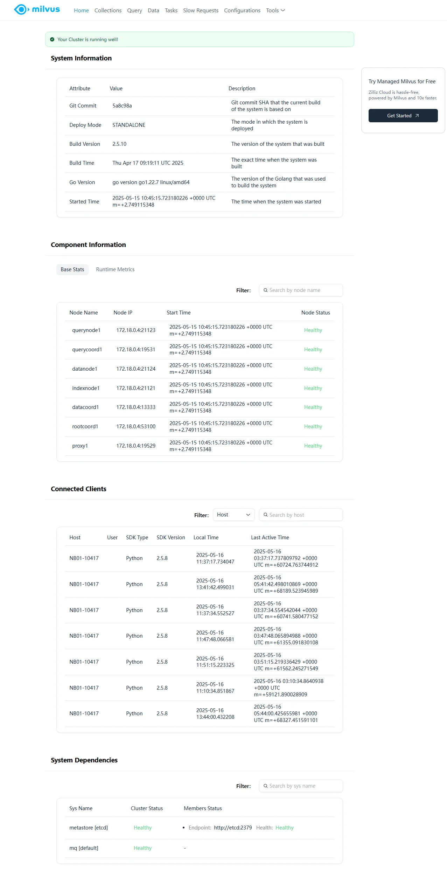
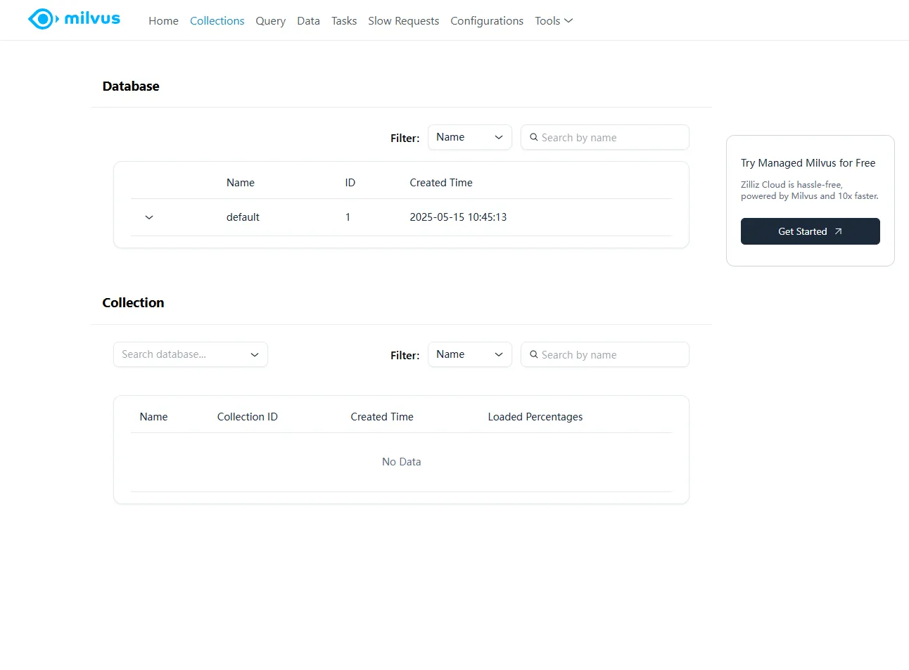
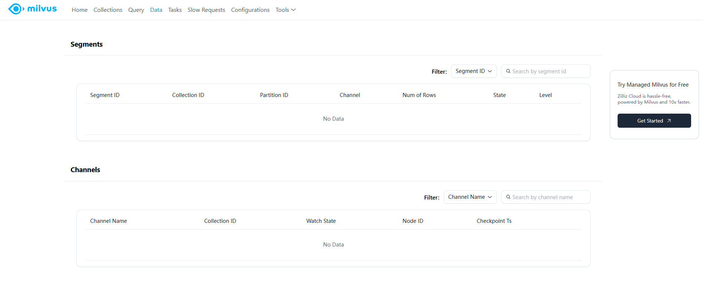
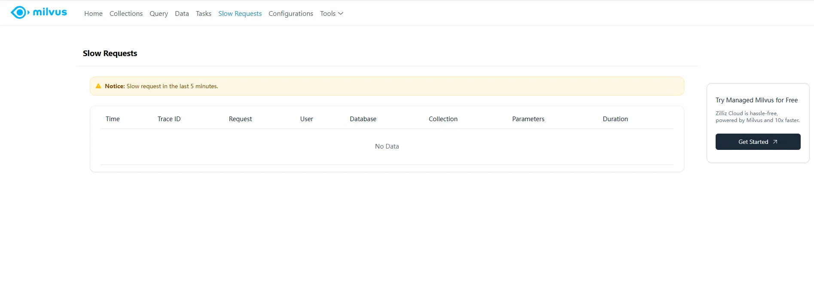
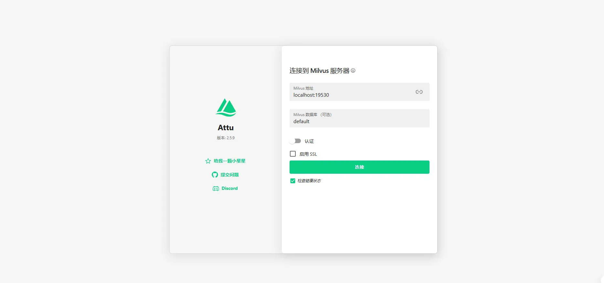
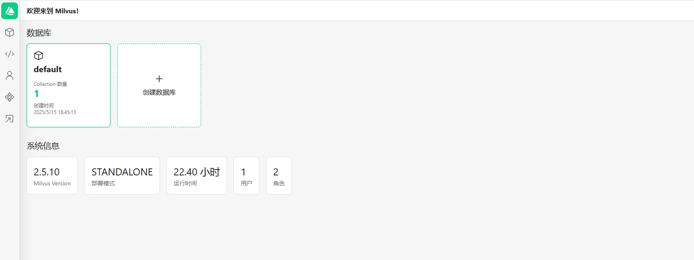
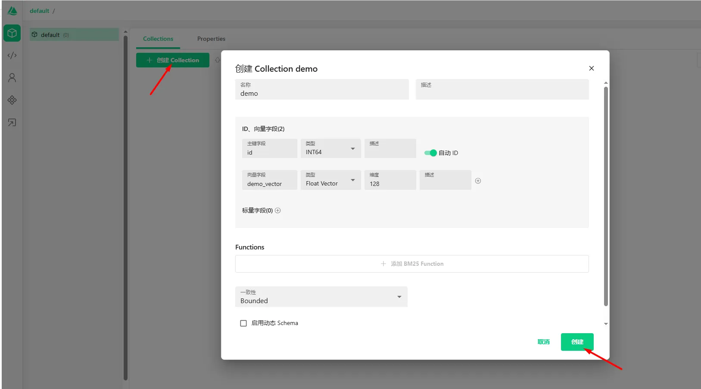
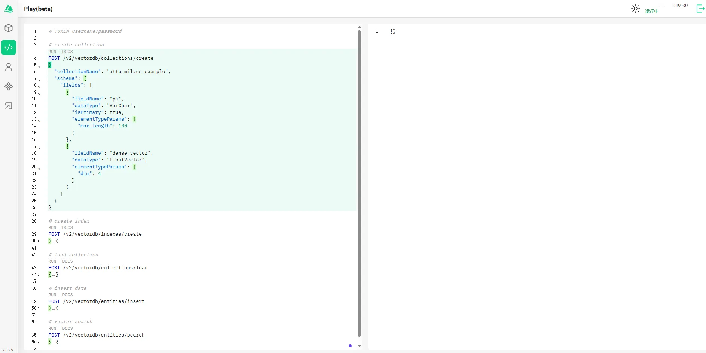
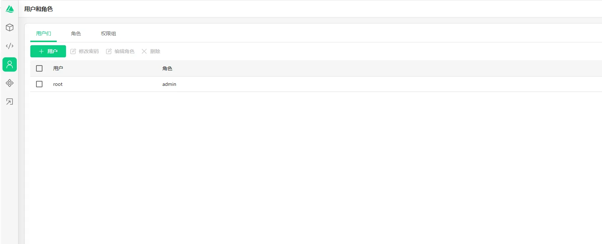

## 1.2 Milvus Installation Guide
In the previous part, we learned the fundamental concepts of the vector database Milvus. Now, we will proceed with the hands-on installation of Milvus.

### Cloud Usage Guide

When learning the Milvus vector database, besides local Milvus Lite, standalone Milvus Standalone, or Milvus on K8s, you can also choose Zilliz Cloud, a managed solution requiring no server deployment and zero upfront costs. Below we'll demonstrate how to apply for Zilliz Cloud's free China region plan and run the official sample code.


#### Register and create a free cluster

1. Visit the official website

   - Domestic site：https://zilliz.com.cn/
   - Overseas site：https://zilliz.com/

This experiment utilizes a domestic site hosted on Alibaba Cloud, which is currently available for free use.

   

2. Select **Mobile Number** or **Email** to sign in/register.

   

3. After entering the console homepage, click the **Create Cluster** button.
   

4. In the pop-up window, select **Free Tier**. The default data center is **Alibaba Cloud · Hangzhou**.
   

5. Wait a few minutes. Once the cluster creation is complete, information such as the **Endpoint URI, API Token, and Cluster ID** will be displayed. Please keep this information safely.
   

6. Running


Install milvus-cli: 


```python
!pip config set global.index-url https://mirrors.tuna.tsinghua.edu.cn/pypi/web/simple
!pip install uv
!uv pip install milvus-cli

```

    Writing to /Users/xu/.config/pip/pip.conf
    Looking in indexes: https://mirrors.tuna.tsinghua.edu.cn/pypi/web/simple, https://mirrors.aliyun.com/pypi/simple/, https://repo.huaweicloud.com/repository/pypi/simple/, https://mirrors.cloud.tencent.com/pypi/simple/
    Requirement already satisfied: uv in /opt/miniconda3/lib/python3.12/site-packages (0.7.17)
    error: unrecognized subcommand 'config'
    
    Usage: uv pip [OPTIONS] <COMMAND>
    
    For more information, try '--help'.
    Using Python 3.12.7 environment at: /opt/miniconda3
    ⠼ pymilvus==2.5.3                                                               


Run `milvus_cli` on the terminal to enter the interactive CLI.


```bash
milvus_cli                                                                                                         


  __  __ _ _                    ____ _     ___
 |  \/  (_) |_   ___   _ ___   / ___| |   |_ _|
 | |\/| | | \ \ / / | | / __| | |   | |    | |
 | |  | | | |\ V /| |_| \__ \ | |___| |___ | |
 |_|  |_|_|_| \_/  \__,_|___/  \____|_____|___|

Milvus cli version: 1.0.2
Pymilvus version: 2.5.3

Learn more: https://github.com/zilliztech/milvus_cli.


milvus_cli > connect -uri https://in03-d7b5690fee7bcbf.serverless.ali-cn-hangzhou.cloud.zilliz.com.cn -t 88b738ee492b2ad88d69c166ee587825d546b049dab3a5d8767733a636efec52a62e96b283ab90c24146d5a311696dacd9499fc1
Connect Milvus successfully.
+---------+---------+
| Address |         |
|  Alias  | default |
+---------+---------+
milvus_cli > list databases
+--------------------+
|      db_name       |
+--------------------+
| db_d7b5690fee7bcbf |
+--------------------+
```


####  Create a virtual environment (If Python 3.12 is missing, uv will download it automatically)

```
uv venv milvus-py --python 3.12

# 激活环境
source milvus-py/bin/activate      # macOS / Linux
# .\milvus-py\Scripts\activate      # Windows PowerShell

```

If you're using conda, you can also: 

```bash
conda create -n milvus-py python==3.12 -y
conda activate milvus-py
```

1. **Clone the Repository**
```bash
git clone https://github.com/zilliztech/cloud-vectordb-examples.git
```

If you are unable to download due to network issues, you can copy the code from the following section.


2. **Install PyMilvus**

```bash
pip3 install pymilvus==2.5.3
```

3. **Enter the Python examples directory**

```bash
cd cloud-vectordb-examples/python


```

It should be noted that in the open-source version of Milvus, the port numbers are 19530 and 9091, while on Zilliz Cloud, the port is 443.


The complete code is as follows. We need a Python file and an ini configuration file to store Zilliz credentials.

Create a new `config.ini` file in the project folder, then enter your cluster information (ensure the format is preserved). ⚠️ Never commit your API Key to a public repository.

```ini
uri = https://<your-endpoint>
token = <your-api-key>
```


```python
# Zilliz cloud URL
url = "https://<your-endpoint>"
# db_admin:password (or ApiKey)
token = "<your-api-key>"

config_content = f"""
[example]
uri = {url}
token = {token}
"""


print("The configuration file is as follows:", config_content)
with open('config.ini', 'w') as f:
    f.write(config_content)
    
print("The config.ini file has been created.")
```

    The configuration file is as follows: 
    [example]
    uri = https://<your-endpoint>
    token = <your-api-key>
    
    The config.ini file has been created.


```python
import configparser
import time
import random

from pymilvus import MilvusClient
from pymilvus import DataType

cfp = configparser.RawConfigParser()
cfp.read('config.ini')
milvus_uri = cfp.get('example', 'uri')
token = cfp.get('example', 'token')

milvus_client = MilvusClient(uri=milvus_uri, token=token)
print(f"Connected to DB: {milvus_uri} successfully")


# Check if the collection exists
collection_name = "book"
check_collection = milvus_client.has_collection(collection_name)

if check_collection:
    milvus_client.drop_collection(collection_name)
    print(f"Dropped the existing collection {collection_name} successfully")

dim = 64

print("Start to create the collection schema")
schema = milvus_client.create_schema()
schema.add_field("book_id", DataType.INT64, is_primary=True, description="customized primary id")
schema.add_field("word_count", DataType.INT64, description="word count")
schema.add_field("book_intro", DataType.FLOAT_VECTOR, dim=dim, description="book introduction")
print("Start to prepare index parameters with default AUTOINDEX")
index_params = milvus_client.prepare_index_params()
index_params.add_index("book_intro", metric_type="L2")

print(f"Start to create example collection: {collection_name}")
# create collection with the above schema and index parameters, and then load automatically
milvus_client.create_collection(collection_name, schema=schema, index_params=index_params)
collection_property = milvus_client.describe_collection(collection_name)
print("Collection details: %s" % collection_property)

# insert data with customized ids
nb = 1000
insert_rounds = 2
start = 0           # first primary key id
total_rt = 0        # total response time for inert

print(f"Start to insert {nb*insert_rounds} entities into example collection: {collection_name}")
for i in range(insert_rounds):
    vector = [random.random() for _ in range(dim)]
    rows = [{"book_id": i, "word_count": random.randint(1, 100), "book_intro": vector} for i in range(start, start+nb)]
    t0 = time.time()
    milvus_client.insert(collection_name, rows)
    ins_rt = time.time() - t0
    start += nb
    total_rt += ins_rt
print(f"Insert completed in {round(total_rt,4)} seconds")

print("Start to flush")
start_flush = time.time()
milvus_client.flush(collection_name)
end_flush = time.time()
print(f"Flush completed in {round(end_flush - start_flush, 4)} seconds")

# search
nq = 3
search_params = {"metric_type": "L2",  "params": {"level": 2}}
limit = 2

for i in range(5):
   search_vectors = [[random.random() for _ in range(dim)] for _ in range(nq)]
   t0 = time.time()
   results = milvus_client.search(collection_name,
                                  data=search_vectors,
                                  limit=limit,
                                  search_params=search_params,
                                  anns_field="book_intro")
   t1 = time.time()
   assert len(results) == nq
   assert len(results[0]) == limit
   print(f"Search {i} results: {results}")
   print(f"Search {i} latency: {round(t1-t0, 4)} seconds")
```

    Connected to DB: https://in03-d7b5690fee7bcbf.serverless.ali-cn-hangzhou.cloud.zilliz.com.cn successfully
    Dropped the existing collection book successfully
    Start to create the collection schema
    Start to prepare index parameters with default AUTOINDEX
    Start to create example collection: book
    Collection details: {'collection_name': 'book', 'auto_id': False, 'num_shards': 1, 'description': '', 'fields': [{'field_id': 100, 'name': 'book_id', 'description': 'customized primary id', 'type': <DataType.INT64: 5>, 'params': {}, 'is_primary': True}, {'field_id': 101, 'name': 'word_count', 'description': 'word count', 'type': <DataType.INT64: 5>, 'params': {}}, {'field_id': 102, 'name': 'book_intro', 'description': 'book introduction', 'type': <DataType.FLOAT_VECTOR: 101>, 'params': {'dim': 64}}], 'functions': [], 'aliases': [], 'collection_id': 457861707878193409, 'consistency_level': 2, 'properties': {}, 'num_partitions': 1, 'enable_dynamic_field': False}
    Start to insert 2000 entities into example collection: book
    Insert completed in 0.7161 seconds
    Start to flush
    Flush completed in 3.0783 seconds
    Search 0 results: data: ["[{'id': 1000, 'distance': 11.278701782226562, 'entity': {}}, {'id': 1001, 'distance': 11.278701782226562, 'entity': {}}]", "[{'id': 1000, 'distance': 12.365486145019531, 'entity': {}}, {'id': 1001, 'distance': 12.365486145019531, 'entity': {}}]", "[{'id': 0, 'distance': 10.917741775512695, 'entity': {}}, {'id': 1, 'distance': 10.917741775512695, 'entity': {}}]"] , extra_info: {'cost': 6}
    Search 0 latency: 0.2629 seconds
    Search 1 results: data: ["[{'id': 1000, 'distance': 10.582381248474121, 'entity': {}}, {'id': 1001, 'distance': 10.582381248474121, 'entity': {}}]", "[{'id': 0, 'distance': 10.344733238220215, 'entity': {}}, {'id': 1, 'distance': 10.344733238220215, 'entity': {}}]", "[{'id': 1000, 'distance': 10.207210540771484, 'entity': {}}, {'id': 1001, 'distance': 10.207210540771484, 'entity': {}}]"] , extra_info: {'cost': 6}
    Search 1 latency: 0.0759 seconds
    Search 2 results: data: ["[{'id': 0, 'distance': 10.79613971710205, 'entity': {}}, {'id': 1, 'distance': 10.79613971710205, 'entity': {}}]", "[{'id': 0, 'distance': 10.37582015991211, 'entity': {}}, {'id': 1, 'distance': 10.37582015991211, 'entity': {}}]", "[{'id': 1000, 'distance': 10.58049201965332, 'entity': {}}, {'id': 1001, 'distance': 10.58049201965332, 'entity': {}}]"] , extra_info: {'cost': 6}
    Search 2 latency: 0.0794 seconds
    Search 3 results: data: ["[{'id': 0, 'distance': 10.324703216552734, 'entity': {}}, {'id': 1, 'distance': 10.324703216552734, 'entity': {}}]", "[{'id': 0, 'distance': 9.349638938903809, 'entity': {}}, {'id': 1, 'distance': 9.349638938903809, 'entity': {}}]", "[{'id': 0, 'distance': 9.982582092285156, 'entity': {}}, {'id': 1, 'distance': 9.982582092285156, 'entity': {}}]"] , extra_info: {'cost': 6}
    Search 3 latency: 0.076 seconds
    Search 4 results: data: ["[{'id': 0, 'distance': 10.211753845214844, 'entity': {}}, {'id': 1, 'distance': 10.211753845214844, 'entity': {}}]", "[{'id': 1000, 'distance': 11.563865661621094, 'entity': {}}, {'id': 1001, 'distance': 11.563865661621094, 'entity': {}}]", "[{'id': 0, 'distance': 8.334447860717773, 'entity': {}}, {'id': 1, 'distance': 8.334447860717773, 'entity': {}}]"] , extra_info: {'cost': 6}
    Search 4 latency: 0.08 seconds


Run the sample script:

```bash
python3 hello_zilliz_vectordb.py
```

After running, you will see output similar to:

```
Connected to DB: https://in03-d7b5690fee7bcbf.serverless.ali-cn-hangzhou.cloud.zilliz.com.cn successfully
Start to create the collection schema
Start to prepare index parameters with default AUTOINDEX
Start to create example collection: book
Collection details: {'collection_name': 'book', 'auto_id': False, 'num_shards': 1, 'description': '', 'fields': [{'field_id': 100, 'name': 'book_id', 'description': 'customized primary id', 'type': <DataType.INT64: 5>, 'params': {}, 'is_primary': True}, {'field_id': 101, 'name': 'word_count', 'description': 'word count', 'type': <DataType.INT64: 5>, 'params': {}}, {'field_id': 102, 'name': 'book_intro', 'description': 'book introduction', 'type': <DataType.FLOAT_VECTOR: 101>, 'params': {'dim': 64}}], 'functions': [], 'aliases': [], 'collection_id': 457861707686138665, 'consistency_level': 2, 'properties': {}, 'num_partitions': 1, 'enable_dynamic_field': False}
Start to insert 2000 entities into example collection: book
Insert completed in 0.692 seconds
Start to flush
Flush completed in 3.0984 seconds
Search 0 results: data: ["[{'id': 0, 'distance': 10.547525405883789, 'entity': {}}, {'id': 1, 'distance': 10.547525405883789, 'entity': {}}]", "[{'id': 0, 'distance': 8.913854598999023, 'entity': {}}, {'id': 1, 'distance': 8.913854598999023, 'entity': {}}]", "[{'id': 1000, 'distance': 9.11572551727295, 'entity': {}}, {'id': 1001, 'distance': 9.11572551727295, 'entity': {}}]"] , extra_info: {'cost': 6}
Search 0 latency: 3.4933 seconds
Search 1 results: data: ["[{'id': 0, 'distance': 8.898500442504883, 'entity': {}}, {'id': 1, 'distance': 8.898500442504883, 'entity': {}}]", "[{'id': 0, 'distance': 9.7216157913208, 'entity': {}}, {'id': 1, 'distance': 9.7216157913208, 'entity': {}}]", "[{'id': 1000, 'distance': 8.997819900512695, 'entity': {}}, {'id': 1001, 'distance': 8.997819900512695, 'entity': {}}]"] , extra_info: {'cost': 6}
Search 1 latency: 0.099 seconds
Search 2 results: data: ["[{'id': 0, 'distance': 7.597465515136719, 'entity': {}}, {'id': 1, 'distance': 7.597465515136719, 'entity': {}}]", "[{'id': 0, 'distance': 9.255533218383789, 'entity': {}}, {'id': 1, 'distance': 9.255533218383789, 'entity': {}}]", "[{'id': 0, 'distance': 9.471370697021484, 'entity': {}}, {'id': 1, 'distance': 9.471370697021484, 'entity': {}}]"] , extra_info: {'cost': 6}
Search 2 latency: 0.0677 seconds
Search 3 results: data: ["[{'id': 1000, 'distance': 8.828998565673828, 'entity': {}}, {'id': 1001, 'distance': 8.828998565673828, 'entity': {}}]", "[{'id': 1000, 'distance': 8.66336441040039, 'entity': {}}, {'id': 1001, 'distance': 8.66336441040039, 'entity': {}}]", "[{'id': 0, 'distance': 9.222965240478516, 'entity': {}}, {'id': 1, 'distance': 9.222965240478516, 'entity': {}}]"] , extra_info: {'cost': 6}
Search 3 latency: 0.0722 seconds
Search 4 results: data: ["[{'id': 0, 'distance': 9.342487335205078, 'entity': {}}, {'id': 1, 'distance': 9.342487335205078, 'entity': {}}]", "[{'id': 0, 'distance': 6.45243501663208, 'entity': {}}, {'id': 1, 'distance': 6.45243501663208, 'entity': {}}]", "[{'id': 0, 'distance': 8.369773864746094, 'entity': {}}, {'id': 1, 'distance': 8.369773864746094, 'entity': {}}]"] , extra_info: {'cost': 6}
Search 4 latency: 0.0687 seconds
```

If the console displays the above log, it indicates that the cluster has been successfully connected to, the collection has been created, and a simple vector search has been completed.

------


------


Then we can use the console to view the newly created index and data.


In addition, Zilliz provides a REST API, enabling us to retrieve data by making HTTP requests.

```bash
curl --request POST \
  --url https://in03-d7b5690fee7bcbf.serverless.ali-cn-hangzhou.cloud.zilliz.com.cn/v2/vectordb/collections/list \
  --header 'accept: application/json' \
  --header 'authorization: Bearer <api-key>' \
  --data '{}'
```


The Python version is as follows. We need to pass the api-key as the bear token in the request header.

```python
import requests

url = "https://in03-d7b5690fee7bcbf.serverless.ali-cn-hangzhou.cloud.zilliz.com.cn/v2/vectordb/collections/list"

payload = "{}"
headers = {
  'Authorization': 'Bearer <api-key>'
}

response = requests.request("POST", url, headers=headers, data=payload)

print(response.text)
```


Similarly, we can also perform testing in Postman. Note that even if the request body is empty, you still need to use {} as a placeholder.


In the api-playground on the left, you can explore more API operations and send requests directly from your browser.


With Zilliz Cloud, you can obtain a fully managed Milvus service within minutes, eliminating the need for local operational maintenance and resource costs. It serves as an ideal vector database backend for learning, prototyping, or small-scale applications. Wishing you all a productive and enjoyable experience!

### Guide to Local Installation
We can run Milvus on Milvus Lite, Standalone (Docker Compose), Kubernetes, and Cloud Services.
| Installation Method | Applicable Scenarios | Features |
| --- | --- | --- |
| Milvus Lite | Specifically designed for small teams to prototype, ideal for rapid validation and resource-constrained environments <br/> Store millions of vectors locally (for prototyping) or find an embedded vector database for unit testing and CI/CD | · Install directly via Python package manager (pip) with no additional dependencies<br/> · A lightweight version of Milvus |
| Standalone (Docker Compose) | Suitable for serving production workloads or when you need to store millions to hundreds of millions of vectors <br/> Scalable from millions to hundreds of millions for production deployment (image search, product retrieval) | · One-click launch of all dependent components<br/> · Lightweight |
| Kubernetes | Highly available, scalable production environments <br/> Recommend distributed solutions for scenarios involving hundreds of millions of vectors or thousands of QPS | · Supports distributed deployment and automatically handles node failures<br/> · Can be quickly deployed using Helm |
| Cloud Services | No operational burden, fast cloud deployment | · Fully managed services, automatically handle scaling, backups, and monitoring |

### Hands-on: Quick Local Installation of Milvus Standalone using Docker Compose
1. Download the configuration file
    ```bash
    wget https://github.com/milvus-io/milvus/releases/download/v2.5.10/milvus-standalone-docker-compose.yml -O docker-compose.yml
    ```
2. Start Milvus
    ```bash
    sudo docker compose up -d
    ```   
3. View docker-compose.yml
    ```yaml
    version: '3.5'

    services:
      etcd:
        container_name: milvus-etcd
        image: quay.io/coreos/etcd:v3.5.18
        environment:
          - ETCD_AUTO_COMPACTION_MODE=revision
          - ETCD_AUTO_COMPACTION_RETENTION=1000
          - ETCD_QUOTA_BACKEND_BYTES=4294967296
          - ETCD_SNAPSHOT_COUNT=50000
        volumes:
          - ${DOCKER_VOLUME_DIRECTORY:-.}/volumes/etcd:/etcd
        command: etcd -advertise-client-urls=http://etcd:2379 -listen-client-urls http://0.0.0.0:2379 --data-dir /etcd
        healthcheck:
          test: ["CMD", "etcdctl", "endpoint", "health"]
          interval: 30s
          timeout: 20s
          retries: 3
    
      minio:
        container_name: milvus-minio
        image: minio/minio:RELEASE.2023-03-20T20-16-18Z
        environment:
          MINIO_ACCESS_KEY: minioadmin
          MINIO_SECRET_KEY: minioadmin
        ports:
          - "9001:9001"
          - "9000:9000"
        volumes:
          - ${DOCKER_VOLUME_DIRECTORY:-.}/volumes/minio:/minio_data
        command: minio server /minio_data --console-address ":9001"
        healthcheck:
          test: ["CMD", "curl", "-f", "http://localhost:9000/minio/health/live"]
          interval: 30s
          timeout: 20s
          retries: 3
    
      standalone:
        container_name: milvus-standalone
        image: milvusdb/milvus:v2.5.10
        command: ["milvus", "run", "standalone"]
        security_opt:
        - seccomp:unconfined
        environment:
          ETCD_ENDPOINTS: etcd:2379
          MINIO_ADDRESS: minio:9000
        volumes:
          - ${DOCKER_VOLUME_DIRECTORY:-.}/volumes/milvus:/var/lib/milvus
        healthcheck:
          test: ["CMD", "curl", "-f", "http://localhost:9091/healthz"]
          interval: 30s
          start_period: 90s
          timeout: 20s
          retries: 3
        ports:
          - "19530:19530"
          - "9091:9091"
        depends_on:
          - "etcd"
          - "minio"
    
    networks:
      default:
        name: milvus
    ```
   From the above file, we can see three services: 
   + milvus-minio: Acts as object storage to persist large files, such as index files and binary logs.
   + milvus-etcd: Responsible for storing snapshots of metadata, such as collection schema information, node status information, and message consumption checkpoints.
   + milvus-standalone（depends on etcd and minio）：Builds indexes and performs queries
     + Port 9091 is the Milvus WebUI port, accessible via http://localhost:9091/webui;
     + Port 19530 is the Milvus client connection port, accessible via localhost:19530.

### Verify Installation

#### Check the Docker container status
```bash
$ sudo docker-compose ps

CONTAINER ID   IMAGE                                      COMMAND                  CREATED         STATUS                   PORTS                                                                                          NAMES
30b5205b2d06   milvusdb/milvus:v2.5.10                    "/tini -- milvus run…"   4 minutes ago   Up 4 minutes (healthy)   0.0.0.0:9091->9091/tcp, [::]:9091->9091/tcp, 0.0.0.0:19530->19530/tcp, [::]:19530->19530/tcp   milvus-standalone
3dbe7e4b9b2c   minio/minio:RELEASE.2023-03-20T20-16-18Z   "/usr/bin/docker-ent…"   4 minutes ago   Up 4 minutes (healthy)   0.0.0.0:9000-9001->9000-9001/tcp, [::]:9000-9001->9000-9001/tcp                                milvus-minio
ffd50fd62316   quay.io/coreos/etcd:v3.5.18                "etcd -advertise-cli…"   4 minutes ago   Up 4 minutes (healthy)   2379-2380/tcp                                                                                  milvus-etcd
```


#### Overview of Milvus SDKs
Milvus provides multiple officially supported SDKs (Python, Node.js, Go, and Java) covering mainstream programming languages, enabling developers to quickly integrate vector search functionality into their applications.
| SDK | Features |
| --- | --- |
| Python |  PyMilvus, the most mature and widely used SDK for communicating with Milvus, creating collections, and inserting/querying/searching vectors.   |
| Node.js |  Node.js applications or frontend-backend collaboration projects. |
| Go |  For building high-performance Go applications; lightweight and suitable for integration into Kubernetes or serverless environments. |
| Java |  Suitable for Java backend services, such as Spring Boot application integration. |

#### Connection Test
Test the connection using milvus_cli or the Python SDK: 
milvus_cli
+ [Installation](https://milvus.io/docs/zh/install_cli.md)：


```python
pip install milvus-cli
```

+ Connection Test：
```bash
milvus_cli > connect -uri http://localhost:19530
```


+ Python SDK


```python
from pymilvus import MilvusClient

# Connect to Milvus Service
# MilvusClient uses a URI or host/port for connection.
MILVUS_HOST = "localhost" # Or your Milvus server IP
MILVUS_PORT = "19530"
MILVUS_URI = f"http://{MILVUS_HOST}:{MILVUS_PORT}" # Recommended format

# Or, if you have the username and password (for Zilliz Cloud or Milvus with auth)
# MILVUS_USER = "username"
# MILVUS_PASSWORD = "password"
# client = MilvusClient(uri=MILVUS_URI, user=MILVUS_USER, password=MILVUS_PASSWORD)

try:
    # Create a MilvusClient instance
    client = MilvusClient(
        uri=MILVUS_URI
        # token="YOUR_API_KEY_OR_TOKEN" # For Zilliz Cloud serverless or other token-based auth
        # db_name="default" # Specify database if not default (Milvus 2.2.9+)
    )
    print(f"Successfully created MilvusClient and connected to the Milvus server: {MILVUS_URI}")
    print(f"Milvus server version (via client): {client.get_server_version()}")
except Exception as e:
    print(f"Failed to create MilvusClient or connect to Milvus server: {e}")
```

```bash
Successfully created MilvusClient and connected to the Milvus server: http://localhost:19530
Milvus server version (via client): 2.5.10
```

#### Introduction to the WebUI
Milvus Web UI is a graphical management tool for Milvus. It is a built-in tool to provide overall system observability with a simple and intuitive interface.

Browser access: http://localhost:9091/webui

+ On the Home page, you can view information about the currently running Milvus instance, its components, connected clients, and dependencies.


+ On the Collections page, you can view the list of databases and collections currently in Milvus and check their details.


+ On the Query page, you can view lists of segments, channels, replicas, and resource groups along with their detailed information.


+ On the Data page, you can view a list of segments and channels for data nodes/coordinators along with their detailed information.


+ On the Tasks page, you can view the list of tasks running in Milvus, including task type, status, and actions.


+ On the Slow Requests page, all slow requests from the past 5 minutes are displayed.


+ On the Configurations page, you can view a list of Milvus runtime configurations and their values.


+ On the Tools page, links to pprof and Milvus data visualization tools are provided.


#### Introduction to Attu
Attu is the official visualization management and operations tool for the Milvus vector database, providing users with a graphical interface to operate and manage Milvus databases.

1. We use Docker for installation here (for more installation methods, refer to the [official website](https://github.com/zilliztech/attu?tab=readme-ov-file#installation-guides)）
```bash
sudo docker run -p 8000:3000 -e MILVUS_URL=localhost:19530 zilliz/attu:v2.5
```
2. Access the browser at http://localhost:8000 to view the Attu GUI.
3. Click the Connect button


+ Home Page


+ Database Management
    - Create Collection
      
      
    - Import Data
      
    - Vector Search
      
+ Play(beta): An experimental feature primarily designed for interactive querying and exploring Milvus databases. It enables developers to quickly test Milvus CRUD operations and is also suitable for new users learning Milvus APIs and query syntax.

+ User and Role Management

+ System View

