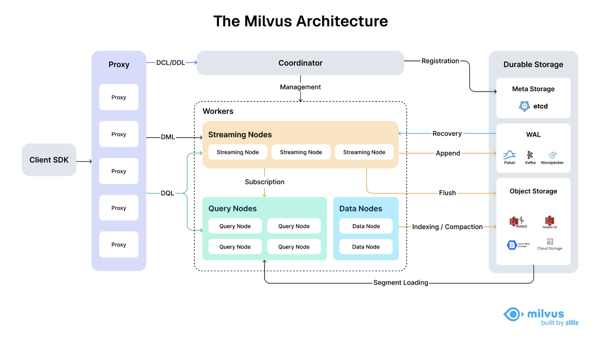

## 1.3 Analysis of Milvus Core Architecture and Components
### Overview of Milvus' Distributed Architecture
Following the principle of separating the data plane and control plane, Milvus consists of four layers: the access layer, coordinator, worker nodes, and storage. These layers operate independently during scaling or disaster recovery.


### Detailed Explanation of Core Component Functions
#### Proxy
+ **Proxy**：Request entry point, load balancing.
    - Composed of a set of stateless proxies, it serves as the front-end layer of the system and the user's endpoint.
    - It provides a unified service address using load balancing components such as Nginx, Kubernetes Ingress, NodePort, and LVS.

#### Coordinator
> The Coordinator serves as the system's brain, responsible for assigning tasks to worker nodes.

+ **Rootcoord**：Root Coordinator, manages topology and tasks.
    - Handles data definition language (DDL) and data control language (DCL) requests, such as creating or deleting collections, partitions, or indexes.
    - Manages timestamp Oracle (TSO) and time ticker issuing.
+ **Querycoord**：Query coordinator, manages query nodes and index loading.
    - Manages topology and load balancing for the Query Nodes, and switches from growing network segments to sealed network segments.
+ **Datacoord**：Data ingestion coordinator, manages data segments.
    - Manages the topology of data nodes and index nodes, maintains metadata, and triggers refresh, compaction, index building, and other background data operations.

#### Worker Nodes
> Work nodes are the arms and legs of the system. They follow instructions from the coordinator and execute Data Manipulation Language (DML) commands from agents.

+ **Data Nodes**: Write nodes that handle data writes and persistence
    - Retrieve incremental log data by subscribing to **log broker** and transform it into growing shards. Load historical data from **object storage** and run hybrid searches across vector and scalar data.
+ **Query Nodes**: Query nodes that load data and indexes, execute searches/queries
    - Retrieve incremental log data by subscribing to **log broker**, process mutation requests, package log data into log snapshots, and store them in **object storage**.
+ **Index Nodes**: Index-building nodes that execute index-building tasks
    - Index nodes construct indexes. Index nodes do not need to reside in memory and can be implemented using serverless frameworks.

#### Storage
> Storage is the bone of the system, responsible for data persistence. 

+ **Meta storage**：
    - Meta storage stores snapshots of metadata such as collection schema, and message consumption checkpoints.
    - Storing metadata demands extremely high availability, strong consistency, and transaction support, so Milvus chose etcd for meta store.
    - Milvus also uses etcd for service registration and health check.
+ **Object storage**：
    - Object storage stores snapshot files of logs, index files for scalar and vector data, and intermediate query results. 
    - Milvus uses MinIO as object storage and can be readily deployed on AWS S3 and Azure Blob, two of the world’s most popular, cost-effective storage services. 
    - However, object storage has high access latency and charges by the number of queries. To improve its performance and lower the costs, Milvus plans to implement cold-hot data separation on a memory- or SSD-based cache pool.
+ **Log broker**：
    - The log broker is a pub-sub system that supports playback. It is responsible for streaming data persistence and event notification. 
    - It also ensures integrity of the incremental data by replaying the message store when the worker nodes recover from system breakdown.
    - Milvus cluster uses Pulsar as log broker; Milvus standalone uses RocksDB as log broker. Besides, the log broker can be readily replaced with streaming data storage platforms such as Kafka.

### Milvus 2.6

- Introduces tiered storage for hot and cold data stratification, balancing performance and cost.
  - Milvus 2.6 introduces a hot-cold storage tiering mechanism that segregates "hot" and "cold" data into distinct tiers: 
  - Frequently accessed hot vector data is retained on high-speed storage media (e.g., local SSDs), while large volumes of cold data that remain unaccessed for extended periods are automatically tiered to low-cost object storage.
  - The entire process is transparent to applications. Milvus retrieves and loads cold data on demand during queries, ensuring retrieval performance remains unaffected.

- Streaming Service enhances real-time vector processing capabilities.
  - Streaming Service is designed to provide Milvus with an efficient, scalable streaming processing engine.
  - It seamlessly integrates with existing mainstream message queues (e.g., Kafka, Pulsar), Woodpecker (Zilliz's proprietary lightweight WAL implementation for cloud-native environments), or directly consumes real-time data streams from data sources.
  - Streaming Service introduces a new role: Streaming Node. Streaming Node closely collaborates with other Milvus components (such as Query Node and Data Node).
  - Streaming Node
    - Responsible for fetching data from sources, performing necessary preprocessing and transformations (e.g., invoking external models for real-time vectorization via Data-In/Data-Out mechanisms), then efficiently distributing processed data to components handling storage and indexing.
    - By introducing a dedicated Streaming Node, Milvus effectively isolates streaming processing workloads from batch processing workloads, preventing large-scale real-time data ingestion from impacting existing query performance.
- Supports 100k Collections;





```python

```


```python

```
