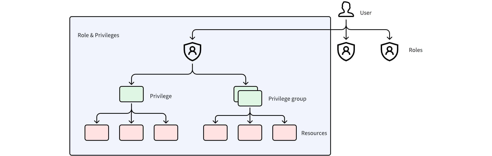

## 1.4 Milvus 访问控制 RBAC
在上一节中，我们学习了向量数据库 Milvus 的核心架构与组件。现在，我们将学习 Mivlus 一个至关重要的能力：访问控制 RBAC。

### 为什么使用 Milvus 时访问控制很重要？
当团队规模较小，其人工智能应用程序只服务于数量有限的用户时，基础设施通常比较简单。少数工程师负责管理系统；Milvus 仅用于开发或测试；操作工作流程简单明了。在这一早期阶段，访问控制很少让人感到紧迫--因为风险面很小，而且任何错误都很容易逆转。

随着 Milvus 进入生产阶段，用户、服务和操作符的数量不断增加，使用模型也迅速发生变化。常见的情况包括：
* 多个业务系统共享同一个 Milvus 实例
* 多个团队访问同一个向量 Collections
* 测试、暂存和生产数据共存于一个集群中
* 从只读查询到写入和操作符控制，不同角色需要不同级别的访问权限

如果没有定义明确的访问边界，这些设置就会产生可预见的风险：
* 测试工作流可能会意外删除生产收集
* 开发人员可能会无意中修改实时服务使用的索引
* root 账户的广泛使用导致无法跟踪或审计操作
* 受到攻击的应用程序可能会不受限制地访问所有向量数据

随着使用量的增加，依靠非正式约定或共享管理员账户已难以为继。一个一致的、可执行的访问模型变得至关重要，而这正是 Milvus RBAC 所提供的。

### Milvus 中的 RBAC 是什么？
[RBAC（基于角色的访问控制）](https://milvus.io/docs/zh/rbac.md)是一种基于角色而不是单个用户来控制访问的权限模型。在 Milvus 中，RBAC 可让您准确定义允许用户或服务执行哪些操作，以及对哪些特定资源执行操作。它提供了一种结构化、可扩展的安全管理方式，当你的系统从单个开发人员发展到一个完整的生产环境时，它也能发挥作用。

Milvus RBAC 围绕以下核心组件构建：


- **资源**：被访问的实体。在 Milvus 中，资源包括实例、数据库和 Collection。
- **权限**：资源上允许的特定操作符--例如，创建 Collections、插入数据或删除实体。
- **权限组**：一组预定义的相关权限，如 "只读" 或 "写入"。
- **角色**：权限及其适用资源的组合。角色决定了可以执行哪些操作以及在哪里执行。
- **用户**：Milvus 中的一个身份。每个用户都有一个唯一的 ID，并被分配一个或多个角色。

这些组件形成一个清晰的层次结构：
- **用户被分配角色**
- **角色定义权限**
- **权限适用于特定资源**

Milvus 的一个关键设计原则是，绝不将权限直接分配给用户。所有访问都通过角色进行。这种间接方式简化了管理，减少了配置错误，并使权限变更具有可预测性。

在实际部署中，该模型的扩展性很好。当多个用户共享一个角色时，更新该角色的权限会立即更新所有用户的权限，而无需对每个用户进行单独修改。这是一种单点控制，符合现代基础设施管理访问的方式。

### 如何在 Milvus 中通过 RBAC 配置访问控制
#### 1.前提条件
在评估和执行 RBAC 规则之前，必须启用用户身份验证，以便 Milvus 的每个请求都能与特定的用户身份相关联。

以下是两种标准部署方法。
- **使用 Docker Compose 部署**   
如果使用 Docker Compose 部署 Milvus，请编辑 `milvus.yaml` 配置文件，并通过将 `common.security.authorizationEnabled` 设置为 `true` 来启用授权：

    ```yaml
    common:
    security:
        authorizationEnabled: true
    ```

- **使用 Helm Charts 部署**  
如果使用 Helm Charts 部署 Milvus，请编辑 `values.yaml` 文件并在 `extraConfigFiles.user.yaml` 中添加以下配置：

    ```yaml
    extraConfigFiles:
    user.yaml: |+
        common:
        security:
            authorizationEnabled: true
    ```

#### 2.初始化
默认情况下，Milvus 会在系统启动时创建一个内置的 `root` 用户。该用户的默认密码为 `Milvus`。

作为初始安全步骤，使用 `root` 用户连接 Milvus，并立即更改默认密码。强烈建议使用复杂密码，以防止未经授权的访问。


```python
from pymilvus import MilvusClient
# Connect to Milvus using the default root user
client = MilvusClient(
    uri='http://localhost:19530', 
    token="root:Milvus"
)
# Update the root password
client.update_password(
    user_name="root",
    old_password="Milvus", 
    new_password="xgOoLudt3Kc#Pq68"
)
```

#### 3.核心操作符
##### 3.1 创建用户

在日常使用中，建议创建专用用户，而不是使用 `root` 账户。


```python
client.create_user(user_name="user_1", password="P@ssw0rd")
```

##### 3.2 创建角色

Milvus 提供了具有完全管理权限的内置 `admin` 角色。不过，对于大多数生产场景，建议创建自定义角色，以实现更精细的访问控制。


```python
client.create_role(role_name="role_a")
```

##### 3.3 创建权限组

权限组是多个权限的组合。为简化权限管理，可将相关权限分组并一起授予。

Milvus 包含以下内置权限组：
* `COLL_RO`、`COLL_RW`、`COLL_ADMIN`
* `DB_RO`、`DB_RW`、`DB_ADMIN`
* `Cluster_RO`、`Cluster_RW`、`Cluster_ADMIN`

使用这些内置权限组可以大大降低权限设计的复杂性，并提高不同角色之间的一致性。

你既可以直接使用内置权限组，也可以根据需要创建自定义权限组。


```python
# Create a privilege group
client.create_privilege_group(group_name='privilege_group_1')
# Add privileges to the privilege group
client.add_privileges_to_group(group_name='privilege_group_1', privileges=['Query', 'Search'])
```

##### 3.4 为角色授予权限或权限组

创建角色后，可向角色授予权限或权限组。这些特权的目标资源可以在不同级别指定，包括实例、数据库或单个 Collection。


```python
client.grant_privilege_v2(
    role_name="role_a",
    privilege="Search",
    collection_name='collection_01',
    db_name='default',
)
client.grant_privilege_v2(
    role_name="role_a",
    privilege="privilege_group_1",
    collection_name='collection_01',
    db_name='default',
)
client.grant_privilege_v2(
    role_name="role_a",
    privilege="ClusterReadOnly",
    collection_name='*',
    db_name='*',
)
```

##### 3.5 向用户授予角色
一旦为用户分配了角色，用户就可以访问资源并执行这些角色所定义的操作符。根据所需的访问范围，一个用户可以被授予一个或多个角色。


```python
client.grant_role(user_name="user_1", role_name="role_a")
```

#### 4.检查和撤销访问
**检查分配给用户的角色**


```python
client.describe_user(user_name="user_1")
```

**检查分配给角色的权限**


```python
client.describe_role(role_name="role_a")
```

**撤销分配给角色的权限**


```python
client.revoke_privilege_v2(
    role_name="role_a",
    privilege="Search",
    collection_name='collection_01',
    db_name='default',
)
client.revoke_privilege_v2(
    role_name="role_a",
    privilege="privilege_group_1",
    collection_name='collection_01',
    db_name='default',
)
```

**撤销用户的角色**


```python
client.revoke_role(
    user_name='user_1',
    role_name='role_a'
)
```

**删除用户和角色**


```python
client.drop_user(user_name="user_1")
client.drop_role(role_name="role_a")
```

### 示例：Milvus 驱动的 RAG 系统的访问控制设计
考虑建立在 Milvus 基础上的检索-增强生成（RAG）系统。

在这个系统中，不同的组件和用户有明确的职责分工，每个组件和用户都需要不同级别的访问权限。

| **行为者** | **责任** | **所需访问权限** |
| --- | --- | --- |
| 平台管理员 | 系统操作和配置 | 实例级管理 |
| 向量摄取服务 | 向量数据摄取和更新 | 读写访问 |
| 搜索服务 | 向量搜索和检索 | 只读访问 |


```python
from pymilvus import MilvusClient
client = MilvusClient(
    uri='http://localhost:19530',
    token="root:xxx"  # Replace with the updated root password
)
# 1. Create a user (use a strong password)
client.create_user(user_name="rag_admin", password="xxx")
client.create_user(user_name="rag_reader", password="xxx")
client.create_user(user_name="rag_writer", password="xxx")
# 2. Create roles
client.create_role(role_name="role_admin")
client.create_role(role_name="role_read_only")
client.create_role(role_name="role_read_write")
# 3. Grant privileges to the role
## Using built-in Milvus privilege groups
client.grant_privilege_v2(
    role_name="role_admin",
    privilege="Cluster_Admin",
    collection_name='*',
    db_name='*',
)
client.grant_privilege_v2(
    role_name="role_read_only",
    privilege="COLL_RO",
    collection_name='*',
    db_name='default',
)
client.grant_privilege_v2(
    role_name="role_read_write",
    privilege="COLL_RW",
    collection_name='*',
    db_name='default',
)
# 4. Assign the role to the user
client.grant_role(user_name="rag_admin", role_name="role_admin")
client.grant_role(user_name="rag_reader", role_name="role_read_only")
client.grant_role(user_name="rag_writer", role_name="role_read_write")
```

### 快速提示：如何在生产中安全操作访问控制
为确保访问控制在长期运行的生产系统中始终有效且易于管理，请遵循以下实用指南。

1. **更改 `root` 的默认密码并限制使用 `root` 账户**  
初始化后立即更新默认的 `root` 密码，并限制其仅用于管理任务。避免在日常操作中使用或共享 `root` 帐户。相反，应为日常访问创建专用用户和角色，以降低风险并加强问责制。

2. **跨环境物理隔离 Milvus 实例**  
为开发、暂存和生产部署独立的 Milvus 实例。与单纯的逻辑访问控制相比，物理隔离提供了更强的安全边界，大大降低了跨环境错误的风险。

3. **遵循最小权限原则**  
只授予每个角色所需的权限：
- **开发环境**：权限可以更宽松，以支持迭代和测试
- **生产环境**：权限应严格限制在必要的范围内
- **定期审核**：定期审核现有权限，确保其仍为必要权限

4. **当不再需要权限时，主动撤销权限**  
访问控制不是一次性设置，需要持续维护。当用户、服务或职责发生变化时，及时撤销角色和权限。这可以防止未使用的权限随着时间的推移不断累积，成为隐藏的安全风险。

### 结论
在 Milvus 中配置访问控制本身并不复杂，但对于在生产中安全可靠地操作该系统至关重要。通过精心设计的 RBAC 模型，你可以

- 防止意外或破坏性操作，**降低风险**
- 通过执行最少权限访问向量数据来**提高安全性**
- 通过明确的职责分工**实现操作符标准化**
- **放心扩展**，为多租户和大规模部署奠定基础

访问控制不是可有可无的功能，也不是一次性任务。它是长期安全操作 Milvus 的基础部分。
