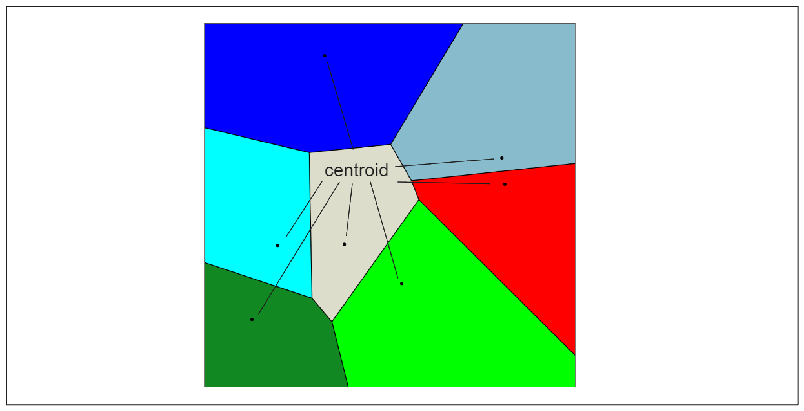
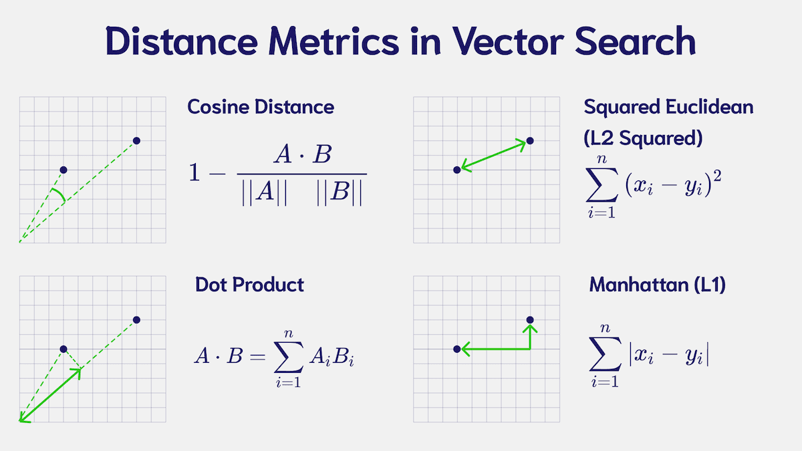
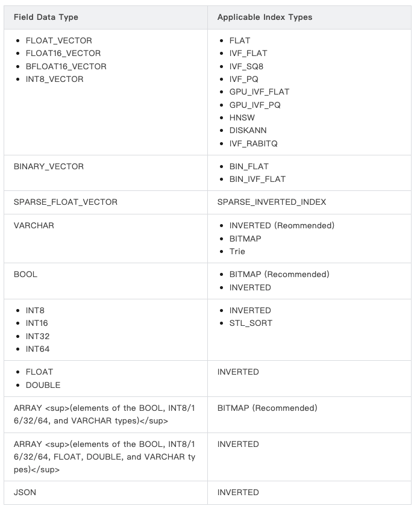

 ## 2.3 Building and Managing Indexes [](https://colab.research.google.com/github/richzw/milvus-workshop/blob/main/ch2/ch2_3_en.ipynb)

 In the previous section, we learned how to create Collections, insert data, and manage data. Now, we will delve into a crucial concept in Milvus: **Index**. Index is the core mechanism for enabling efficient vector similarity search.


 ### Concept: Index - The Key to Accelerating Vector Similarity Search

 In large-scale vector datasets, sequentially comparing a query vector against every vector in the database to find the most similar ones (i.e., brute-force search or exact search) is extremely time-consuming and impractical. **Indexes** are specialized data structures that preprocess and organize raw vector data. This enables them to **significantly accelerate** similarity searches, either by sacrificing some precision (for approximate searches) or without sacrificing precision (for specific indexes like FLAT).

 - **Purpose**: Rapidly identify candidate vectors similar to the query vector, reducing the number requiring exact distance calculations.
 - **Trade-offs**: Most high-performance indexes (ANNS indexes) balance **search speed**, **accuracy (recall)**, and **index construction time/resources**.

 ### Core: Approximate Nearest Neighbor Search (ANNS)

 For massive high-dimensional vector data, exact nearest neighbor search (ENN) is often computationally prohibitively expensive. Therefore, Milvus and many other vector databases primarily employ **Approximate Nearest Neighbor Search (ANNS)** algorithms.

 - **ANNS**: The goal is to find "good enough" approximate results within acceptable time, rather than guaranteeing the absolute nearest neighbors.
 - **Recall**: A key evaluation metric for ANNS algorithms, indicating the proportion of true nearest neighbors included in the search results. Generally, higher recall implies greater search precision but may also demand more computational resources and time.
 - Milvus supports multiple ANNS indexing algorithms, enabling users to balance speed and accuracy based on specific application requirements.


 ###  Introduction to Common Vector Index Types and Their Use Cases

 Milvus supports multiple vector index types, each with its specific data structure, algorithm, and applicable scenarios. Below are some common index types:

 1.  **`FLAT` (or `FLAT_NM` in some earlier versions)**:

     
     *   **Principle**: Performs precise exhaustive search directly on raw vector data without any compression or clustering.
     *   **Advantages**: 100% recall rate (precise search).
     *   **Disadvantages**: Extremely slow search speed, especially with large datasets. High memory consumption due to storing raw vectors.
     *   **Suitable Scenarios**: Very small datasets (e.g., under tens of thousands of entries), or scenarios demanding absolute recall with acceptable query delays. Typically used for small-scale testing or performance comparisons with other indexes.

 2.  **`IVF_FLAT` (Inverted File with FLAT CQuantizer)**:

     
     *   **Principle**:
         1.  **Clustering**: First, use algorithms like k-means to partition the vectors in the dataset into `nlist` clusters. Each cluster has a centroid vector.
         2.  **Inverted File**: Create an inverted index mapping each vector to its corresponding cluster.
         3.  **Search**: During querying, first identify the `nprobe` closest cluster centroids to the query vector. Then perform an exact search within these selected clusters using FLAT (exhaustive search).
     *   **Advantages**: Significantly faster than FLAT with relatively high recall.
     *   **Disadvantages**: Performance heavily influenced by `nlist` and `nprobe` parameters, requiring tuning.
     *   **Parameters**:
         *   `nlist`: Number of cluster centers. Typically recommended between `4 * sqrt(N)` and `16 * sqrt(N)` (where N is the total number of vectors).
         *   `nprobe` (search parameter): Number of clusters to search during queries. Higher values improve recall but reduce speed.
     *   **Suitable Scenarios**: Scenarios requiring high recall with moderate to large datasets. Serves as an excellent baseline index.

 3.  **`IVF_SQ8` (Inverted File with Scalar Quantization)**:
     *   **Principle**: Similar to `IVF_FLAT`, but when storing vectors within clusters, scalar quantization is used to perform lossy compression, quantizing each floating-point dimension into an 8-bit integer.
     *   **Advantages**: Significantly reduces disk and memory usage compared to `IVF_FLAT`, and typically offers faster query speeds (since comparisons are made on quantized values).
     *   **Disadvantages**: Recall is typically slightly lower than `IVF_FLAT` due to the lossy nature of quantization.
     *   **Parameters**: `nlist` (same as IVF_FLAT), `nprobe` (search parameters).
     *   **Use Cases**: Scenarios sensitive to storage and memory footprint where minor precision loss is acceptable.

 4.  **`IVF_PQ` (Inverted File with Product Quantization)**:
     *   **Principle**: Similar to `IVF_SQ8`, but employs Product Quantization (PQ) within clusters for more advanced vector compression. PQ splits the original vector into multiple subvectors and quantizes each subvector separately.
     *   **Advantages**: Higher compression ratio and reduced memory usage.
     *   **Disadvantages**: Recall may further decrease, and index construction time may increase. Parameter tuning is more complex (e.g., `m` - number of PQ subspaces, `nbits` - quantization bits per subspace).
     *   **Parameters**: `nlist`, `nprobe`, `m`, `nbits`.
     *   **Use Cases**: Scenarios prioritizing minimal memory consumption and high throughput, such as vector searches involving billions of vectors.

 5.  **`HNSW` (Hierarchical Navigable Small World graphs)**:

          
     *   **Principle**: A graph-based ANNS algorithm. It constructs a multi-layered navigational small-world graph, where upper layers are sparser and lower layers are denser. Searches begin at entry points in the top layer and progressively approach the nearest neighbors of the query vector.
     *   **Advantages**: Typically excellent search performance (high recall and high QPS), insensitive to dataset distribution, and does not require data training (clustering) like the IVF family.
     *   **Disadvantages**: Relatively long index construction time and relatively high memory consumption (storing graph structure and raw vectors).
     *   **Parameters**:
         *   `M`: Maximum out-degree (number of connections) per node in the graph. Higher values result in denser graphs and higher recall, but also increase construction time and memory usage. Typically set to 8-64.
         *   `efConstruction`: Size of the dynamic list during index construction (search range). Higher values improve index quality but increase construction time. Typically set to 100-500.
         *   `ef` (search parameter): Size of the dynamic list during queries. Higher values increase recall but reduce speed.
     *   **Applicable Scenarios**: Widely applicable across various scenarios, especially for applications demanding high search performance and recall. Currently one of the most popular indexes.

 **Other Index Types**: Milvus also supports types such as `DISKANN` (for large-scale datasets on disk storage) and `SCANN`. For details, refer to the official Milvus documentation.

    * DiskANN is based on the Vamana graph structure. It builds navigable indexes on hard disks using PQ compressed vectors, suitable for datasets in the billions.


 ### 介绍距离度量 (Distance Metrics)

 距离度量（或相似度度量）用于衡量两个向量之间的“远近”或“相似”程度。在创建索引和执行搜索时，必须指定一个与您的数据和应用场景相匹配的度量方式。

 1.  **欧氏距离 (Euclidean Distance, `L2`)**:
     *   **公式**: $d = \sqrt{\sum_{i=1}^{n}(A_i - B_i)^2}$
     *   **含义**: 向量空间中两点之间的直线距离。值越小，向量越相似。
     *   **适用场景**: 适用于大多数通用场景，特别是当向量的绝对大小和方向都很重要时，例如图像特征向量。

 2.  **内积 (Inner Product, `IP`)**:
     *   **公式**: $d = \sum_{i=1}^{n}(A_i \cdot B_i)$
     *   **含义**: 衡量两个向量方向上的一致性以及幅度的乘积。值越大，向量越相似。
     *   **适用场景**: 适用于向量方向比绝对大小更重要的场景。例如，推荐系统中用户和物品的嵌入向量。

 3.  **余弦相似度 (Cosine Similarity)**:
     *   **公式**: $similarity = \frac{\sum_{i=1}^{n}(A_i \cdot B_i)}{\sqrt{\sum_{i=1}^{n}A_i^2} \cdot \sqrt{\sum_{i=1}^{n}B_i^2}}$
     *   **含义**: 衡量两个向量方向之间的夹角的余弦值。值在 [-1, 1] 或 [0, 1] (如果向量非负) 之间，值越大（越接近1），向量方向越相似。
     *   **与 IP 的关系**: 如果所有向量都经过归一化 (L2-normalize，即长度为1)，则 IP 等价于余弦相似度。Milvus 在使用 `IP` 度量时，如果向量未归一化，它计算的是纯内积。要获得真正的余弦相似度，**您需要在插入数据前对向量进行归一化处理**。
     *   **适用场景**: 文本相似度 (如 TF-IDF, Word Embeddings)，当向量的长度不重要，只关心方向时。




 **如何选择？**

 - **模型来源**: 最重要的是，选择与您生成向量嵌入（Embeddings）时所用模型的目标函数或相似性度量相一致的度量方式。例如，如果模型是用欧氏距离优化的，那么在 Milvus 中也应该用 `L2`。
 - **数据特性**: 考虑您的数据特性。如果向量长度有实际意义，`L2` 可能更合适。如果只关心方向，`IP` (配合归一化向量以实现余弦相似度) 可能更好。
 - **实验验证**: 如果不确定，可以尝试不同的度量方式，并评估它们在您的验证集上的表现。


[Similarity Metrics for Vector Search](https://zilliz.com/blog/similarity-metrics-for-vector-search)

 ### Hands-On: Creating an Index for a Vector Field

 We will create an HNSW index for the `book_embedding` field in the `book_search_mc` Collection created in the previous exercise.

 **Prerequisites**:
 1.  Milvus server is connected (`client` object is available).
 2.  The `book_search_mc` collection has been created, and **some data has been inserted** along with the completion of the `flush` operation. The index is built based on existing data.


```python
# Ensure that the MilvusClient 'client' has been initialized and connected from the previous section.
from pymilvus import MilvusClient
MILVUS_URI = "http://localhost:19530"
client = MilvusClient(uri=MILVUS_URI)

# Define Collection and Field Name
COLLECTION_NAME_INDEX_EXERCISE = "book_search"
VECTOR_FIELD_NAME_INDEX_EXERCISE = "book_embedding" # Vector field name defined in the schema

# 1. Check whether the Collection exists and contains data
try:
    if not client.has_collection(collection_name=COLLECTION_NAME_INDEX_EXERCISE):
        print(f"Error: Collection '{COLLECTION_NAME_INDEX_EXERCISE}' does not exist. Please run the preceding exercises to create and insert data first.")
        raise ValueError(f"Collection '{COLLECTION_NAME_INDEX_EXERCISE}' not found for indexing.")

    stats = client.get_collection_stats(collection_name=COLLECTION_NAME_INDEX_EXERCISE)
    num_entities_for_index = int(stats.get('row_count', 0))
    print(f"Number of entities currently in the Collection '{COLLECTION_NAME_INDEX_EXERCISE}': {num_entities_for_index}")
    if num_entities_for_index == 0:
        print(f"Warning: Collection '{COLLECTION_NAME_INDEX_EXERCISE}' contains no data. The created index will be empty. It is recommended to insert data first.")
        # Typically, creating indexes without data makes little sense, but Milvus permits this.
        # Indexes will automatically update after data insertion and flush (if auto-build is configured or manually triggered).

except Exception as e:
    print(f"An error occurred while checking the Collection status: {e}")
    raise
```

    Number of entities currently in the Collection 'book_search': 234


```python
# 2. Define index parameters
# We select the HNSW index using L2 distance
# For Workshop, we use smaller parameters to accelerate construction speed
hnsw_index_params = MilvusClient.prepare_index_params()

hnsw_index_params.add_index(
    field_name=VECTOR_FIELD_NAME_INDEX_EXERCISE,
    metric_type="L2",
    index_type="HNSW",
    index_name="idx_book_embedding_hnsw",
    params={
        "M": 8,               # Maximum number of connections per node (smaller value, faster construction)
        "efConstruction": 100 # Search scope during graph construction (smaller value, faster construction)
    }
)

VECTOR_INDEX_NAME='vector_index'

# 3. Create an index
try:
    print(f"\nPreparing to create an index for the field '{VECTOR_FIELD_NAME_INDEX_EXERCISE}' in the Collection '{COLLECTION_NAME_INDEX_EXERCISE}'...")

    # (Optional) Check and delete old indexes to ensure the new parameters are used.
    name_indexes = client.list_indexes(collection_name=COLLECTION_NAME_INDEX_EXERCISE)
    index_exists_for_field = any(idx_name == VECTOR_INDEX_NAME for idx_name in name_indexes)

    if index_exists_for_field:
        print(f"An index already exists on the field '{VECTOR_FIELD_NAME_INDEX_EXERCISE}'. The old index will be deleted and recreated with the new parameters.")
        client.release_collection(collection_name=COLLECTION_NAME_INDEX_EXERCISE)
        try:
            client.drop_index(collection_name=COLLECTION_NAME_INDEX_EXERCISE, index_name=VECTOR_INDEX_NAME)
            print(f"The old index on the field '{VECTOR_FIELD_NAME_INDEX_EXERCISE}' has been deleted.")
        except Exception as drop_e:
            print(f"Failed to delete old index (possibly due to version or permission issues): {drop_e}")
            print("Will continue attempting to create a new index...") # Even if deletion fails, attempt to create.

    print(f"Create an HNSW index using parameters: {hnsw_index_params}")
    client.create_index(
        collection_name=COLLECTION_NAME_INDEX_EXERCISE,
        index_params=hnsw_index_params,
        sync=False 
    )
    print(f"The index creation request has been successfully sent to Milvus.")
    print("Index building is asynchronous. Please check the status later.")

except Exception as e:
    print(f"Index creation failed: {e}")
    raise
```

    
    Preparing to create an index for the field 'book_embedding' in the Collection 'book_search'...
    An index already exists on the field 'book_embedding'. The old index will be deleted and recreated with the new parameters.
    The old index on the field 'book_embedding' has been deleted.
    Create an HNSW index using parameters: [{'field_name': 'book_embedding', 'index_type': 'HNSW', 'index_name': 'idx_book_embedding_hnsw', 'M': 8, 'efConstruction': 100, 'metric_type': 'L2'}]
    The index creation request has been successfully sent to Milvus.
    Index building is asynchronous. Please check the status later.


 ### Hands-on: Checking the index status

 Index creation is asynchronous. We can use the following methods to view index information and construction progress.


```python
from pymilvus import connections, utility

# Connection to localhost:19530
connections.connect()

try:
    print(f"\nView index information for Collection '{COLLECTION_NAME_INDEX_EXERCISE}':")
    indexes_names = client.list_indexes(collection_name=COLLECTION_NAME_INDEX_EXERCISE)
    if not indexes_info:
        print("There are no indexes on the current Collection.")
    else:
        for idx_name in indexes_names: 
            idx_info_dict = client.describe_index(collection_name=COLLECTION_NAME_INDEX_EXERCISE, index_name=idx_name)
            # idx_info_dict is an OmitZeroDict that can be accessed like a regular dictionary.
            print(f"  - Index name: {idx_info_dict.get('index_name', 'N/A')}") # Using .get() is safer.
            print(f"    Field name: {idx_info_dict.get('field_name')}")
            print(f"    Total number of lines: {idx_info_dict.get('total_rows')}") 
            print(f"    Number of indexed rows: {idx_info_dict.get('indexed_rows')}") 
            print(f"    Number of rows being indexed: {idx_info_dict.get('pending_index_rows')}") 
    

            print(f"\nView index construction progress for the field '{VECTOR_FIELD_NAME_INDEX_EXERCISE}':")
            index_progress = utility.index_building_progress(
                collection_name=COLLECTION_NAME_INDEX_EXERCISE,
                index_name=idx_name
            )
            print(f"  Total rows for indexing: {index_progress.get('total_rows', 'N/A')}")
            print(f"  Indexed rows: {index_progress.get('indexed_rows', 'N/A')}")
            print(f"  Pending index rows: {index_progress.get('pending_index_rows', 'N/A')}")
            
            if index_progress.get('total_rows', 0) > 0 and index_progress.get('indexed_rows') == index_progress.get('total_rows') and index_progress.get('pending_index_rows', 0) == 0:
                print("  Status: Index built successfully!")
            elif index_progress.get('total_rows', 0) == 0 and index_progress.get('indexed_rows', 0) == 0 :
                 print("  Status: The Collection may not contain any data, or the index has not yet begun processing data.")
            else:
                print("  Status: Index is still being built or partially completed.")

except Exception as e:
    print(f"An error occurred while viewing index information or progress: {e}")
```

 ### [Which vector index should I choose?](https://mp.weixin.qq.com/s/yJIHKfUOAtz4iWVHURri9g)

- **Correspondence Between Field Types and Available Index Types**:

 

- **Rule**: "Early startup > Slow fine-tuning". Therefore, Milvus provides AutoIndex.

  - AutoIndex
    - For scalar fields, automatically selects indexes based on field type (e.g., hash trees for numeric fields, inverted indexes for strings), allowing for indirect inference.
    - For vector fields, the actual index type is determined internally by Milvus; HNSW is used by default.

--------

- We typically categorize indexes into "memory-based", "disk-based" and "GPU-based" types. Let's explore each of these three categories.

  - **Memory Indexes: Fastest retrieval speed, but high memory cost**. Common indexes like IVF_FLAT and HNSW are all supported by Milvus. Additionally, most indexes quantize vectors to reduce memory usage, but require memory to store additional data structures. Other non-vector data (scalars) and their indexes also occupy memory space.

  - **Disk Indexes: When handling billions of vectors without massive memory, use DiskANN and MMap**. DiskANN stores uncompressed vectors and graph search structures on disk, maintaining only highly compressed copies in memory. Of course, “low latency” comes with a caveat—you must use NVMe drives (SATA performance will make you question life). MMap, meanwhile, uses virtual memory mechanisms to swap indexes between disk and memory as needed. This approach allows loading the entire index even when only a small portion of data is used each time, but frequent page swapping can lead to excessive latency. Many users engaged in log replay and long-tail analysis actually prefer this “on-demand loading” method.

  - **GPU Indexes: GPUs offer benefits like parallelism, multithreading, and high throughput, but their drawbacks are equally clear: complex scheduling, higher costs, and more challenging code maintenance.** Milvus' GPU indexes, powered by NVIDIA RAPIDS, achieve lower latency than CPU indexes in high-concurrency scenarios. However, they become cost-effective only when query volumes reach hundreds or thousands of "GPU-squeezed" operations. After all, GPU memory is typically smaller than CPU RAM, and operational costs are higher.

  - **How to Evaluate Different Indexes**
 
    - When evaluating index performance, we should balance index creation time, QPS, and recall rate, typically following these principles:
      - Graph indexes generally outperform IVF in QPS;
      - IVF is more suitable for scenarios with larger topK values (e.g., > 2000);
      - PQ achieves higher recall than SQ at similar compression rates, but SQ delivers faster performance;
      - Storing partial indexes on disk (e.g., DiskANN) suits massive datasets but may introduce IOPS bottlenecks.
    - Capacity relates to the balance between data volume and available memory. Recommendations are as follows:
      - If 1/4 of the raw data fits in memory, use DiskANN for stable latency;
      - If all data fits in memory, use memory-based indexes + mmap;
      - For maximum capacity, combine quantized indexes with mmap, sacrificing some precision for storage efficiency. **Note**: mmap is not a universal solution. If most data resides on disk, DiskANN delivers superior latency performance.
    - Recall rate is closely related to the filtering ratio:
      - Filtering ratio < 85%: Graph indexes outperform IVF;
      - Filtering ratio 85%–95%: Use IVF;
      - Filtering ratio > 98%: Brute-Force (FLAT) yields the highest accuracy.
    - top-K denotes the number of results returned per query:
      - Small topK (e.g., 2000 or below) + high recall: Graph indexing is superior;
      - Large topK: IVF outperforms graph indexing;
      - Moderate topK + high filtering: IVF delivers better performance.

-----------

- **Index Rule**：


 ### Hands-on Exercise 3: Creating an HNSW Index

 **Tasks**:
 1.  Ensure the `book_search_mc` Collection used in the previous exercise (`Hands-on Exercise 2`) exists and contains some data.
 2.  Create an `HNSW` index for the `book_embedding` field of this Collection.
 3.  **Select the metric type**: `L2`.
 4.  **Select HNSW parameters**:
     *   `M`: 16
     *   `efConstruction`: 200
 5.  Send the request to create the index.
 6.  Use `client.list_indexes()` to verify the index is listed on the Collection.
 7.  Use `client.get_index_build_progress()` to monitor index construction progress (at least `total_rows` and `indexed_rows` will be visible).
 8.  (Optional) For smaller datasets, consider using `client.wait_for_index_build_complete()` to wait for index construction to finish.


```python

```


```python

```


```python

```
