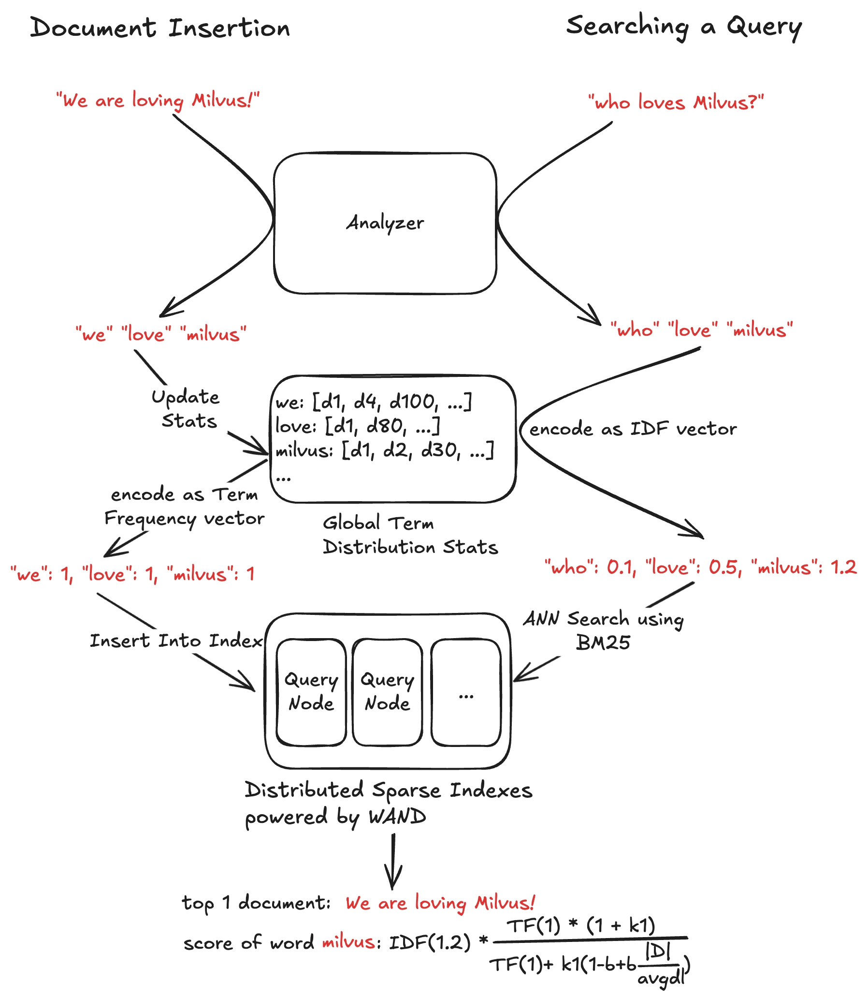
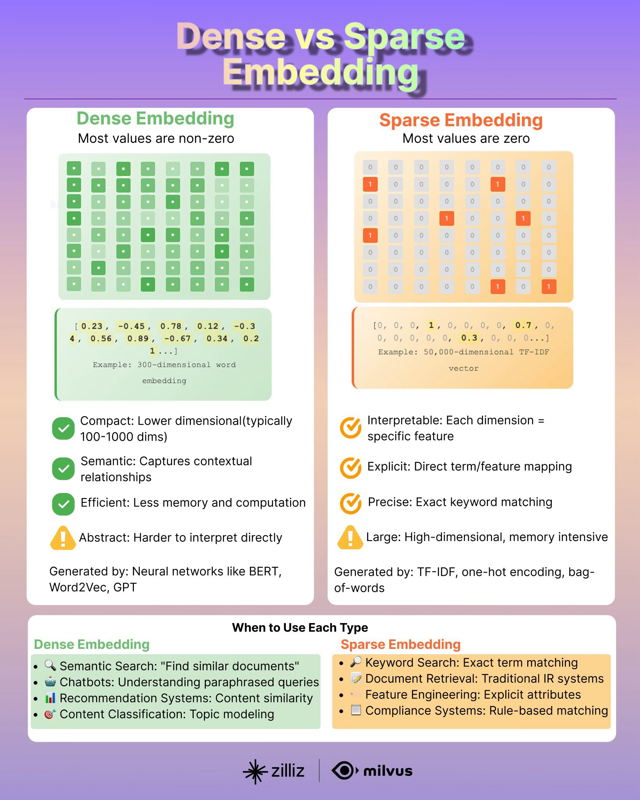

 ## 2.4 Vector Similarity Search, Query, and Hybrid Search [](https://colab.research.google.com/github/richzw/milvus-workshop/blob/main/ch2/ch2_4_en.ipynb) 

 In the previous section, we learned how to create Collections, insert data, and build indexes for vector fields. Now, building on these foundations, we will explore Milvus' core capabilities: vector similarity search, query based on scalar fields, and powerful hybrid search.

 ### Concept: Vector Search - Find the Top K most similar vectors based on input vectors

 **Vector Search** is Milvus' core feature. Its objective is: given one or more query vectors, quickly locate the K vectors in the Collection that are most similar to these query vectors (i.e., the Top K results).

 - **Input**:
     - Query Vectors: One or more vectors with the same dimension as those stored in the Collection.
     - Top K: The number of most similar results to return.
     - Search Parameters: Parameters controlling search behavior, such as index parameters used and filtering conditions.
 - **Process**: Milvus leverages indexes previously built for vector fields (e.g., HNSW, IVF_FLAT) to efficiently locate candidate sets within large vector populations. It calculates the distance/similarity between query vectors and these candidate vectors, ultimately returning the Top K most similar results.
 - **Output**: Typically includes each matching entity's ID, distance/similarity score relative to the query vector, and any other specified scalar fields.

 ### Hands-On: Executing a vector search

 We will perform vector search using the `book_search` Collection created and indexed in the previous exercise.

 **Prerequisites**:
 1.  Milvus server is connected (`client` object is available).
 2.  The `book_search` Collection exists, contains data, and its vector field `book_embedding` has been **successfully indexed and loaded into memory**.


```python
# Ensure the MilvusClient 'client' has been initialized and connected from the previous section.
from pymilvus import MilvusClient
import numpy as np
MILVUS_URI = "http://localhost:19530"
client = MilvusClient(uri=MILVUS_URI)

# Define Collection and related field name
SEARCH_COLLECTION_NAME = "book_search" # Consistent with previous practice
SEARCH_VECTOR_FIELD_NAME = "book_embedding" # Vector Field Name
DIMENSION_SEARCH = 768 # Vector dimensions must be consistent with the Collection Schema

# 1. Ensure the Collection has been loaded
try:
    print(f"Ensure Collection '{SEARCH_COLLECTION_NAME}' is loaded for searching...")
    # client.load_collection is blocking and will wait for loading to complete (or time out).
    client.load_collection(collection_name=SEARCH_COLLECTION_NAME)
    print(f"Collection '{SEARCH_COLLECTION_NAME}' has been successfully loaded or is currently loading.")
    
    # (Optional) Check loading status
    load_state = client.get_load_state(collection_name=SEARCH_COLLECTION_NAME)
    print(f"Collection loading status: {load_state}")
    if load_state.get('state') != 1 and load_state.get('state') != "LoadStateLoaded": # 'state': <LoadState.Loaded: 1>
        # For MilvusClient 2.4.x, load_state['state'] is <LoadState.Loaded: 1>
        # For older versions, it might be a string or a raw number
        # This is a simplified check; the actual LoadState enumeration values may be more complex
        is_loaded = False
        if isinstance(load_state.get('state'), int): # pymilvus 2.3.x style
            is_loaded = (load_state.get('state') == 1) # 1 typically indicates Loaded
        elif hasattr(load_state.get('state'), 'name'): # pymilvus 2.4.x style, state is an Enum member
            is_loaded = (load_state.get('state').name == 'Loaded')
        
        if not is_loaded:
            print(f"Warning: Collection '{SEARCH_COLLECTION_NAME}' is not fully loaded. Searches may fail or produce inaccurate results.")
            # Consider reloading if it fails to load or throwing an error.
            # client.load_collection(collection_name=SEARCH_COLLECTION_NAME)
            # print("Try loading again...")


except Exception as e:
    print(f"Failed to load Collection '{SEARCH_COLLECTION_NAME}': {e}")
    # If loading fails, the search will not be able to proceed.
    raise ValueError(f"Unable to load Collection '{SEARCH_COLLECTION_NAME}'. The search operation cannot proceed.")
```

    Ensure Collection 'book_search' is loaded for searching...
    Collection 'book_search' has been successfully loaded or is currently loading.
    Collection loading status: {'state': <LoadState: Loaded>}
    Warning: Collection 'book_search' is not fully loaded. Searches may fail or produce inaccurate results.


```python
# 2. Prepare Query Vectors
# Typically, query vectors come from user input, another model, etc. Here, we generate one or more randomly.
num_query_vectors = 1
query_vectors = [np.random.rand(DIMENSION_SEARCH).astype(np.float32).tolist() for _ in range(num_query_vectors)]
# If searching only one vector, you can also pass a list directly:
# query_vectors = np.random.rand(DIMENSION_SEARCH).astype(np.float32).tolist() # Error: search data must be list of list
# query_vectors = [np.random.rand(DIMENSION_SEARCH).astype(np.float32).tolist()] # Correct


print(f"Prepared {len(query_vectors)} query vectors.")
# print(f"First query vector (first 5 dimensions): {query_vectors[0][:5]}")
```

    Prepared 1 query vectors.


```python
# 3. Set Search Parameters
# These parameters affect search behavior and performance
top_k = 5 # Return the top 5 most similar results

# Index-related search parameters (search_params)
# - For HNSW indexes, the key parameter is `ef` (size of the dynamic list during search)
# - For IVF_FLAT, IVF_SQ8, etc., the key parameter is `nprobe` (number of clusters searched during queries)
# These parameters are typically specified when creating the index for metric_type and index_type
# The "params" entry in the search_params dictionary defines search-time parameters for a specific index type
# metric_type should match the value used during index creation
search_params_hnsw = {
    "metric_type": "L2", # Must be consistent with the time of index creation.
    "params": {"ef": 64}, # The larger the ef, the higher the recall rate, but the slower the processing. Typically, ef > top_k.
}

# search_params_ivf = {
#     "metric_type": "L2",
#     "params": {"nprobe": 10},
# }

# Assuming we created an HNSW index for the 'book_embedding' field, use search_params_hnsw.
current_search_params = search_params_hnsw

# 4. Perform Vector Search
print(f"\nBegin executing vector search (Top K = {top_k})...")
try:
    search_results = client.search(
        collection_name=SEARCH_COLLECTION_NAME,
        data=query_vectors,                       # Query Vector List (list of lists)
        anns_field=SEARCH_VECTOR_FIELD_NAME,      # The name of the vector field to search on
        limit=top_k,                              # Number of returned results (Top K)
        search_params=current_search_params,      # Index-related search parameters
        # expr="publication_year > 2000",         # (Optional) Filter conditions for hybrid search, to be covered later
        output_fields=["book_title", "publication_year"], # (Optional) Scalar fields to be returned in the results
        consistency_level="Strong"                # (Optional) Consistency level, default "Bounded"
                                                  # Strong: Ensures access to the latest data, but may experience higher latency.
                                                  # Bounded: Allows for a certain degree of data expiration, resulting in better performance.
    )
    print("Vector search completed.")

    # 5. Interpreting Search Results
    # `search_results` is a list where each element corresponds to the result of a query vector
    # Each query vector result is itself a list containing the Top K matches
    # Each match is a dictionary (OmitZeroDict) containing 'id', 'distance', and specified 'output_fields'
    
    if not search_results:
        print("The search did not return any results.")
    else:
        for i, hits in enumerate(search_results): # hits correspond to all matches for a query vector
            print(f"\nQuery vector #{i+1} results:")
            if not hits:
                print("  No matches found.")
            else:
                for hit in hits: # A hit corresponds to a matched entity.
                    # A hit is either a pymilvus.client.types.Hit object or a dictionary-like object.
                    # Accessible via hit.id, hit.distance, hit.entity.get("field_name")
                    # Or accessed like a dictionary: hit['id'], hit['distance'], hit['entity']['field_name']
                    # (Depending on PyMilvus version, MilvusClient typically returns dictionary-like structures)
                    
                    entity_id = hit.get('id')
                    distance = hit.get('distance')
                    fields = hit.get('entity', {}) # 'entity' key contains output_fields
                    
                    print(f"  - ID: {entity_id}, distance: {distance:.4f}")
                    if "book_title" in fields:
                        print(f"    book title: {fields['book_title']}")
                    if "publication_year" in fields:
                        print(f"    publication year: {fields['publication_year']}")
                    # You can also directly print the `hit` object to view its structure.
                    # print(f"    Original Hit Object: {hit}")


except Exception as e:
    print(f"Vector search failed: {e}")
    raise
```

    
    Begin executing vector search (Top K = 5)...
    Vector search completed.
    
    Query vector #1 results:
      - ID: None, distance: 112.4192
        book title: The Amazing Book Title 86
        publication year: 2004
      - ID: None, distance: 112.4192
        book title: The Amazing Book Title 86
        publication year: 2004
      - ID: None, distance: 112.4192
        book title: The Amazing Book Title 86
        publication year: 2004
      - ID: None, distance: 115.0183
        book title: The Amazing Book Title 65
        publication year: 2021
      - ID: None, distance: 115.0183
        book title: The Amazing Book Title 65
        publication year: 2021


 #### Explain the search results (`ef` for HNSW, `nprobe` for IVF)

 These parameters are specified under the `“params”` key within the `search_params` dictionary of `client.search()`, and they are closely tied to the index type selected during index creation.

 - **`ef` (for HNSW index)**:
     - **Meaning**: "Effective Factor". The size of the dynamic candidate list maintained during searches in the HNSW graph.
     - **Impact**:
         - **Recall**: A larger `ef` value broadens the search scope, increasing the likelihood of finding true nearest neighbors and typically improving recall.
         - **QPS**: A larger `ef` value requires exploring and comparing more nodes, prolonging search duration and reducing QPS (queries per second).
     - **Recommendation**: `ef` must be greater than or equal to `top_k`. Typically, `ef` should be several to several dozen times `top_k`, depending on the balance required between recall and speed. Experimental tuning is necessary.

 - **`nprobe` (for IVF_FLAT, IVF_SQ8, IVF_PQ indexes)**:
     - **Meaning**: "Number of Probes"。In IVF (inverted file) based indexes, when a query vector arrives, it is first compared against the centroids of all clusters. Then, the `nprobe` most similar clusters are selected for further precise search.
     - **Impact**:
         - **Recall**: A larger `nprobe` value increases the number of clusters searched, raising the probability of selecting a cluster containing the true nearest neighbor and typically improving recall.
         - **QPS**: A larger `nprobe` value requires searching within more clusters, increasing computational load and reducing QPS.
     - **Recommendation**: Typically start with a small `nprobe` value (e.g., 1 or 2) and incrementally increase it until a satisfactory balance between recall and speed is achieved. Its upper limit is the `nlist` parameter set during index creation.

 **Optimization**: These parameters are critical for performance optimization. Experimentation on a validation set is usually required to find the optimal balance between recall and QPS for a specific application scenario by adjusting these values.


 ### Concept: Data Query - Retrieve data based on filter conditions for Scalar Fields

 **Data Query** enables you to retrieve entities based on conditions defined for Scalar Fields, functioning similarly to the SQL `WHERE` clause in traditional databases. It **does not involve vector similarity calculations**.

 - **Purpose**: Filter entities meeting specific attribute conditions.
 - **Filter Expression (`filter` or `expr`)**: Defines filtering criteria using a specific string expression syntax.
     - Supports common comparison operators: `==`, `!=`, `>`, `<`, `>=`, `<=`
     - Supports logical operators: `and`, `or`, `not`
     - Supports range queries: `in`, `not in` (e.g., `year in [2020, 2021]`)
     - Supports string matching: `like` (e.g., `title like “The%”`, where `%` is a wildcard)
     - Field name and string value require appropriate quotation marks (field name is typically not required; string values use double or single quotes).
- **Output**: Returns all entities matching the filter conditions. You can specify `output_fields` to retrieve specific fields, or set `limit` and `offset` for pagination.

 ### Hands-On: Executing a data query

 We will execute several scalar field-based queries on the `book_search` Collection.


```python
print("\nBeginning data query...")

# Query Example 1: Find books published in a specific year
filter_expr_1 = "publication_year == 2005"
try:
    print(f"\nQuery condition: {filter_expr_1}")
    query_results_1 = client.query(
        collection_name=SEARCH_COLLECTION_NAME,
        filter=filter_expr_1, # MilvusClient 2.3+ uses filter; older versions or Collection objects use expr.
        output_fields=["book_id", "book_title", "publication_year"],
        limit=10 # Return a maximum of 10 items.
    )
    print(f"Found {len(query_results_1)} entities matching the criteria:")
    for i, entity_dict in enumerate(query_results_1):
        # entity_dict is a dictionary containing output_fields.
        print(f"  - Result #{i+1}: ID={entity_dict.get('book_id')}, "
              f"Title='{entity_dict.get('book_title')}', "
              f"Year={entity_dict.get('publication_year')}")
except Exception as e:
    print(f"Data query (condition 1) failed: {e}")

# Query Example 2: Find books whose titles begin with "Amazing" and were published after 2010.
filter_expr_2 = 'book_title like "The Amazing%" and publication_year > 2010'
# Note: The string value "The Amazing%"" must be enclosed in quotation marks. Field names typically do not require quotation marks.
try:
    print(f"\nQuery condition: {filter_expr_2}")
    query_results_2 = client.query(
        collection_name=SEARCH_COLLECTION_NAME,
        filter=filter_expr_2,
        output_fields=["book_id", "book_title", "publication_year"],
        limit=5
    )
    print(f"Found {len(query_results_2)} entities matching the condition:")
    for i, entity_dict in enumerate(query_results_2):
        print(f"  - Result #{i+1}: ID={entity_dict.get('book_id')}, "
              f"Title='{entity_dict.get('book_title')}', "
              f"Year={entity_dict.get('publication_year')}")
except Exception as e:
    print(f"Data query (condition 2) failed: {e}")

# Query Example 3: Using the 'in' Operator
filter_expr_3 = "publication_year in [1985, 1995, 2015]"
try:
    print(f"\nQuery condition: {filter_expr_3}")
    query_results_3 = client.query(
        collection_name=SEARCH_COLLECTION_NAME,
        filter=filter_expr_3,
        output_fields=["book_id", "book_title", "publication_year"],
        limit=10
    )
    print(f"Found {len(query_results_3)} entities matching the condition:")
    for i, entity_dict in enumerate(query_results_3):
        print(f"  - Result #{i+1}: ID={entity_dict.get('book_id')}, "
              f"Title='{entity_dict.get('book_title')}', "
              f"Year={entity_dict.get('publication_year')}")
except Exception as e:
    print(f"Data query (condition 3) failed: {e}")
```

    
    Beginning data query...
    
    Query condition: publication_year == 2005
    Found 3 entities matching the criteria:
      - Result #1: ID=461486305505040454, Title='The Amazing Book Title 68', Year=2005
      - Result #2: ID=461486305505040556, Title='The Amazing Book Title 68', Year=2005
      - Result #3: ID=461486305505040658, Title='The Amazing Book Title 68', Year=2005
    
    Query condition: book_title like "The Amazing%" and publication_year > 2010
    Found 5 entities matching the condition:
      - Result #1: ID=461486305505040389, Title='The Amazing Book Title 4', Year=2015
      - Result #2: ID=461486305505040393, Title='The Amazing Book Title 8', Year=2019
      - Result #3: ID=461486305505040394, Title='The Amazing Book Title 9', Year=2018
      - Result #4: ID=461486305505040397, Title='The Amazing Book Title 12', Year=2016
      - Result #5: ID=461486305505040400, Title='The Amazing Book Title 15', Year=2017
    
    Query condition: publication_year in [1985, 1995, 2015]
    Found 8 entities matching the condition:
      - Result #1: ID=461486305505040387, Title='The Amazing Book Title 2', Year=1995
      - Result #2: ID=461486305505040389, Title='The Amazing Book Title 4', Year=2015
      - Result #3: ID=461486305505040485, Title='The Amazing Book Title 99', Year=1995
      - Result #4: ID=461486305505040489, Title='The Amazing Book Title 2', Year=1995
      - Result #5: ID=461486305505040491, Title='The Amazing Book Title 4', Year=2015
      - Result #6: ID=461486305505040587, Title='The Amazing Book Title 99', Year=1995
      - Result #7: ID=461486305505040593, Title='The Amazing Book Title 4', Year=2015
      - Result #8: ID=461486305505040689, Title='The Amazing Book Title 99', Year=1995


 ### Concept: Hybrid Search - Combining vector similarity and Sparse-BM25 filtering conditions for searching

-------

 #### Milvus 2.5 supports full-text search [Sparse-BM25](https://milvus.io/blog/full-text-search-in-milvus-what-is-under-the-hood.md)


 
-------

Milvus supports dense, sparse, and **Hybrid Search** modes:

- **Dense Search**: Utilizes semantic context to understand the intent behind queries.
- **Sparse Search**: Emphasizes keyword matching, finding results based on specific words, equivalent to full-text search.
- **Hybrid Search**: Combines dense and sparse approaches, capturing both complete semantic context and specific keyword matches to deliver more comprehensive search results.


 ### Hands-on: Executing a hybrid search


**Query Collection**

To support BM25 sparse filtering, add the **book_sparse** field to the collection and ensure the book_title field has the analyzer enabled (**enable_analyzer=True**) so Milvus can perform tokenization and processing on the text.


```python
from pymilvus import CollectionSchema, FieldSchema, DataType, Function, FunctionType

field_book_id = FieldSchema(name="book_id", dtype=DataType.INT64, is_primary=True, auto_id=True)

analyzer_params = {"tokenizer": "standard"}
field_book_title = FieldSchema(name="book_title", 
                               dtype=DataType.VARCHAR, 
                               max_length=512,
                               analyzer_params=analyzer_params,
                               enable_analyzer=True)
field_publication_year = FieldSchema(name="publication_year", dtype=DataType.INT32)
field_book_embedding = FieldSchema(name="book_embedding", dtype=DataType.FLOAT_VECTOR, dim=768)
field_book_sparse = FieldSchema(name="book_sparse", dtype=DataType.SPARSE_FLOAT_VECTOR)

book_schema_def = CollectionSchema(
    fields=[field_book_id, field_book_title, field_publication_year, field_book_embedding, field_book_sparse],
    description="Collection for storing book information and embeddings",
    enable_dynamic_field=False
)

# The BM25 function automatically converts the text in book_title into a sparse vector, which is stored in the book_sparse field.
bm25_function = Function(
    name="book_title_bm25_emb",
    input_field_names=["book_title"],
    output_field_names=["book_sparse"],
    function_type=FunctionType.BM25
)
book_schema_def.add_function(bm25_function)

# Create Index
index_params = MilvusClient.prepare_index_params()
index_params.add_index(
    field_name="book_embedding",
    metric_type="COSINE",
    index_type="IVF_FLAT",
    index_name="vector_index",
    params={ "nlist": 128 }
)
index_params.add_index(
    field_name="book_sparse",
    index_type="SPARSE_INVERTED_INDEX",
    metric_type="BM25",
)

if client.has_collection(EXERCISE_COLLECTION_NAME):
    client.drop_collection(EXERCISE_COLLECTION_NAME)
    
# Test collection name
EXERCISE_COLLECTION_NAME = "book_search_hybrid"
client.create_collection(collection_name=EXERCISE_COLLECTION_NAME, 
                         schema=book_schema_def,
                         index_params=index_params)

print(f"Collection '{EXERCISE_COLLECTION_NAME}' created successfully")
```


```python
import random

books = [
    {"book_title": "Pride and Prejudice", "publication_year": 1813, "book_embedding": [random.uniform(0, 1) for _ in range(768)]},
    {"book_title": "1984", "publication_year": 1949, "book_embedding": [random.uniform(0, 1) for _ in range(768)]},
    {"book_title": "The Catcher in the Rye", "publication_year": 1951, "book_embedding": [random.uniform(0, 1) for _ in range(768)]},
    {"book_title": "Moby-Dick", "publication_year": 1851, "book_embedding": [random.uniform(0, 1) for _ in range(768)]},
    {"book_title": "Brave New World", "publication_year": 1932, "book_embedding": [random.uniform(0, 1) for _ in range(768)]},
    {"book_title": "The Hobbit", "publication_year": 1937, "book_embedding": [random.uniform(0, 1) for _ in range(768)]},
    {"book_title": "Lord of the Flies", "publication_year": 1954, "book_embedding": [random.uniform(0, 1) for _ in range(768)]},
    {"book_title": "Jane Eyre", "publication_year": 1847, "book_embedding": [random.uniform(0, 1) for _ in range(768)]},
    {"book_title": "Animal Farm", "publication_year": 1945, "book_embedding": [random.uniform(0, 1) for _ in range(768)]},
    {"book_title": "Fahrenheit 451", "publication_year": 1953, "book_embedding": [random.uniform(0, 1) for _ in range(768)]},
]
client.insert(collection_name=EXERCISE_COLLECTION_NAME, data=books)
```


    {'insert_count': 10, 'ids': [457888763904009812, 457888763904009813, 457888763904009814, 457888763904009815, 457888763904009816, 457888763904009817, 457888763904009818, 457888763904009819, 457888763904009820, 457888763904009821], 'cost': 0}


```python
print("\nBeginning execution of the hybrid query...")

# Prepare the query vector
# query_vectors = [np.random.rand(DIMENSION_SEARCH).astype(np.float32).tolist() for _ in range(num_query_vectors)]
query_text = "classic american literature"
query_vectors = [0.5] * 768
limit_num = 3

# %%
# Create an AnnSearchRequest object
from pymilvus import AnnSearchRequest, RRFRanker

dense_req = AnnSearchRequest(
    data=[query_vectors],
    anns_field="book_embedding",
    param={"metric_type": "COSINE"},
    # expr=filter_strategy1,
    limit=limit_num
)

sparse_req = AnnSearchRequest(
    data=[query_text],
    anns_field="book_sparse",
    param={"metric_type": "BM25"},
    # expr=filter_strategy2,
    limit=limit_num
)

# Define RRFRanker (Reciprocal Rank Fusion)
# RRFRanker calculates a fusion score based on each result's rank within its respective recall list
# k is an internal smoothing parameter in the RRF algorithm, typically set around 60, which influences score computation.
rrf_ranker = RRFRanker(k=60)

print(f"\nPrepare to execute hybrid_search, combining two recall streams, and ultimately return the Top {limit_num} results.")

# %%
# Execute hybrid_search
try:
    hs_results = client.hybrid_search(
        collection_name=EXERCISE_COLLECTION_NAME,
        reqs=[dense_req, sparse_req], # Contains two recall requests.
        ranker=rrf_ranker,                           # Performing fusion using RRFRanker
        limit=limit_num,                             # Number of results returned
        output_fields=["book_title", "publication_year"],
        consistency_level="Strong"
    )
    print("Multi-strategy hybrid_search completed.")

    # Explain results 
    if not hs_results or not hs_results[0]:
        print("The multi-strategy hybrid_search did not return any results.")
    else:
        results_for_query = hs_results[0] # The result corresponding to the first (and only) query vector
        print(f"\nQuery vector #1's multi-strategy hybrid_search results (final Top {limit_num}):")
        for i, hit in enumerate(results_for_query): # hit is a Hit object
            entity_id = hit.id
            fusion_score = hit.score # This is the fusion score calculated by RRFRanker.
            fields = hit.entity

            print(f"  - Result #{i+1}: ID: {entity_id}, RRF Fusion Score: {fusion_score:.4f}, Book Title: {hit.entity.book_title}")

except Exception as e:
    print(f"Multi-strategy hybrid_search failed: {e}")
    raise
```

### How to choose?

- • Sparse Embeddings：Sparse vectors are often high-dimensional with many zero values. They are generated from algorithms like BM25 and SPLADE and are used in keyword-based search.
- • Dense Embeddings：Dense embeddings contain mostly non-zero values and are generated from machine learning models like Transformers. These vectors capture the semantic meaning of text and are used in semantic search.
- • Binary Embeddings：Extreme quantization, reducing vector components to binary (0 or 1) values. Drastically reduces memory use.

**Which type should you use? It depends on your use case:**

- • Need semantic matching? → Choose dense embeddings
- • Limited storage space? → Consider binary embeddings
- • Need keyword search? → Opt for sparse vectors

- 

### Embedding Dimensionality

- Embedding dimensionality refers to the number of values used to represent each data point in the vector space of artificial intelligence. Its key lies in finding the optimal balance between simplicity and complexity.
   - 𝐇𝐢𝐠𝐡𝐞𝐫 𝐝𝐢𝐦𝐞𝐧𝐬𝐢𝐨𝐧𝐬 capture nuanced patterns but demand more computational power
   - 𝐥𝐨𝐰𝐞𝐫 𝐝𝐢𝐦𝐞𝐧𝐬𝐢𝐨𝐧𝐬 run faster but might miss subtle details

- 


 ### Hands-on Exercise 4: Search and Query Practice

 **Tasks**:
 1.  **Vector Search**:
     *   Prepare a new random query vector for the `book_search` Collection.
     *   Execute a vector search to find the Top 3 most similar books.
     *   Use the search parameters from the previously created HNSW index (e.g., `ef=32`).
     *   Output the `id`, `distance`, and `book_title` of the results.
 2.  **Data Query**:
     *   Execute a data query to find all books where `publication_year` is in the range `[2000, 2005]` (both inclusive).
     *   Output the `book_id`, `book_title`, and `publication_year` of the results.
     *   Limit the return to a maximum of 10 entries.
 3.  **Hybrid Query**:
     *   Use the same query vector from Step 1.
     *   Execute a hybrid query to find the Top 3 most similar books, with the additional condition: `publication_year < 1995`.
     *   Output the results for `id`, `distance`, `book_title`, `publication_year`.


```python

```


```python

```


```python

```
