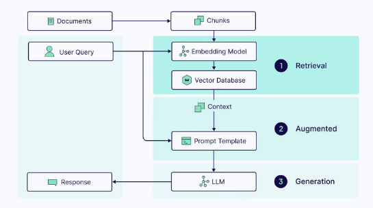
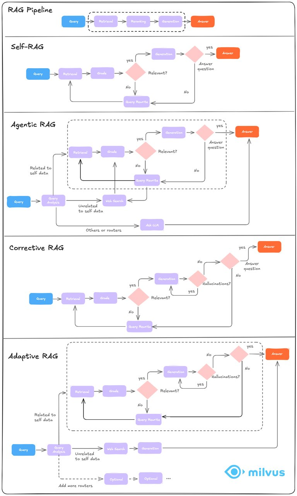
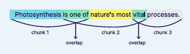
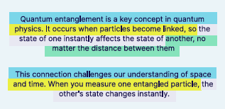
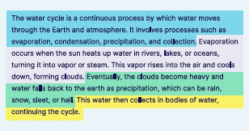

# 3.2 Application of Milvus in RAG (Retrieval-Augmented Generation) [](https://colab.research.google.com/github/richzw/milvus-workshop/blob/main/ch3/ch3_2_en.ipynb)


In RAG (Retrieval-Augmented Generation) systems, Milvus plays a core role as an "external knowledge base". Its main task is to transform processed document content into high-dimensional semantic vectors and efficiently store and retrieve them.

Specifically, the RAG system first divides the original documents into multiple text chunks and uses an embedding model to convert each text chunk into a semantic vector. Milvus, as a vector database, stores these text chunks along with their vectors and metadata. When users ask questions, the system converts the question into a vector as well and quickly retrieves the most relevant text chunks through Milvus.

These retrieved text chunks, serving as knowledge basis and context, are input into the large language model for further generation of factual and reliable answers. Thanks to Milvus's high-performance vector retrieval capabilities, even when facing millions or even hundreds of millions of document data, the RAG system can provide precise knowledge responses in an extremely short time.

In short, Milvus is the "knowledge hub" in the RAG architecture, ensuring the effective expansion and on-demand retrieval of external knowledge. It enables large model generation to no longer rely on memory and guesswork, but on real, traceable semantic data. This is also one of the foundations for modern intelligent Q&A systems to be trustworthy, professional, and scalable.


In this chapter, we will systematically review the core technical workflow of RAG (Retrieval-Augmented Generation) to help you understand how this technical architecture works from a holistic perspective. In subsequent experiments, we will gradually build an intelligent system with real Q&A capabilities based on these components.

The proposal of RAG stems from two major problems of traditional large language models (LLM):

1. **Limited memory scope**: The model's context window is limited and cannot directly process large volumes of knowledge.
2. **Prone to "hallucination"**: The model may generate output based on semantic guessing and fabricate facts (Hallucination).

The core idea of RAG is: **Introduce a retrieval module into the generation process, allowing the model to "look up information" before generating answers.** This can greatly improve the relevance and accuracy of answers, especially suitable for scenarios such as enterprise document Q&A, knowledge base assistants, legal regulation summaries, and technical support.

RAG systems typically include the following six key steps:

```
Document Loading → Chunking → Embedding → Storage → Retrieval → Generation
```



Below we will briefly introduce the significance and key points of these six steps.

---

### 1️⃣ Document Loading

This is the starting point of the entire process. We need to first load the enterprise's internal knowledge content into the system. Common document formats include `.pdf`, `.txt`, `.md`, `.docx`, etc., and information sources can be local files, web pages, databases, or even cloud documents (such as Notion, Confluence, S3, etc.).

In practice, it is recommended to use the `DocumentLoader` tool in LangChain, combined with libraries such as `Unstructured`, `PyMuPDF`, `pdfplumber`, to help us load documents as standard text data structures (Document List).

---

### 2️⃣ Chunking

Original documents are often lengthy and not suitable for direct vectorization, so they need to be "chunked" by breaking long documents into short text blocks (chunks) of several hundred characters.

Common strategies include:

* Fixed-size splitting (e.g., 500 characters per chunk)
* Sliding window splitting (e.g., 500 characters with 100 character overlap)
* Splitting by paragraph or heading (preserving semantic integrity)

The chunking strategy will directly affect subsequent retrieval effectiveness: chunks that are too small lack semantic completeness, while chunks that are too large may blur the focus. Therefore, chunk size and overlap are important parameters that need to be optimized.

---

### 3️⃣ Embedding

Each text chunk needs to be converted into a vector through a language model, which is the model's "semantic representation".

Commonly used embedding models include:

* OpenAI's `text-embedding-3-small`
* Sentence Transformers' `all-MiniLM-L6-v2`
* Amazon Bedrock's `Titan Embeddings`
* Cohere's `embed-english-light-v3`

The generated vectors are usually floating-point arrays of 384, 768, or 1536 dimensions, representing the semantic position of that text chunk. Subsequently, we can use these vectors for similarity comparison (such as cosine similarity) to achieve semantic retrieval.

---

### 4️⃣ Storage

To enable vectors to be retrieved at any time, we need to persist them in a vector database.
In this process, we choose Milvus—an open-source vector database that supports hundreds of millions of data and has powerful performance.

Milvus can not only save the vectors themselves, but also store the original text and metadata (such as document name, paragraph position, etc.) at the same time, facilitating subsequent citation in answers.

---

### 5️⃣ Retrieval

When users ask questions, the system first vectorizes the question, then performs similarity search with vectors in the database to find the most relevant text chunks. This process is "semantic retrieval".

To improve retrieval accuracy, many systems also use Hybrid Search technology, combining keyword matching (such as BM25) with semantic matching, or adding metadata filters for restricted screening.

Retrieval results usually return Top-K (e.g., the most relevant 3~5) text chunks as input context for the generation module.

---

### 6️⃣ Generation

Finally, the retrieved text chunks are input into the large language model together with the user's question, and the model generates the final answer based on the context.

You can customize the prompt template, such as:

```
Please answer the question based on the following content:
{context}

Question: {question}
```

The LLM will refer to the retrieved content for generation, thereby improving accuracy and reducing hallucination rate.

---

Through these six steps, we have built a complete intelligent Q&A system that "finds information from the knowledge base and generates answers". In the following experiments, we will build a RAG system based on LangChain and Milvus using this process as a foundation.

## Milvus's Role in RAG

When building a RAG (Retrieval-Augmented Generation) based Q&A system, many people's first instinct is to focus on the large language model's (LLM) answering capability. However, what truly determines the quality of answers is often "what the model sees". The provision of this "contextual information" is the task of the vector database. Among many vector databases, **Milvus** is the most commonly used and most suitable solution for engineering implementation.

This chapter will take you deep into understanding: What role does Milvus play in the entire RAG architecture? How does it improve the accuracy, efficiency, and scalability of Q&A systems? And how should we use it correctly?


### 🧠 Responsibilities in the RAG Process

Milvus primarily undertakes two key tasks in RAG systems:

#### 1. Store text chunks and their semantic vectors

The first step of the RAG system is to load documents and divide them into several small segments (chunks). Each piece of text is converted into a high-dimensional vector by an embedding model (such as `all-MiniLM-L6-v2` or OpenAI Embedding model).

These vectors cannot be stored directly in memory, otherwise as the number of documents grows, the system will be unable to handle the load. At this point, Milvus as a vector database comes into play, **it not only stores these vectors, but also saves the original text and metadata (such as filename, page number, paragraph number, etc.) together**, forming a complete semantic retrieval library.

#### 2. Quickly retrieve text chunks similar to user questions

When users ask a natural language question, the question is also converted into a semantic vector by the same embedding model. This query vector is sent to Milvus, and the system will find the text chunks corresponding to the Top-K vectors closest to it in the storage.

The retrieval results from this step will serve as **context** and be fed to the LLM (such as GPT, Claude), becoming the basis for its answers. In other words, Milvus determines "what the LLM sees", while the LLM determines "how to say it".


### 🧪 Summary: Milvus is the "Memory Hub" of RAG

In the six-step RAG process:

```
Document Loading → Chunking → Embedding → Storage (Milvus) → Retrieval → Generation
```

Although Milvus is not the "protagonist" answering questions, it is the "memory hub" of the entire system. It enables large language models to have "long-term memory beyond short-term memory", thus being able to handle structured documents, unstructured knowledge, complex reports and other massive information beyond the context window.

The essence of RAG is to connect retrieval and generation, and Milvus is the bridge in this connection, ensuring the scalability, accuracy, and real-time performance of the system.

---

In the next chapter, we will get hands-on: use LangChain to write vector data into Milvus, and complete a real question retrieval and context generation process.


# RAG with LangChain & Milvus: Sentence Transformers Local Model Demo

> Suitable for scenarios without OpenAI Key, enterprise intranet, sensitive knowledge bases, etc.

**Dependency Installation**
```bash
pip install langchain pymilvus sentence-transformers ollama
```

My testing environment for reference: Python 3.12, dependency versions are:
```bash
pip install \
  langchain==0.3.20 \
  pymilvus==2.5.10 \
  sentence-transformers==4.1.0 \
  ollama==0.4.7

```
Milvus is recommended to start with docker in one command,
Documentation example path: docs/**.md

## 0 · Import Dependencies & Environment Preparation
Before formally loading and vectorizing documents, first import all necessary libraries and establish a connection with Milvus.

| Dependency | Purpose |
|------|------|
| **os** | Read environment variables, handle file paths, facilitate painless migration on different machines |
| **TextLoader / DirectoryLoader** | Batch read single files or texts in directories for subsequent chunking |
| **RecursiveCharacterTextSplitter** | Recursively chunk long documents, ensuring balanced fragment length and semantic integrity |
| **HuggingFaceEmbeddings** | Use Hugging Face models (such as bge-small, E5) to convert text into vectors |
| **pymilvus** module | <ul><li>`connections` establishes gRPC connection with Milvus</li><li>`FieldSchema` / `CollectionSchema` declares fields and table structure</li><li>`Collection` creates or opens vector collection</li><li>`list_collections` debugs and views existing collections</li></ul> |

> Before running the next code cell, make sure:
> 1. You have started Milvus (Docker Compose or cluster are both acceptable);
> 2. Set `MILVUS_HOST` and `MILVUS_PORT` in environment variables (default 19530);
> 3. Installed `langchain`, `sentence-transformers`, `pymilvus` and other dependencies (`pip install -r requirements.txt`).

## Download and Install Ollama

1. Open your browser and visit [https://ollama.com/download](https://ollama.com/download) and download the installation package according to your operating system.
2. Run the installation package and complete the installation according to the prompts.
3. Execute `ollama --version` in the terminal to confirm successful installation.

## Pull the deepseek-r1:7b Model

```bash
ollama pull deepseek-r1:7b
```

> The first pull takes about several minutes (depending on network and disk performance). After downloading, you can use `ollama list` to view local models.

## Start Ollama Service

```bash
ollama serve
```

* By default, it listens on `127.0.0.1:11434`; if you need LAN or remote access, you can set it before running

  ```bash
  export OLLAMA_HOST=0.0.0.0:11434
  ```
* After the service starts, you can call it with REST API, for example:

  ```bash
  curl http://localhost:11434/api/chat -d '{
    "model":"deepseek-r1:7b",
    "messages":[{"role":"user","content":"Hello, please introduce yourself"}]
  }'
  ```


```python
# 0. Import Dependencies & Environment Preparation
import os
from langchain.document_loaders import TextLoader, DirectoryLoader
from langchain.text_splitter import RecursiveCharacterTextSplitter
from langchain.embeddings import HuggingFaceEmbeddings
from pymilvus import connections, FieldSchema, CollectionSchema, DataType, Collection, list_collections
```

### 📑 Document Vectorization Preprocessing

> **Goal**: Split all Markdown files in the `docs/` directory into small fragments suitable for vector retrieval, and prepare the local MiniLM model for embedding.

1. **Embedding Model**  
   - Use `sentence-transformers/all-MiniLM-L6-v2` (384 dimensions, small size, strong versatility), which will map each text block into a vector later.

2. **Batch Load Markdown**  
   - `DirectoryLoader("docs", glob="**/*.md")` recursively scans all `.md` files.  
   - Use `TextLoader` to extract plain text content one by one.  
   - After running, print "number of loaded documents" for intuitive viewing of reading results.

3. **Recursive Text Chunking**  
   - Use `RecursiveCharacterTextSplitter`:  
     - `chunk_size=500`: maximum 500 characters per chunk;  
     - `chunk_overlap=80`: adjacent chunks overlap by 80 characters to ensure semantic coherence.  
   - The chunking result will serve as the basic unit for vectorization, outputting "document total chunks" for confirmation.

> After executing this code cell, you will get the `docs` list (Document objects) and the `docs` fragmented list after chunking, which can be directly used for vector writing and similarity retrieval.


```python
# Select local vector model
embed_model = HuggingFaceEmbeddings(model_name="sentence-transformers/all-MiniLM-L6-v2")

# 1. Load all .md files in the doc directory, using TextLoader to parse text content
loader = DirectoryLoader("docs", glob="**/*.md", loader_cls=TextLoader)
documents = loader.load()
print(f'Total documents loaded: {len(documents)}')

# 2. Use RecursiveCharacterTextSplitter for chunking
text_splitter = RecursiveCharacterTextSplitter(chunk_size=500, chunk_overlap=80)
docs = text_splitter.split_documents(documents)
print(f'Document total chunks: {len(docs)}')
```

### 🔗 Step 2: Text Vectorization

This cell converts **all text chunks split in the previous step** into dense vectors for writing to the vector database and supporting subsequent similarity retrieval.

1. **Extract Text**
   - `texts = [doc.page_content for doc in docs]`  
     Extract the `Document` list into a pure text string list, ensuring no extra metadata is carried.

2. **Generate Vectors**
   - `vectors = embed_model.embed_documents(texts)`  
     Use our selected `sentence-transformers/all-MiniLM-L6-v2` model (384 dimensions) to batch embed all fragments, accelerating processing.

3. **Result Confirmation**
   - `print(...)` will output:  
     - "Text vectorization completed"  
     - Vector dimension (should be **384**), used to verify correct model configuration.

> After executing this cell, the variable **`vectors`** will contain a vector list in the form of `[N, 384]`, which can be directly used for writing to Milvus.


```python
# ===== 2. Text Vectorization =====
texts = [doc.page_content for doc in docs]
vectors = embed_model.embed_documents(texts)
print(f'Text vectorization completed, vector dimension: {len(vectors[0])}')
```

### 🗄️ Step 3: Connect to Milvus and Initialize Collection

This code completes all preparatory work before writing vectors, including four stages:

1. **Connect to Database**
   `connections.connect(host="localhost", port="19530")`
   Establish gRPC connection with local Milvus instance, paving the way for subsequent operations.

2. **Determine Vector Dimension**
   `dim = len(vectors[0])`
   Read the length of the first vector (should be 384 here) and record it for use when defining vector fields later.

3. **Create or Get Collection**

   * If there is no Collection named `rag_demo_local` in the library yet:

     * Define three columns:

       * `id` primary key, auto-increment
       * `embedding` FLOAT_VECTOR, dimension = `dim`
       * `content` VARCHAR (≤2048), saves original text
     * Create a new Collection with this Schema.
   * If a table with the same name already exists, directly get and reuse it.

4. **Build Vector Index**
   Create an **IVF_FLAT + L2** index (`nlist=128`) for the `embedding` field to accelerate similarity search.

After completing the above four steps, the `rag_demo_local` table is ready and can immediately perform batch vector writing and retrieval.


```python
# 3. Connect to Milvus and initialize Collection
connections.connect(host="localhost", port="19530")
collection_name = "rag_demo_local"
dim = len(vectors[0])

if collection_name not in list_collections():
    fields = [
        FieldSchema(name="id", dtype=DataType.INT64, is_primary=True, auto_id=True),
        FieldSchema(name="embedding", dtype=DataType.FLOAT_VECTOR, dim=dim),
        FieldSchema(name="content", dtype=DataType.VARCHAR, max_length=2048),
    ]
    schema = CollectionSchema(fields)
    collection = Collection(name=collection_name, schema=schema)
    collection.create_index(
        field_name="embedding",
        index_params={"index_type": "IVF_FLAT", "metric_type": "L2", "params": {"nlist": 128}}
    )
else:
    collection = Collection(collection_name)
```

### 🚀 Step 4: Write Vectors to Milvus

This code batch writes the previously generated **vectors** and their corresponding **text content (texts)** into the just-created `rag_demo_local` Collection, and immediately makes the data searchable:

1. **Assemble Write Data**

   ```python
   milvus_data = [vectors, texts]
   ```

   Milvus requires passing in a two-dimensional list (column-first) in field order. The order here aligns with Schema: first `embedding`, then `content`.

2. **Insert Records**

   ```python
   mr = collection.insert(milvus_data)
   ```

   Write all fragments at once; the return value `mr` contains auto-increment primary key IDs, which can be used for subsequent debugging or incremental updates.

3. **Load into Memory**

   ```python
   collection.load()
   ```

   Load the newly created index segment into QueryNode memory to ensure similarity retrieval can be performed immediately.

4. **Result Confirmation**
   `print(...)` outputs the number of successfully written fragments to verify the write was error-free.

> After execution, the vector library is ready, and you can then call `collection.search()` for similarity queries and return reference fragments in the RAG process.


```python
# ===== 4. Insert Data into Milvus =====
milvus_data = [
    vectors,   # embedding
    texts,     # content
]
mr = collection.insert(milvus_data)
collection.load()
print(f'Inserted {len(texts)} chunks')

```

### 🔍 Step 5: User Query and Retrieve Relevant Content

This code demonstrates the "Retrieve" stage in the **end-to-end RAG** process: after getting a user question, vectorize it and perform similarity search in Milvus to find the most relevant text fragments.

1. **User Question → Vectorization**

   ```python
   query_vec = embed_model.embed_query(user_query)
   ```

   Convert the natural language question into a vector with the same dimension as the fragments in the library, ensuring consistent metric space.

2. **Configure Retrieval Parameters**

   ```python
   search_params = {"metric_type": "L2", "params": {"nprobe": 10}}
   ```

   * **metric_type=L2**: Consistent with index building.
   * **nprobe=10**: Fine search in 10 inverted clusters to improve recall rate (can be optimized as needed).

3. **Execute Similarity Search**

   ```python
   results = collection.search(
       data=[query_vec],
       anns_field="embedding",
       param=search_params,
       limit=4,
       output_fields=["content"]
   )
   ```

   * `limit=4`: Return at most 4 most similar fragments.
   * `output_fields=["content"]`: In addition to the distance score, also retrieve the original text field.

4. **Extract and Display Fragments**

   ```python
   retrieved_chunks = [hit.entity.get("content") for hit in results[0]]
   ```

   Use a simple `for` loop to print the first 120 characters to verify retrieval effectiveness.

> At this point, you have completed the "vectorization → write to library → retrieval" full chain closed loop of RAG. Feed `retrieved_chunks` as context to the language model to generate final answers with citations.


```python
# 5. User inputs question and retrieves relevant content
user_query = "How to install Milvus using Docker?"
query_vec = embed_model.embed_query(user_query)
search_params = {"metric_type": "L2", "params": {"nprobe": 10}}
results = collection.search(
    data=[query_vec],
    anns_field="embedding",
    param=search_params,
    limit=4,
    output_fields=["content"]
)
retrieved_chunks = [hit.entity.get("content") for hit in results[0]]
for idx, chunk in enumerate(retrieved_chunks, 1):
    print(f'Relevant fragment {idx}: {chunk[:120]}...')
```


### 📝 Step 6: Construct LLM Prompt

> **Purpose**: Concatenate the retrieved relevant fragments (`retrieved_chunks`) into context, and assemble them together with the user question into the final prompt for the language model.

1. **Merge Retrieved Fragments**  
   ```python
   context = '\n'.join(retrieved_chunks)
   ```

   * Use newline character `\n` to concatenate multiple text fragments, maintaining paragraph separation to avoid information confusion.
   * The resulting `context` string carries the factual foundation needed to answer the question.

2. **Generate Prompt**

   ```python
   prompt = (
       f'Given the following information:\n{context}\n\n'
       f'Please answer the user question based on the above information: {user_query}'
   )
   ```

   * First guide with English: "Given the following information:" → put in `context` → then add "Please answer the user question based on the above information:".
   * This format makes the LLM clear: **answer only based on the given information**, thereby reducing hallucination and improving citability.

After completion, `prompt` can be directly sent to large language models (such as ChatGPT, Claude, Llama, etc.) to generate the final response.


```python
context = '\n'.join(retrieved_chunks)
prompt = f'Given the following information:\n{context}\n\nPlease answer the user question based on the above information: {user_query}'
```

### 🤖 Step 7: Call Local LLM to Generate Final Answer

This code feeds the previously retrieved fragments to a local Ollama model (such as `deepseek-r1:7b`) to get the final response to the user's question. The process is broken down as follows:

1. **Concatenate Retrieved Fragments**

   ```python
   context = '\n'.join(retrieved_chunks)
   ```

   Use newline characters to string all relevant fragments into a long context, keeping paragraphs clear.

2. **Assemble Prompt**

   ```python
   prompt = (
       f"Given the following information:\n{context}\n\n"
       f"Please answer the user question based on the above information: {user_query}"
   )
   ```

   * Clearly instruct the model to "answer based only on the above information" to reduce hallucination risk.
   * Attach the user's original question `user_query` directly at the end of the prompt.

3. **Initialize Ollama Client**

   ```python
   client = Client()
   ```

   `ollama-python` simple SDK, defaults to connecting to the local Ollama service port (usually `127.0.0.1:11434`).

4. **Send Chat Request**

   ```python
   response = client.chat(
       model='deepseek-r1:7b',
       messages=[{'role': 'user', 'content': prompt}]
   )
   ```

   * `model` specifies the image name already pulled locally in Ollama (e.g., `llama2`, `deepseek-r1:7b`).
   * `messages` uses OpenAI Chat format, containing only one user message.
   * Ollama automatically returns JSON, where `response['message']['content']` is the model-generated text.

5. **Print Output**

   ```python
   print(response['message']['content'])
   ```

   Print the model's answer directly to Notebook output for visual inspection or subsequent rendering.

> After completing this cell, the RAG complete chain (**vector retrieval → Prompt construction → LLM generation**) is complete, and you can view conversational answers on the page.


```python
from ollama import Client

context = '\n'.join(retrieved_chunks)

prompt = f"Given the following information:\n{context}\n\nPlease answer the user question based on the above information: {user_query}"

client = Client()

response = client.chat(
    model='deepseek-r1:7b',  # e.g., 'llama2' or others
    messages=[{'role': 'user', 'content': prompt}]
)

print(response['message']['content'])

```


## RAG Evolution: RAG, Self-RAG, Agentic RAG, Corrective RAG, Adaptive RAG.

- Standard RAG
This is the foundation - retrieve documents based on similarity and generate answers. Simple, fast, but limited feedback loop.

- Self-RAG
Adds self-reflection capability. The model evaluates its own output and decides whether to retrieve more information or regenerate the answer; excels at quality control and well-grounded answers.

- Agentic RAG
Moves towards full autonomy - breaks complex queries into subtasks, plans retrieval strategies, and executes multi-step reasoning flows.

- Corrective RAG (CRAG)
Focuses on accuracy through iterative correction. Continuously fact-checks retrieved knowledge and refines corrections on answers; achieves highest accuracy through continuous correction loops.

- Adaptive RAG
Intelligent switcher - dynamically selects the best retrieval strategy based on query complexity, domain, and confidence; provides optimal efficiency by choosing appropriate approaches.




**When should you use them?**
- Need quick start or prioritize speed → Choose Standard RAG
- Quality and well-grounded answers are crucial → Choose Self-RAG
- Need complex reasoning → Choose Agentic RAG
- Extremely high accuracy requirements for mission-critical tasks → Choose CRAG
- Facing diverse query types → Choose Adaptive RAG

A common mistake many people make is: jumping directly to complex architectures before mastering the basics.
In fact, 80% of production RAG systems still run on Standard RAG with clever optimizations.

**Our recommendation**: Start with Standard RAG, add Self-RAG for quality considerations, then gradually evolve based on specific needs.

## Discussion: How to Optimize Retrieval Effectiveness in RAG (Chunk Size, Embedding Model Selection, Use of Hybrid Search)

### Chunk Size Optimization
Chunk size refers to the length of dividing documents or text into small blocks (chunks), directly affecting retrieval efficiency and semantic integrity.

#### 1 **Importance of Chunk Size**:
   A delicate balance. There is no "best" chunk size that applies to all scenarios. It needs to find a balance between "contextual completeness" and "retrieval precision":

*   **Too Large Chunks**:
    *   **Advantages**: Can contain more complete contextual information.
    *   **Disadvantages**: May introduce too much noise, causing core semantics to be diluted, increasing the cost and latency of large language model (LLM) processing, and may even reduce retrieval accuracy due to "needle in a haystack" problems.
*   **Too Small Chunks**:
    *   **Advantages**: Semantics are more concentrated, helping to achieve more precise matching in vector space.
    *   **Disadvantages**: May lose necessary context, leading to information fragmentation, making it impossible for LLM to generate high-quality answers based on incomplete fragments.
    
####  2 **Influencing Factors**:
  - **Content Nature**: For long documents, smaller chunk sizes (e.g., 256 tokens) may be more appropriate, ensuring each chunk contains sufficient semantic information. For short documents, larger chunk sizes may be more effective.
  - **Embedding Model Limitations**: Most deep embedding models (such as BERT-based) are limited to 512 tokens input length, while OpenAI's ada-002 model supports up to 8191 tokens, suitable for processing larger texts.
  - **Query Length and Complexity**: Complex queries may require smaller chunk sizes to ensure each chunk contains sufficient semantic information for subsequent retrieval matching.
####  3 **Chunking Strategies**:
  - **Fixed-size chunking**
    - Fixed-size chunking is a simple technique that divides text into blocks of predetermined size without considering content structure. While this method is cost-effective, it lacks context awareness. This can be improved by using overlapping blocks, allowing adjacent blocks to share some content.
    - 
  - **𝗦𝗹𝗶𝗱𝗶𝗻𝗴-𝘄𝗶𝗻𝗱𝗼𝘄 𝗰𝗵𝘂𝗻𝗸𝗶𝗻𝗴**
    - 𝗦𝗹𝗶𝗱𝗶𝗻𝗴-𝘄𝗶𝗻𝗱𝗼𝘄 𝗰𝗵𝘂𝗻𝗸𝗶𝗻𝗴 (𝟱𝟬–𝟭𝟬𝟬 𝘁𝗼𝗸𝗲𝗻𝘀 𝗼𝗳 𝗼𝘃𝗲𝗿𝗹𝗮𝗽) 𝘀𝘁𝗼𝗽𝘀 𝗮𝗻𝘀𝘄𝗲𝗿𝘀 𝗳𝗿𝗼𝗺 𝗴𝗲𝘁𝘁𝗶𝗻𝗴 𝗰𝘂𝘁 𝗺𝗶𝗱-𝘀𝗲𝗻𝘁𝗲𝗻𝗰𝗲, 𝗯𝘂𝘁 𝗶𝘁 𝗰𝗿𝗲𝗮𝘁𝗲𝘀 𝗱𝘂𝗽𝗹𝗶𝗰𝗮𝘁𝗲𝘀. The same passage shows up in three overlapping chunks, all three score high, and they fill your top results — leaving no room for other relevant content.
  - **Recursive chunking**
    - Recursive chunking provides greater flexibility by first splitting text using primary separators (such as paragraphs), then applying secondary separators (such as sentences) if blocks are still too large. This technique respects document structure and adapts well to various use cases.
    - 
  - **Document-based chunking**
    - Document-based chunking creates chunks based on natural divisions in documents (such as headings or sections). It is particularly effective for structured data like HTML, Markdown, or code files, but less useful when data lacks clear structural elements.
    - 
  - **Semantic chunking**
    - Semantic chunking divides text into meaningful units, then vectorizes them. These units are then combined into chunks based on cosine distance between their embeddings, forming a new chunk whenever a significant contextual change is detected. This approach balances semantic coherence and chunk size.
    - 
  - **LLM-based chunking**
    - LLM-based chunking is an advanced technique that uses large language models (LLM) to generate chunks by processing text and creating semantically independent sentences or propositions. While highly accurate, it is also the most computationally demanding method.
    - 
    
####  4 **Optimization Recommendations**:
  - In practical applications, it is recommended to find the optimal balance through preprocessing and testing different chunk sizes (e.g., from 128 to 1024 tokens).
  - Using overlap (such as 10% or 25%) can reduce information loss and improve retrieval continuity. For example, Recall@50 with 10% overlap is 43.1, with 25% overlap is 43.9.
  - For semantically ambiguous chunks, it is recommended to combine with subsequent rerank steps for further optimization.

#### 5 **𝗪𝗵𝗮𝘁'𝘀 𝘄𝗼𝗿𝗸𝗲𝗱 𝗳𝗼𝗿 𝘂𝘀**
  - 𝗧𝗲𝗰𝗵𝗻𝗶𝗰𝗮𝗹 𝗱𝗼𝗰𝘀: semantic chunking, with sliding-window as a fallback
  - 𝗖𝗵𝗮𝘁 𝗹𝗼𝗴𝘀 𝗮𝗻𝗱 𝘁𝗶𝗰𝗸𝗲𝘁𝘀: fixed-length, with a larger overlap
  - 𝗔𝗣𝗜 𝗱𝗼𝗰𝘀 𝗮𝗻𝗱 𝗰𝗼𝗻𝗳𝗶𝗴 files: references: split by section

### Embedding Model Selection
The embedding model is responsible for converting text into vector representations and is the core component of the RAG retrieval stage. Choosing the appropriate model directly affects retrieval accuracy and efficiency. Here are key points about embedding model selection:

*   **Performance (MTEB Leaderboard)**: Hugging Face's [**MTEB (Massive Text Embedding Benchmark)**](https://huggingface.co/spaces/mteb/leaderboard) is an authoritative public evaluation benchmark that comprehensively evaluates model performance across multiple tasks such as retrieval, classification, and clustering. This is an excellent starting point for model selection, especially focusing on the average score of **Retrieval** tasks.
*   **Model Size and Dimension**:
    *   **Model Size**: Affects inference speed and deployment cost. Larger models usually perform better but also consume more resources.
    *   **Embedding Dimension**: Higher dimensions can usually encode richer semantic information, but also mean larger storage requirements and slower retrieval speeds. Common dimensions are 384, 768, 1024, etc.
*   **Language Support**: Confirm whether the model supports the languages required by your business scenario. For multilingual scenarios, specialized multilingual models need to be selected.
*   **Domain Specificity**: General models may perform poorly in specific professional domains (such as law, medicine). In such cases, consider using models pre-trained or fine-tuned on specific domain data.
*   **Cost and Licensing**:
    *   **Proprietary Models**: Such as OpenAI's `text-embedding-3-large`, called via API, simple and easy to use, but with cost and data privacy considerations.
    *   **Open-Source Models**: Such as BGE, GTE, E5 series, provide greater flexibility and data control, can be deployed locally, but maintenance costs need to be considered at scale.

#### 2. Overview of Mainstream Embedding Models

| Model Series | Representative Model | Developer | Type | Core Features |
| :--- | :--- | :--- | :--- | :--- |
| **OpenAI** | `text-embedding-3-large` / `small` | OpenAI | Proprietary | Powerful performance, easy integration, industry benchmark. |
| **BGE** | `bge-m3`, `bge-large-zh-v1.5` | BAAI | Open Source | Excellent performance on MTEB, especially in Chinese-English retrieval tasks. `m3` supports multilingual and multi-functional. |
| **GTE** | `gte-Qwen2-7B-instruct` | Alibaba | Open Source | Based on Qwen2 large model, tops MTEB leaderboard, supports ultra-long context. |
| **E5** | `multilingual-e5-large` | Microsoft/intfloat | Open Source | Powerful multilingual capabilities, was a leader on MTEB. |
| **Jina** | `jina-embeddings-v2-base-en` | Jina AI | Open Source | Supports 8192 token long context window, suitable for processing long text chunks. |
| **Nomic** | `nomic-embed-text-v1.5` | Nomic | Open Source | Excellent performance, comparable to OpenAI's `text-embedding-3-small`. |
| **Youdao** | `BCEmbedding` | Netease Youdao | Open Source | Outstanding performance in Chinese-English bilingual and cross-lingual RAG scenarios. |

**For Chinese RAG tasks, `bge-large-zh-v1.5`, `gte-Qwen2...` and `BCEmbedding` series models are all highly recommended starting points.**

#### 3. Linkage Between Chunk Size and Embedding Model

Chunk size and embedding model selection are interrelated:

*   **Model Context Window**: Chunk size (in tokens) **cannot exceed** the maximum input length (Context Window) of the embedding model. For example, BERT-type models are typically limited to 512 tokens. Models like Jina support longer inputs.
*   **Training Data**: Models are pre-trained on their optimal performing input lengths. For example, some sentence transformer models perform best on single sentences, while others perform better on blocks containing hundreds of tokens. Generally, aligning chunk size with the text length the model excels at processing yields better embedding quality.

 ## Hands-on Exercise 2: Try modifying search parameters and observe changes in retrieval results
