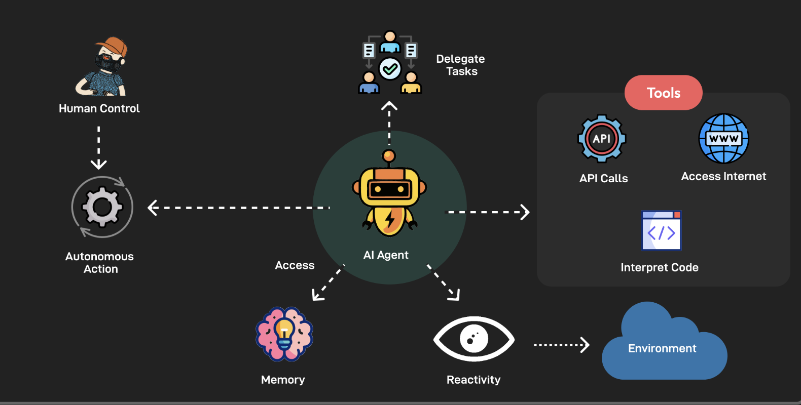

# 3.3 Application of Milvus in AI Agents [](https://colab.research.google.com/github/richzw/milvus-workshop/blob/main/ch3/ch3_3_en.ipynb)

In this section, we will explore the basic architecture of AI Agents, how Milvus plays a key role within them, and demonstrate practical applications through a case study of an Agent built using LangGraph and Milvus.

## AI Agent Architecture Overview



A typical AI Agent usually consists of the following core components:

*   **Planning:**
    *   **Goal Setting and Decomposition:** The Agent first needs to understand the user's ultimate goal and decompose it into a series of executable subtasks or steps.
    *   **Strategy Selection:** For each subtask, the Agent may have multiple execution methods or tools to choose from. The planning module is responsible for selecting the optimal strategy.
    *   **Execution Monitoring and Adjustment:** During task execution, the Agent needs to monitor progress and adjust the plan according to actual circumstances. For example, if a step fails, it may need to replan or try other methods.

*   **Memory:**
    *   **Short-term Memory:** Used to store the context of the current conversation, recent interaction information, or intermediate states of tasks being processed. This is crucial for maintaining conversation coherence and multi-turn interactions.
    *   **Long-term Memory:** Used to store knowledge learned by the Agent, past experiences, user preferences, successful solutions, etc. This enables the Agent to learn from past interactions and become more intelligent and personalized over time.

*   **Tools:**
    *   **Function Calling:** The Agent can use various tools to complete specific tasks. These tools can be:
        *   **API Calls:** For example, searching weather, querying databases, sending emails, etc.
        *   **Code Execution:** Executing Python scripts or other code snippets to process data or perform complex calculations.
        *   **Knowledge Base Queries:** Retrieving information from external knowledge bases (such as Milvus).
    *   **Tool Selection and Usage:** The Agent's planning module needs to decide when to use which tool and how to integrate the tool's output into its task execution flow.

This architecture enables the AI Agent to act like an intelligent assistant, understanding tasks, formulating plans, utilizing available resources (tools and memory), and ultimately achieving goals.

## The Role of Milvus in Agents

As a high-performance vector database, Milvus can play two crucial roles in AI Agents:

### 1. External Knowledge Base

*   **Function:** Agents often need to access and query large amounts of external information to answer questions or complete tasks. This information can be unstructured text data, documents, web page content, etc.
*   **Milvus's Role:**
    *   **Storage:** Convert this external information into vectors through embedding models and store them in Milvus.
    *   **Retrieval:** When the Agent needs relevant information, it can convert the user's query or its internal thoughts into vectors as well, then perform efficient similarity search in Milvus to quickly find the most relevant knowledge fragments.
    *   **Similar to RAG:** This pattern is very similar to Retrieval Augmented Generation (RAG). Milvus serves as the core retrieval engine in the RAG architecture, providing the Agent with accurate and relevant contextual information, thereby improving the quality and factuality of its responses.

### 2. Memory

*   **Function:** Agents need to remember past interactions, learned experiences, successful planning steps, etc., in order to perform better in future tasks.
*   **Milvus's Role:**
    *   **Store Conversation History:** The Agent's conversation history (user questions, Agent answers, intermediate thoughts) can be vectorized and stored in Milvus.
    *   **Store Learning Experiences:** Successful strategies, lessons from failures, user preferences, etc., learned by the Agent during task execution can all be converted to vector form and stored.
    *   **Store Planning Steps:** Intermediate steps and decision logic in complex task planning processes can also be vectorized and stored in Milvus for future reference in similar tasks.
    *   **Fast Recall:** When the Agent starts a new conversation or task, it can query the memory vectors stored in Milvus to find historical records or experiences most similar to the current situation, thereby quickly recalling relevant information and providing more coherent, personalized, and efficient service.

By vectorizing and storing information in Milvus, Agents can leverage semantic similarity to retrieve knowledge and memory, rather than just keyword matching, which greatly enhances the Agent's information acquisition and utilization capabilities.

## Case Demonstration/Code Walkthrough: An Agent Using LangGraph and Milvus

Next, we will demonstrate through a simplified case how an AI Agent utilizes Milvus as an external knowledge base. We will use LangGraph to build the Agent's control flow.

**Core Flow:**

1.  **User Question:** The user asks the Agent a question.
2.  **Agent Planning (Identifying Needs):** The Agent (through LLM) analyzes the question and determines whether it needs to retrieve information from the external knowledge base (Milvus).
3.  **Query Vectorization:** If needed, the Agent converts the user's query or its derived search keywords into vectors.
4.  **Milvus Search:** The Agent uses this vector to search for relevant knowledge in Milvus.
5.  **Retrieve Information:** Milvus returns the most relevant document fragments.
6.  **Agent Integrates Information and Responds:** The Agent combines the information retrieved from Milvus with its own reasoning capabilities to generate a final answer for the user.

**Additionally, we can envision how the Agent stores conversation fragments:**

1.  **Conversation End/Fragment Recording:** At a certain node in the conversation (for example, when a round of Q&A ends), the Agent vectorizes that conversation fragment (user question, Agent answer, and possibly some context metadata).
2.  **Store in Milvus Memory Repository:** Store this vector and corresponding text content in a dedicated Milvus collection (or specific partition) as long-term memory.
3.  **Recall at the Start of New Conversation:** When a new conversation begins or the user asks a vague question, the Agent can vectorize the current input and search for similar historical conversations in the Milvus memory repository, thereby quickly understanding user intent or providing more personalized responses.

**Below we focus on the LangGraph Agent implementation using Milvus as an external knowledge base.**

We will simplify the GraphRAG concept from the reference links above and build a more direct Agent with a tool that queries Milvus.

### 1. Prepare Environment

%pip install pymilvus langchain==0.3.25 langgraph==0.4.7 langchain_openai==0.3.18 langchain_community==0.0.38 langchain-core==0.3.61 


```python
# Import necessary libraries
import os
import uuid
from typing import TypedDict, Annotated, List, Union
import operator

from langchain_openai import OpenAIEmbeddings, ChatOpenAI
from langchain_core.messages import BaseMessage, HumanMessage, AIMessage, ToolMessage
from langchain_core.tools import tool
from langchain_community.vectorstores import Milvus
from langgraph.graph import StateGraph, END
# from langgraph.prebuilt import ToolExecutor,  ToolInvocation
from langgraph.prebuilt import create_react_agent

# Milvus/Pymilvus related
from pymilvus import connections, utility, CollectionSchema, FieldSchema, DataType, Collection

# --- Configuration ---
# os.environ["OPENAI_API_KEY"] = "sk-YOUR_OPENAI_API_KEY"
if "OPENAI_API_KEY" not in os.environ:
    print("Error: Please set the OPENAI_API_KEY environment variable.")
    # exit() # In a notebook, we may not want to exit directly, but prompt the user

# Milvus Connection Parameters
MILVUS_HOST = "localhost" # Or your Milvus service address
MILVUS_PORT = "19530"     # Milvus Standalone/Cluster default port
MILVUS_COLLECTION_NAME = "ai_agent_knowledge_base"
MILVUS_EMBEDDING_DIM = 1536 # OpenAI ada-002 embeddings
ID_FIELD_NAME = "doc_id"
TEXT_FIELD_NAME = "text_content"
VECTOR_FIELD_NAME = "embedding"

# LLM and Embeddings
llm = ChatOpenAI(model="gpt-4.1", temperature=0)
embeddings_model = OpenAIEmbeddings(model="text-embedding-ada-002")

print("Configuration loaded.")
```


    ---------------------------------------------------------------------------

    ModuleNotFoundError                       Traceback (most recent call last)

    <ipython-input-1-8c2c309e9dc7> in <module>
          5 import operator
          6 
    ----> 7 from langchain_openai import OpenAIEmbeddings, ChatOpenAI
          8 from langchain_core.messages import BaseMessage, HumanMessage, AIMessage, ToolMessage
          9 from langchain_core.tools import tool


    ModuleNotFoundError: No module named 'langchain_openai'


```python
# Milvus Setup and Helper Functions

def connect_to_milvus():
    """Establish connection to Milvus"""
    try:
        connections.connect(host=MILVUS_HOST, port=MILVUS_PORT)
        print(f"Successfully connected to Milvus: {MILVUS_HOST}:{MILVUS_PORT}")
    except Exception as e:
        print(f"Failed to connect to Milvus: {e}")
        raise

def create_milvus_collection_if_not_exists():
    """Create collection if it doesn't exist"""
    connect_to_milvus() # Ensure connection
    if utility.has_collection(MILVUS_COLLECTION_NAME):
        print(f"Collection '{MILVUS_COLLECTION_NAME}' already exists.")
        utility.drop_collection(collection_name=MILVUS_COLLECTION_NAME)

    field_id = FieldSchema(name=ID_FIELD_NAME, dtype=DataType.VARCHAR, is_primary=True, max_length=36)
    field_text = FieldSchema(name=TEXT_FIELD_NAME, dtype=DataType.VARCHAR, max_length=65535) # Store original text
    field_embedding = FieldSchema(name=VECTOR_FIELD_NAME, dtype=DataType.FLOAT_VECTOR, dim=MILVUS_EMBEDDING_DIM)

    schema = CollectionSchema(
        fields=[field_id, field_text, field_embedding],
        description="AI Agent Knowledge Base collection",
        enable_dynamic_field=False # If you need extra metadata and don't want to predefine, set to True
    )
    collection = Collection(MILVUS_COLLECTION_NAME, schema=schema)
    print(f"Collection '{MILVUS_COLLECTION_NAME}' created successfully.")

    # Create index for vector field (IVF_FLAT is a commonly used choice)
    index_params = {
        "metric_type": "L2", # Or "IP" (Inner Product)
        "index_type": "IVF_FLAT",
        "params": {"nlist": 128},
    }
    collection.create_index(field_name=VECTOR_FIELD_NAME, index_params=index_params)
    print(f"Index created successfully for field '{VECTOR_FIELD_NAME}'.")
    collection.load()
    print(f"Collection '{MILVUS_COLLECTION_NAME}' loaded.")
    return collection

def insert_data_to_milvus(collection: Collection, texts: List[str]):
    """Vectorize text data and insert into Milvus"""
    if not texts:
        print("No data to insert.")
        return

    print(f"Generating vectors for {len(texts)} texts...")
    vectors = embeddings_model.embed_documents(texts)
    print("Vector generation complete.")

    # Prepare data for insertion
    data_to_insert = []
    for i, text_content in enumerate(texts):
        data_to_insert.append({
            ID_FIELD_NAME: str(uuid.uuid4()),
            TEXT_FIELD_NAME: text_content,
            VECTOR_FIELD_NAME: vectors[i]
        })

    print(f"Inserting {len(data_to_insert)} records into Milvus collection '{collection.name}'...")
    insert_result = collection.insert(data_to_insert)
    collection.flush() # Ensure data persistence
    print(f"Data inserted successfully. Rows affected: {insert_result.insert_count}")
    print(f"Current collection entity count: {collection.num_entities}")


# Execute Milvus initialization
try:
    knowledge_collection = create_milvus_collection_if_not_exists()

    # Prepare some sample knowledge data (only insert on first run or when needed)
    # To avoid duplicate insertion, check if collection is empty
    if knowledge_collection.num_entities == 0:
        print("Knowledge base is empty, preparing to insert sample data...")
        sample_knowledge = [
            "Milvus is an open-source vector database designed for large-scale vector similarity search and analysis.",
            "AI Agents can utilize Milvus as their long-term memory storage and external knowledge base.",
            "LangGraph is a library for building stateful, multi-actor applications, particularly suitable for building complex AI Agents.",
            "Vector databases convert data into vector embeddings and use specialized indexes for efficient similarity search.",
            "RAG (Retrieval Augmented Generation) is an AI technique that combines retrieval systems and generative models, improving the accuracy and relevance of generated content.",
            "The Sun is the central celestial body of the Solar System, with a core temperature reaching 15 million degrees Celsius.",
            "Python is a widely used high-level programming language, known for its concise syntax and powerful library ecosystem."
        ]
        insert_data_to_milvus(knowledge_collection, sample_knowledge)
    else:
        print(f"Knowledge base already contains {knowledge_collection.num_entities} records, skipping sample data insertion.")

except Exception as e:
    print(f"Error occurred during Milvus initialization or data insertion: {e}")
    # In a notebook, we may not want the program to completely stop subsequent cell execution due to Milvus connection issues
    # But subsequent cells that depend on Milvus may fail
    knowledge_collection = None # Mark as None for subsequent checks
```


```python
from typing import List, TypedDict, Annotated
import operator
from langgraph.graph import StateGraph, END
from langchain_core.tools import tool
from langchain_core.messages import BaseMessage, ToolMessage
from langchain_core.runnables import RunnableLambda
from langchain_core.utils.function_calling import convert_to_openai_tool

# 1. Define Tools
@tool
def search_milvus_knowledge_base(query: str) -> str:
    """
    Search the Milvus knowledge base for information relevant to the query.
    The input should be a clear and specific question or search keywords.
    """
    if not knowledge_collection:
        return "Milvus knowledge base is not available."
    print(f"\n[Tool Call: search_milvus_knowledge_base] Query: {query}")
    query_vector = embeddings_model.embed_query(query)
    
    search_params = {
        "metric_type": "L2",
        "params": {"nprobe": 10},  # Adjust nprobe based on index type and data size
    }
    
    # Perform the search
    results = knowledge_collection.search(
        data=[query_vector],
        anns_field=VECTOR_FIELD_NAME,
        param=search_params,
        limit=3,  # Return top 3 relevant results
        expr=None,  # Optional filter, e.g., "doc_type == 'faq'"
        output_fields=[TEXT_FIELD_NAME]  # Retrieve original text content
    )
    
    context = ""
    if results and results[0]:
        context_docs = [hit.entity.get(TEXT_FIELD_NAME) for hit in results[0]]
        context = "\n".join(context_docs)
        print(f"[Tool Result] Found context: {context[:200]}...")
    else:
        print("[Tool Result] No relevant context found in Milvus.")
        context = "No relevant information found in the knowledge base."
    return context

# Define the tools list
tools = [search_milvus_knowledge_base]

# 2. Define Agent State
class AgentState(TypedDict):
    messages: Annotated[List[BaseMessage], operator.add]  # Accumulate messages

# 3. Define Nodes
def agent_node(state: AgentState) -> dict:
    """
    Agent node: Decides the next action (call a tool or respond directly).
    """
    print("\n[Node: Agent]")
    # Bind tools to the LLM to make it aware of available tools
    bound_llm = llm.bind_tools(tools)
    response = bound_llm.invoke(state["messages"])
    
    print(f"[Agent Decision] Response: {response.content}, Tool Calls: {response.tool_calls}")
    return {"messages": [response]}

def tool_node(state: AgentState) -> dict:
    """
    Tool node: Executes tool calls requested by the agent.
    """
    print("\n[Node: Tool Executor]")
    last_message = state["messages"][-1]
    
    if not hasattr(last_message, "tool_calls") or not last_message.tool_calls:
        print("[Tool Executor] No tool calls found in the last message.")
        return {"messages": []}
    
    tool_messages = []
    for tool_call in last_message.tool_calls:
        tool_name = tool_call["name"]
        tool_input = tool_call["args"]
        
        # Find the tool by name
        tool = next((t for t in tools if t.name == tool_name), None)
        if not tool:
            tool_messages.append(
                ToolMessage(
                    content=f"Error: Tool {tool_name} not found.",
                    tool_call_id=tool_call["id"]
                )
            )
            continue
        
        try:
            # Execute the tool
            result = tool.invoke(tool_input)
            tool_messages.append(
                ToolMessage(
                    content=str(result),
                    tool_call_id=tool_call["id"]
                )
            )
        except Exception as e:
            tool_messages.append(
                ToolMessage(
                    content=f"Error executing tool {tool_name}: {str(e)}",
                    tool_call_id=tool_call["id"]
                )
            )
    
    print(f"[Tool Executor] Executed tools, results: {tool_messages}")
    return {"messages": tool_messages}

# 4. Define Conditional Edges
def should_continue(state: AgentState) -> str:
    """
    Determines whether to continue to the tools node or end the workflow.
    """
    print("\n[Edge: should_continue]")
    last_message = state["messages"][-1]
    if hasattr(last_message, "tool_calls") and last_message.tool_calls:
        print("[Edge Decision] Continue to 'tools'")
        return "tools"
    print("[Edge Decision] End")
    return END

# 5. Construct the Graph
workflow = StateGraph(AgentState)

# Add nodes
workflow.add_node("agent", RunnableLambda(agent_node))
workflow.add_node("tools", RunnableLambda(tool_node))

# Set entry point
workflow.set_entry_point("agent")

# Add conditional edges
workflow.add_conditional_edges(
    "agent",
    should_continue,
    {
        "tools": "tools",
        END: END
    }
)

# Add edge from tools back to agent
workflow.add_edge("tools", "agent")

# Compile the graph
app = workflow.compile()
print("\nLangGraph App compiled successfully!")

```


```python
from IPython.display import Image, display

try:
    display(Image(app.get_graph().draw_mermaid_png()))
except Exception:
    pass
```


```python
# Run the Agent and Interact

if "OPENAI_API_KEY" not in os.environ or not knowledge_collection:
    print("Unable to run Agent: Please ensure OpenAI API key is set and Milvus connection and collection initialization are successful.")
else:
    print("Agent is ready. Start asking questions! (Type 'exit' to quit)")
    print("-" * 30)

    # Demonstrate Agent using Milvus as external knowledge base
    print("\n--- Case 1: Agent leveraging Milvus to find information ---")
    query1 = "What is Milvus?"
    print(f"User: {query1}")
    inputs = {"messages": [HumanMessage(content=query1)]}
    
    # Use stream method to view execution process step by step
    for event in app.stream(inputs):
        for key, value in event.items():
            print(f"--- Event for Node: {key} ---")
            if "messages" in value:
                # Print content of latest message
                latest_message = value["messages"][-1]
                if isinstance(latest_message, AIMessage):
                    print(f"AI: {latest_message.content}")
                    if latest_message.tool_calls:
                        print(f"AI requests tool call: {latest_message.tool_calls}")
                elif isinstance(latest_message, ToolMessage):
                    print(f"Tool Result ({latest_message.tool_call_id}): {latest_message.content}")
                else:
                    print(f"Message ({type(latest_message).__name__}): {latest_message.content}")
        print("-" * 10)
    
    print("\n--- Case 2: Agent answering a question that doesn't require knowledge base lookup (may answer directly or decline) ---")
    query2 = "How are you?"
    print(f"User: {query2}")
    inputs = {"messages": [HumanMessage(content=query2)]}
    # Get final result
    final_response = app.invoke(inputs)
    if final_response and "messages" in final_response and final_response["messages"]:
        print(f"AI: {final_response['messages'][-1].content}")
    else:
        print("AI failed to generate a response.")

    # Demonstrate Agent storing conversation fragment vectors (conceptual, actual storage logic needs to be more refined)
    # Assume query1 and its final reply is a fragment that needs to be remembered
    if final_response and "messages" in final_response: # Using results from previous interaction
        print("\n--- Conceptual Demonstration: Storing conversation to Milvus (as memory) ---")
        # Assume we want to store the user's question and Agent's final answer as a memory unit
        # The final_response['messages'] here may contain the entire conversation history
        # We typically take the last user question and AI answer pair
        
        # Find the final AIMessage corresponding to query1
        # This is a simplified lookup; in practice, more complex logic may be needed to pair Q&A
        q1_final_answer = ""
        # Assume the last message in the messages list returned by app.invoke is the final answer
        if final_response['messages'] and isinstance(final_response['messages'][-1], AIMessage):
             q1_final_answer = final_response['messages'][-1].content # Depends on content from previous invoke
        
        # If query1 led to tool calls, we might need to find its final answer from stream
        # To simplify, we directly use the final answer printed in the interaction above
        # In a real scenario, we would capture the final AIMessage from app.invoke(inputs1)

        # Assume we already have query1 and agent_final_answer_to_query1
        # Here we manually set an example because the final result of app.invoke(inputs) above was for query2
        # To accurately get the final answer for query1, we need to re-run app.invoke for query1
        # Or extract from app.stream events
        
        # For demonstration purposes, we assume the final answer to the first question "What is Milvus" is "Milvus is an open-source vector database..." (generated by LLM combining search results)
        # Actually, this answer would appear in some AIMessage in the stream
        # Here we simulate it because capturing the final answer directly from the stream above is a bit complex
        # Ideally, we would have a clear "final_answer" state or message type
        
        # Assume we obtained the final AI answer to query1 through some means
        simulated_final_answer_to_query1 = "Milvus is an advanced open-source vector database, well-suited for large-scale similarity search in AI applications. It helps Agents quickly find relevant information from large amounts of documents." # This is a simulated final answer

        if simulated_final_answer_to_query1:
            memory_text = f"User asked: {query1}\nAgent answered: {simulated_final_answer_to_query1}"
            print(f"Preparing to store the following conversation fragment in memory repository:\n{memory_text}")
            
            # To avoid conflict with knowledge base, can store in different collection or use partitions
            # Here we simply demonstrate storing in the same collection; in practice it should be separate
            try:
                # For simplicity, we assume there is a separate memory collection memory_collection
                # memory_collection = create_milvus_collection_if_not_exists("ai_agent_memory", ...)
                # insert_data_to_milvus(memory_collection, [memory_text])
                # Since we only have one collection here, we insert directly into knowledge_collection with a note
                print("Note: In practice, conversation memory should be stored in a dedicated collection or partition. This is for demonstration, inserting into current knowledge base.")
                insert_data_to_milvus(knowledge_collection, [memory_text])
                print("Conversation fragment has been (conceptually) stored in Milvus memory repository.")

                # How to search for similar history at the start of a new conversation -> recall relevant memories
                new_user_query = "Tell me about vector databases" # A new question, but related to previous memory
                print(f"\nNew user query: {new_user_query}")
                print("Agent (conceptually) will search Milvus memory repository for similar historical conversations...")
                # Actual operation:
                # 1. new_user_query_vector = embeddings_model.embed_query(new_user_query)
                # 2. search memory_collection with new_user_query_vector
                # 3. retrieved_memories = results_from_memory_collection
                # 4. Agent uses retrieved_memories as context to assist current conversation
                # Here we use knowledge base search to simulate this process:
                retrieved_memories = search_milvus_knowledge_base(new_user_query)
                print(f"Recalled (simulated) relevant memories/knowledge from Milvus:\n{retrieved_memories}")

            except Exception as e:
                print(f"Error occurred while storing or retrieving memory: {e}")
        else:
            print("Failed to obtain final answer for query1, skipping memory storage demonstration.")
```

## Discussion: How Milvus Empowers Agents to Execute Tasks More Intelligently

Milvus, through its powerful vector storage and retrieval capabilities, can empower AI Agents in multiple ways to make them more intelligent:

1.  **Enhanced Knowledge Acquisition and Utilization:**
    *   **Massive Knowledge Management:** Agents can access large-scale, diverse external knowledge stored in Milvus, no longer limited to model pre-training data.
    *   **Semantic Understanding:** Through vector similarity search, Agents can understand the deep semantics of queries rather than simple keyword matching, thus finding more relevant knowledge.
    *   **Dynamic Knowledge Updates:** The knowledge base in Milvus can be updated at any time, allowing Agents to obtain the latest information instantly and maintain knowledge timeliness.

2.  **More Powerful Memory Capabilities:**
    *   **Long-term Memory Implementation:** Milvus provides an effective mechanism for Agents to store and retrieve long-term memory (such as conversation history, user preferences, learning experiences).
    *   **Context Awareness and Personalization:** By retrieving similar past interactions, Agents can better understand the context of current conversations and provide more coherent and personalized services. For example, remembering user's previous choices or questions.
    *   **Continuous Learning and Improvement:** Agents can vectorize and store successful interaction patterns or problem-solving strategies, which can be quickly referenced when encountering similar situations in the future, enabling continuous learning and performance improvement.

3.  **Improved Task Execution Efficiency and Effectiveness:**
    *   **Fast Information Retrieval:** Milvus's efficient retrieval capabilities ensure that Agents can quickly find the information they need, reducing task execution latency.
    *   **Complex Problem Solving:** For complex questions requiring knowledge from multiple aspects, Agents can retrieve multiple relevant knowledge fragments from Milvus, analyze them comprehensively, and provide answers.
    *   **Reduced Hallucinations:** Through the RAG pattern, Agent responses are based on actual data retrieved from Milvus, which can significantly reduce "hallucination" phenomena and improve answer accuracy and reliability.

4.  **Support for More Complex Agent Behaviors:**
    *   **Active Learning and Exploration:** Agents can vectorize newly discovered knowledge and environmental information and store them in Milvus for future planning and decision-making.
    *   **Multi-Agent Collaboration:** Multiple Agents can share the same Milvus instance as a knowledge or memory center, promoting collaboration and knowledge sharing.

In summary, Milvus provides a solid data foundation for AI Agents, enabling them to more effectively store, manage, and utilize information, thereby performing more intelligently in understanding, planning, learning, and interaction.

## Hands-on Exercise 3: AI Agent Demo Practice

**Objective:** Experience and extend the AI Agent we just built.

**Tasks:**

1.  **Run and Understand the Agent:**
    *   Ensure your OpenAI API Key is properly set and the Milvus service is running.
    *   Execute the Jupyter Notebook cells above one by one.
    *   Observe the Agent's behavior when handling different types of questions:
        *   Which questions triggered the `search_milvus_knowledge_base` tool?
        *   How does the Agent use information returned from Milvus to construct answers?
        *   How does the Agent handle questions that don't require external knowledge?
    *   Carefully read the output from `app.stream(inputs)` to understand the flow of nodes in LangGraph.

2.  **Extend the Knowledge Base:**
    *   In `Cell 3` (Milvus Setup and Helper Functions), find the `sample_knowledge` list.
    *   Add several custom knowledge entries to the list (for example, about a specific technology, historical event, or any topic you're interested in).
        *   **Important:** After adding new knowledge, you need a way to re-run the `insert_data_to_milvus` function. You can:
            *   Simply drop the Milvus collection (if just testing), then recreate and insert all data: `utility.drop_collection(MILVUS_COLLECTION_NAME)` (Use with caution!).
            *   Or modify the code to only insert new entries that don't exist yet (this is more complex, requiring checks for existing data).
            *   For this exercise, the simplest method is: if `knowledge_collection.num_entities > 0`, first `utility.drop_collection(MILVUS_COLLECTION_NAME)`, then call `create_milvus_collection_if_not_exists()` and `insert_data_to_milvus()`. **Note that this will delete all existing data.**
    *   Re-run the relevant cells to update the data in Milvus.
    *   Ask the Agent questions to test whether it can utilize your newly added knowledge.

3.  **(Optional) Try Different Queries:**
    *   Construct some more complex queries to see how the Agent responds.
    *   Try some ambiguous queries and observe whether the Agent will try to clarify or rely on its internal knowledge.

4.  **(Advanced Optional) Add a New Simple Tool:**
    *   For example, add a `get_current_time` tool that doesn't query Milvus but simply returns the current time.
        ```python
        from datetime import datetime

        @tool
        def get_current_time(placeholder: str = "default") -> str: # Langchain tools often expect an input arg
            """Returns the current date and time."""
            print("\n[Tool Call: get_current_time]")
            return datetime.now().strftime("%Y-%m-%d %H:%M:%S")
        ```
    *   Add this new tool to the `tools` list in `Cell 4`: `tools = [search_milvus_knowledge_base, get_current_time]`.
    *   Recompile `app = workflow.compile()`.
    *   Ask the Agent a question like "What time is it now?" to see if it will use this new tool.

**Reflection and Recording:**

*   What do you think is Milvus's greatest value in this Agent?
*   If you were to further improve this Agent, what aspects would you start with? (For example, more refined memory management, more complex planning logic, more tools, etc.)


```python

```


```python

```


```python

```


```python

```
