# Part 4: Milvus Advanced Practice

Welcome to Part 4 of the Milvus Workshop!

This part focuses on Milvus observability, operations, tuning, and other practical topics. It will help you better understand the Milvus runtime status, ensure stable operation of Milvus, and perform better performance tuning.

## 4.1 Milvus Observability Operations Practice

> This section refers to the official documentation: [Milvus Monitoring, Alerting, and Logging](https://milvus.io/docs/zh/monitor_overview.md)

### Overview of This Section

- **1. Understanding Observability Architecture**: Deep dive into Milvus observability architecture design and core component functions
- **2. Key Metrics Analysis**: Master Milvus metrics naming conventions and label system, learn to analyze key performance indicators
- **3. Component Deployment Practice**: Deploy and configure a complete observability component stack in a cluster
- **4. Monitoring and Alerting Configuration**: Configure monitoring dashboards and alert rules, master troubleshooting methods

### Environment Requirements
- ✅ Ensure Milvus cluster is installed and running
- ✅ Ensure K8s cluster has sufficient resources to install Prometheus + Loki + Jaeger + Grafana and corresponding collectors

### 4.1.1 Milvus Observability Architecture and Core Components

Observability is a core concept in modern distributed system operations, helping us understand system runtime status through three pillars:

**Three Pillars**:
- 📊 **Metrics**: Numerical system state data, such as QPS, latency, error rate, etc.
- 📝 **Logs**: Structured text records capturing key events during system operation
- 🔍 **Tracing**: Request-level call chain tracing to help locate performance bottlenecks

Milvus observability architecture adopts a layered design, divided into four layers from bottom to top:

**Kubernetes Cluster**
- `Cluster Nodes`
- `Milvus Cluster`: Various Milvus components

 **Data Collection Layer**:
- `Exporters`: Collect various metrics exposed by nodes and Milvus components
- `Promtail`: Collect log data from Kubernetes cluster
- `Jaeger Agent`: Collect distributed tracing data and call chain information between services
 
**Data Storage Layer**:
- `Prometheus`: Store time-series metrics data
- `Loki`: Store log data
- `Jaeger`: Store distributed tracing data
- `AlertManager`: Alert management, supporting various alert aggregation, grouping, and routing
 
**Visualization Layer**:
- `Grafana`: Unified visualization monitoring dashboard displaying metrics, logs, and tracing data
- `IM / Email`: Alert notification channels (email, DingTalk, Lark, etc.)


**Observability Architecture Diagram**

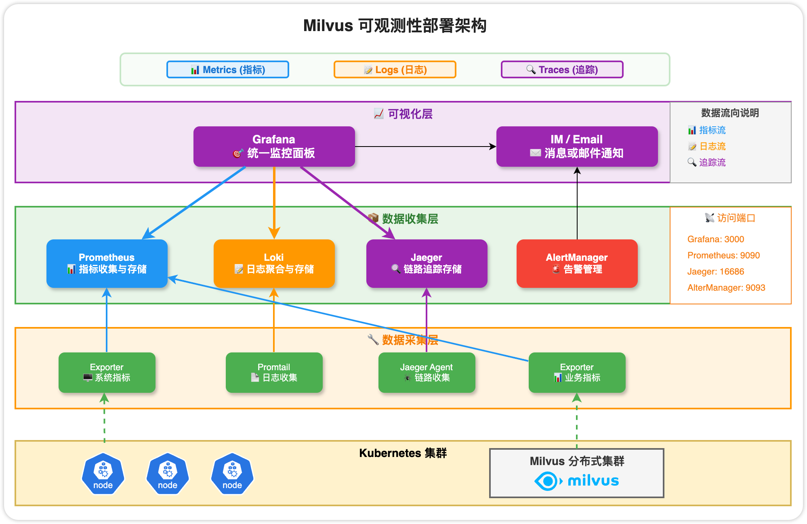

### 4.1.2. Milvus Metrics Description

**Metrics Naming Structure**

A valid Metrics name in Milvus contains three elements, connected by `_`:

```
namespace_subsystem_name
```

- **namespace**: The namespace where Milvus component resides (assume `Milvus` below)
- **subsystem**: The component role to which the metrics belongs
- **name**: Specific metrics name

**System Components (Subsystem)**

Based on the role to which the metrics belongs, subsystem includes the following eight types:

| Component | Function |
|------|------|
| `proxy`      | Proxy node - request entry and load balancing |
| `rootcoord`  | Root coordinator - cluster topology management      |
| `querycoord` | Query coordinator - query node management    |
| `querynode`  | Query node - execute search and query    |
| `datacoord`  | Data coordinator - data write management    |
| `datanode`   | Data node - data write and persistence  |
| `indexcoord` | Index coordinator - index build management    |
| `indexnode`  | Index node - execute index build      |

**Metrics Naming Examples**

```bash
# Proxy node search vector count
milvus_proxy_search_vectors_count

# Query node search request latency
milvus_querynode_sq_req_latency

# Query coordinator cumulative load request count
milvus_querycoord_load_req_count
```

For more complete Metrics, refer to the official website: [Milvus Metrics Dashboard](https://milvus.io/docs/zh/metrics_dashboard.md)

**Metrics Types**

Prometheus supports four Metrics types:

| Type | Features | Usage | Example |
|------|------|------|------|
| **Counter** | Cumulative type, can only increase or reset to 0 | Counter, such as cumulative queried vector count | `milvus_proxy_search_vectors_count` |
| **Gauge** | Instantaneous value that can increase or decrease | Current state, such as scheduler estimated CPU usage per query node | `milvus_querynode_estimate_cpu_usage` |
| **Histogram** | Distribution statistics based on configurable buckets | Search and query request latency | `milvus_proxy_sq_latency` |
| **Summary** | Quantiles within a sliding time window | Quick access to quantiles | `-` |

**Common Metrics Labels**

Prometheus uses labels to distinguish different instances of metrics with the same name:

| Label Name | Meaning | Possible Values |
|--------|------|-------|
| `node_id` | Node unique identifier | Globally unique ID generated by Milvus |
| `status` | Status of processed operations or requests | `abandon`, `success`, `fail` |
| `query_type` | Query type | `search`, `query` |
| `msg_type` | Message type | `insert`, `delete`, `search`, `query` |
| `segment_state` | Segment state | `Sealed`, `Growing`, `Flushed`, `Flushing`, `Dropped`, `Importing` |
| `cache_state` | Cache state | `hit`, `miss` |
| `cache_name` | Cache object name, used with `cache_state` | `CollectionID`, `Schema` etc. |
| `channel_name` | Topic in message store (Pulsar or Kafka) | `by-dev-rootcoord-dml_0` etc. |
| `function_name` | Function name that processes specific requests | `CreateCollection`, `CreatePartition`, `CreateIndex` etc. |
| `user_name` | Username | Username for authentication |
| `index_task_status` | Index task status in meta store | `unissued`, `in-progress`, `failed`, `finished`, `recycled` |

### 4.1.3. Observability Component Deployment Practice

**Check Existing Environment**

First confirm if Milvus instance is running:

```bash
docker ps | grep milvus
```

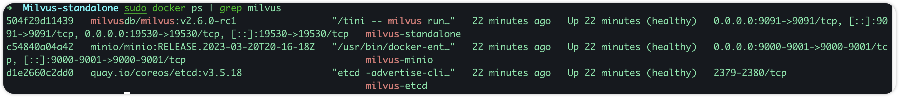

If not running, please refer to [**1.2 Milvus Installation Practice**](../ch1/ch1_2.ipynb) to start Milvus using Docker Compose method.

Next, we will add complete observability facilities to this Milvus Standalone instance.

**1. Expose Milvus Network Environment**

First, configure Docker shared network (monitoring-network):
```
sudo docker network create monitoring-network
```

Modify the previous Milvus Docker Compose configuration file (# Network Configuration):

```yaml
version: '3.5'

services:
  etcd:
    container_name: milvus-etcd
    image: quay.io/coreos/etcd:v3.5.18
    environment:
      - ETCD_AUTO_COMPACTION_MODE=revision
      - ETCD_AUTO_COMPACTION_RETENTION=1000
      - ETCD_QUOTA_BACKEND_BYTES=4294967296
      - ETCD_SNAPSHOT_COUNT=50000
    volumes:
      - ${DOCKER_VOLUME_DIRECTORY:-.}/volumes/etcd:/etcd
    command: etcd -advertise-client-urls=http://etcd:2379 -listen-client-urls http://0.0.0.0:2379 --data-dir /etcd
    healthcheck:
      test: ["CMD", "etcdctl", "endpoint", "health"]
      interval: 30s
      timeout: 20s
      retries: 3
    # Network configuration
    networks:
      - monitoring-network

  minio:
    container_name: milvus-minio
    image: minio/minio:RELEASE.2023-03-20T20-16-18Z
    environment:
      MINIO_ACCESS_KEY: minioadmin
      MINIO_SECRET_KEY: minioadmin
    ports:
      - "9001:9001"
      - "9000:9000"
    volumes:
      - ${DOCKER_VOLUME_DIRECTORY:-.}/volumes/minio:/minio_data
    command: minio server /minio_data --console-address ":9001"
    healthcheck:
      test: ["CMD", "curl", "-f", "http://localhost:9000/minio/health/live"]
      interval: 30s
      timeout: 20s
      retries: 3
    # Network configuration
    networks:
      - monitoring-network

  standalone:
    container_name: milvus-standalone
    image: milvusdb/milvus:v2.6.0-rc1
    command: ["milvus", "run", "standalone"]
    security_opt:
    - seccomp:unconfined
    environment:
      ETCD_ENDPOINTS: etcd:2379
      MINIO_ADDRESS: minio:9000
      MQ_TYPE: woodpecker
    volumes:
      - ${DOCKER_VOLUME_DIRECTORY:-.}/volumes/milvus:/var/lib/milvus
    healthcheck:
      test: ["CMD", "curl", "-f", "http://localhost:9091/healthz"]
      interval: 30s
      start_period: 90s
      timeout: 20s
      retries: 3
    ports:
      - "19530:19530"
      - "9091:9091"
    depends_on:
      - "etcd"
      - "minio"
    # Network configuration
    networks:
      - monitoring-network

# Network configuration
networks:
  monitoring-network:
    name: monitoring-network
    external: true
```

Restart: `sudo docker compose up -d`

**2. Install Grafana and Prometheus**

First create an empty directory: grafana-prometheus.

Then need two yml files: docker-compose.yml and prometheus.yml

**docker-compose.yml**

There are three components here:
- prometheus
- grafana
- node-exporter

```yaml
version: '3.8'

services:
  prometheus:
    image: prom/prometheus:latest
    container_name: prometheus
    volumes:
      - ./prometheus.yml:/etc/prometheus/prometheus.yml
      - prometheus_data:/prometheus
    ports:
      - "9090:9090"
    restart: unless-stopped
    networks:
      - monitoring-network

  grafana:
    image: grafana/grafana:latest
    container_name: grafana
    ports:
      - "3000:3000"
    volumes:
      - grafana_data:/var/lib/grafana
    environment:
      - GF_SECURITY_ADMIN_USER=admin
      - GF_SECURITY_ADMIN_PASSWORD=admin
    restart: unless-stopped
    networks:
      - monitoring-network

  node-exporter:
    image: prom/node-exporter:latest
    container_name: node-exporter
    ports:
      - "9100:9100"
    volumes:
      - /proc:/host/proc:ro
      - /sys:/host/sys:ro
      - /:/rootfs:ro
    command:
      - '--path.procfs=/host/proc'
      - '--path.sysfs=/host/sys'
      - '--path.rootfs=/rootfs'
    restart: unless-stopped
    networks:
      - monitoring-network

volumes:
  prometheus_data:
  grafana_data:

networks:
  monitoring-network:
    name: monitoring-network
    external: true
```

**prometheus.yml**

Prometheus scrape metrics configuration (the third one scrapes data exposed by Milvus)
- prometheus
- node-exporter
- milvus

```yaml
global:
  scrape_interval: 15s

scrape_configs:
  - job_name: 'prometheus'
    static_configs:
      - targets: ['localhost:9090']
  - job_name: 'node-exporter'
    metrics_path: /metrics
    static_configs:
      - targets: ['node-exporter:9100']
  - job_name: 'milvus'
    metrics_path: /metrics
    static_configs:
      - targets: ['milvus-standalone:9091']
```

Start: `sudo docker compose up -d`

After configuration, open the Prometheus URL targets directory, and you can see three data sources
`http://localhost:9090/targets?search=`

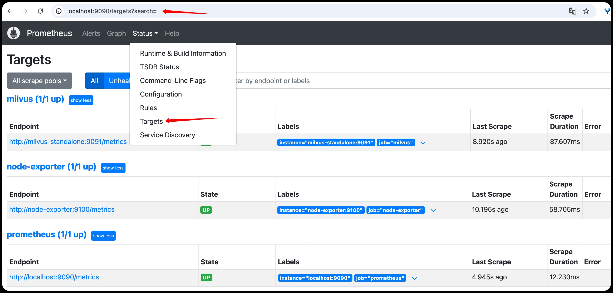

Then enter the homepage `http://localhost:9090/`, and you can search for milvus-related Metrics

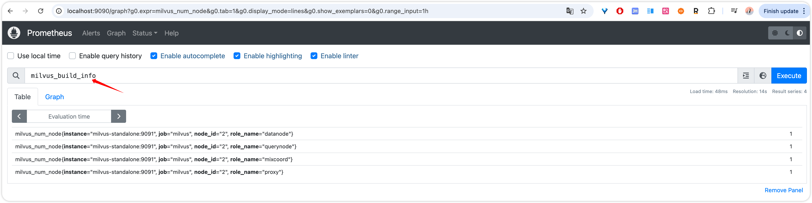

**3. Visualize Metrics in Grafana**

Open Grafana: `http://localhost:3000/connections/datasources`

First configure Data sources, import Prometheus data into Grafana, here connection

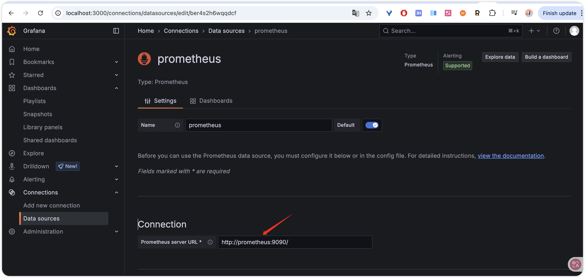


Download the milvus-dashboard.json provided by the official website locally, note the url path, which indicates the dashboard for standalone mode of v2.6.x. If it's another mode, you can adjust accordingly

```bash
curl -O https://raw.githubusercontent.com/milvus-io/web-content/refs/heads/master/v2.6.x/assets/standalone-monitoring/grafana/dashboards/milvus-standalone-dashboard.json
```

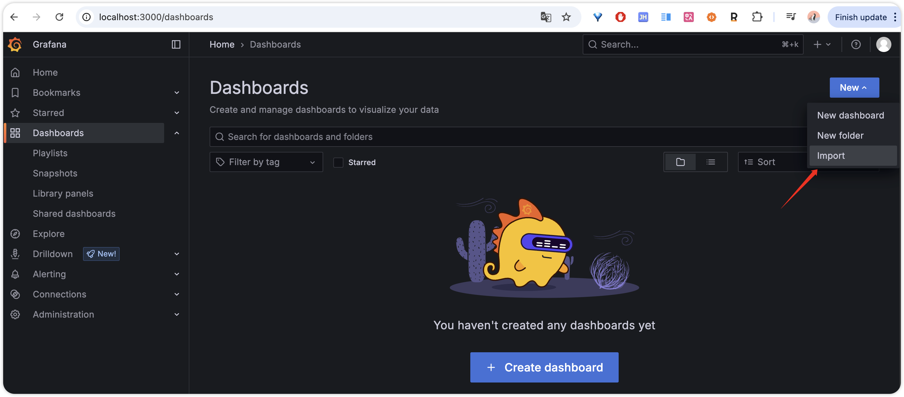

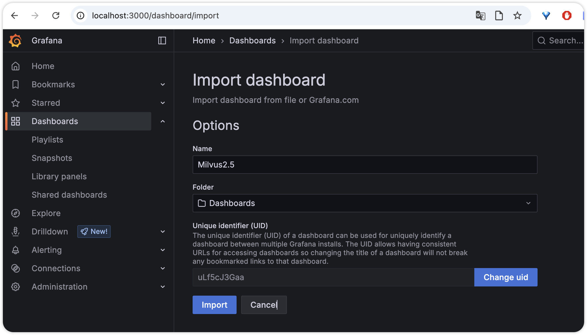

Import the downloaded json file, and you can see it. If there are some metrics data, you can first import a batch of test data through attu, execute a few times, and you can see the data.

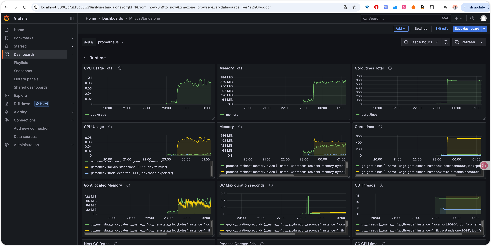

**4. Install Loki to Monitor Milvus Logs**

Modify docker-compose.yml in the previous grafana-prometheus, add the following lines under the services tag

```yaml
  loki:
    image: grafana/loki:latest
    container_name: loki
    ports:
      - "3100:3100"
    volumes:
      - loki_data:/loki
    restart: unless-stopped
    networks:
      - monitoring-network

  promtail:
    image: grafana/promtail:latest
    container_name: promtail
    user: "0:0"
    volumes:
    - ./promtail-config.yml:/etc/promtail/config.yml
    - /var/run/docker.sock:/var/run/docker.sock
    depends_on:
      - loki
    restart: unless-stopped
    networks:
      - monitoring-network

volumes:
  prometheus_data:
  grafana_data:
  loki_data:
```

**Add promtail-config.yml**

```yaml
server:
  http_listen_port: 9080
  grpc_listen_port: 0

positions:
  filename: /tmp/positions.yaml

clients:
  - url: http://loki:3100/loki/api/v1/push

scrape_configs:
- job_name: system
  static_configs:
  - targets:
      - localhost
    labels:
      job: varlogs
      __path__: /var/log/*log
- job_name: milvus
  docker_sd_configs:
    - host: unix:///var/run/docker.sock
  relabel_configs:
    - source_labels: [__meta_docker_name]
      regex: milvus-standalone
      action: keep
    - source_labels: [__meta_docker_name]
      target_label: job
      replacement: milvus
    - source_labels: [__meta_docker_name]
      target_label: container
      replacement: milvus-standalone
  pipeline_stages:
    - docker: {}
```

Restart components: `sudo docker compose up -d`

Then add Loki data source in Grafana Data source (same as Prometheus), Connection URL fill in: `http://loki:3100`

Finally create a Dashboard, select Loki as the data source, and select Logs for the display panel

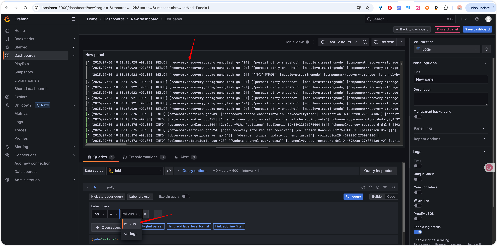

**5. Install Jaeger to Track Milvus Usage Chain**

Similarly, enter the grafana-prometheus directory, modify docker-compose.yml, add Jaeger all-in-one image under service

```yaml
  jaeger:
    image: jaegertracing/all-in-one:latest
    container_name: jaeger
    ports:
      - "16686:16686"  # Jaeger UI
      - "4317:4317"    # OTLP gRPC receiver
      - "4318:4318"    # OTLP HTTP receiver
      - "5778:5778"    # Jaeger agent configs
      - "14268:14268"  # Zipkin compatible endpoint
    environment:
      - COLLECTOR_OTLP_ENABLED=true
    restart: unless-stopped
    networks:
      - monitoring-network
```

After adding, restart the service: `sudo docker compose up -d`

Then modify Milvus configuration, return to the directory where Milvus docker compose is located.

First export the configuration file from the current Milvus-standalone:

`docker cp milvus-standalone:/milvus/configs/milvus.yaml ./milvus.yaml`

Then modify the trace part:

```yaml
trace:
  # trace exporter type, default is stdout,
  # optional values: ['noop','stdout', 'jaeger', 'otlp']
  exporter: jaeger
  # fraction of traceID based sampler,
  # optional values: [0, 1]
  # Fractions >= 1 will always sample. Fractions < 0 are treated as zero.
  sampleFraction: 1.0
  jaeger:
    url: http://jaeger:14268/api/traces # when exporter is jaeger should set the jaeger's URL
  otlp:
    endpoint:  # example: "127.0.0.1:4317" for grpc, "127.0.0.1:4318" for http
    method:  # otlp export method, acceptable values: ["grpc", "http"],  using "grpc" by default
    secure: true
  initTimeoutSeconds: 10 # segcore initialization timeout in seconds, preventing otlp grpc hangs forever
```

Then mount the modified milvus.yaml back
Add this line in volumes in docker-compose.yml, as shown
`- ./milvus.yaml:/milvus/configs/milvus.yaml`

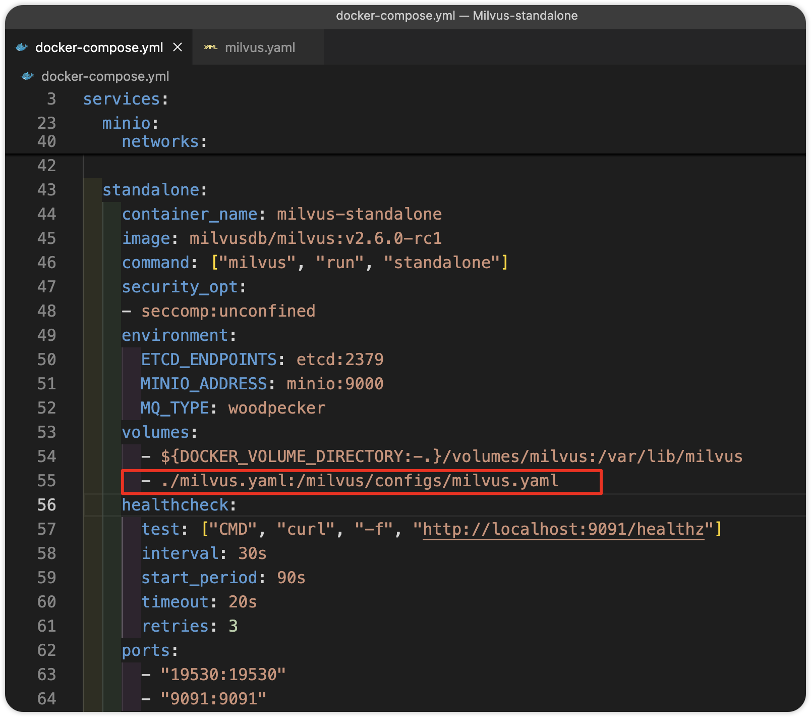

Then restart: `sudo docker compose up -d`

Finally open Jaeger (http://localhost:16686/) / Grafana (add Jaeger data source) and you can see the Trace:

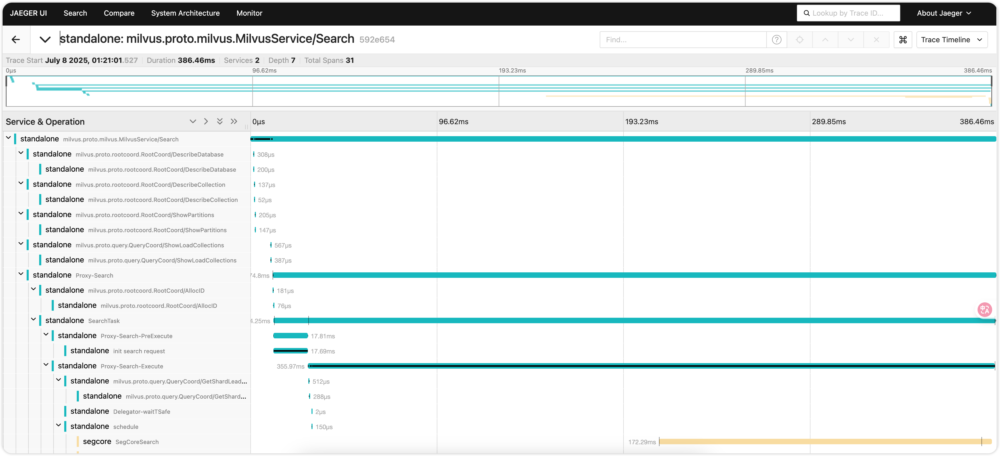

**6. Configure Alert Rules**

Since we don't do very heavy alerting, we'll use Grafana directly to configure alert rules.

The core of configuring alerts in Milvus is to configure expressions to trigger alert rules through Exporter data collected by Prometheus or Logs data collected by Loki.

The simplest is to configure an instance liveness alert, the corresponding expression is as follows:

`up{instance="milvus-standalone:9091"} == 0`

The value defaults to 1, 0 means down, so we monitor the == 0 situation

As shown, configure an alert in Grafana. We can change the above to ==1, and you can see the alert in Firing state:

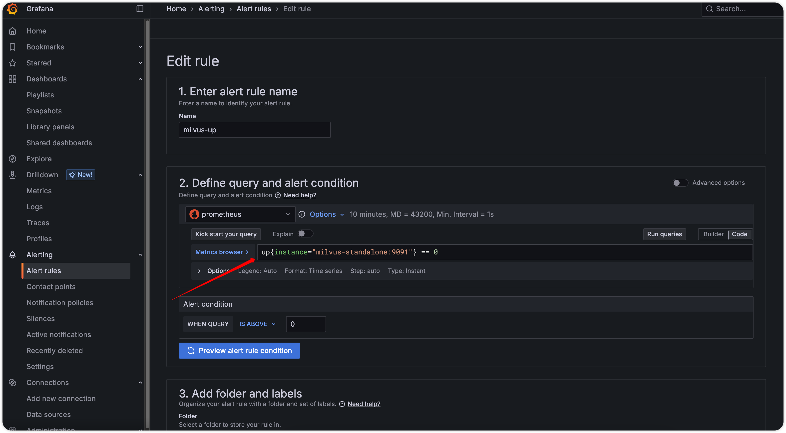


