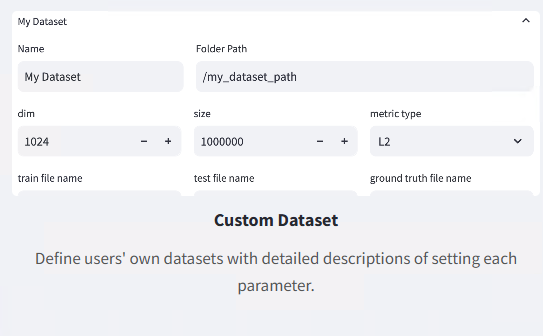
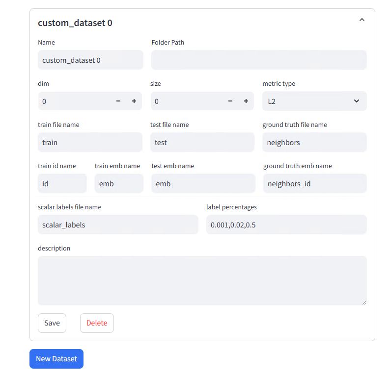
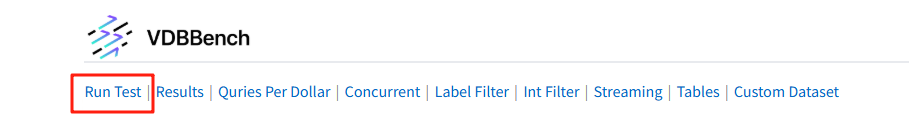
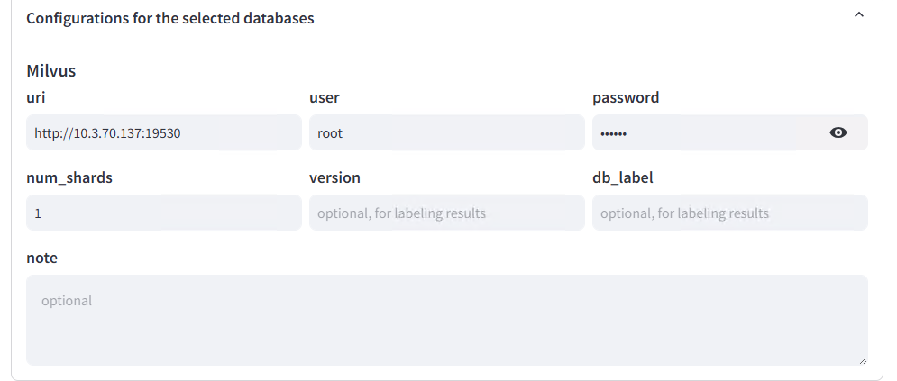
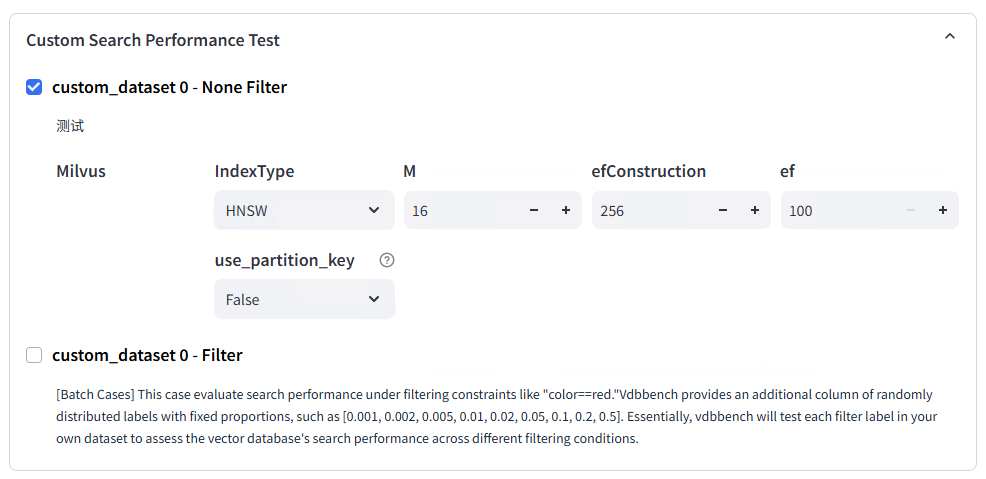
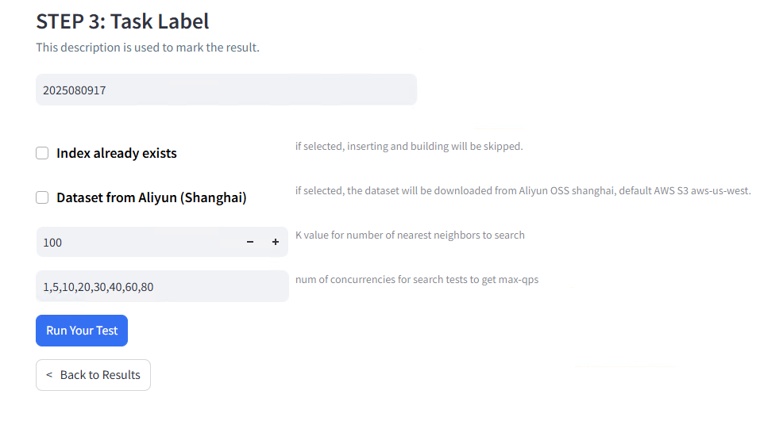

# 4.2 VectorDBBench 基准测试实战

本节将带你了解并实践 VectorDBBench 这一主流向量数据库基准测试工具的部署与使用。

## 4.2.1 VectorDBBench 简介

VectorDBBench（VDBBench）是一个面向主流向量数据库和云服务的开源基准测试工具，支持多种数据库的性能与性价比对比，提供可视化界面和丰富的测试场景，方便用户复现结果或测试新系统。

- 支持多种数据库（如 Milvus、Zilliz Cloud、Qdrant、Weaviate、PgVector、Redis、Chroma 等）
- 提供插入、搜索、过滤搜索、流式搜索等多种测试场景
- 内置多种公开数据集（如 SIFT、GIST、Cohere、OpenAI C4 等）
- 支持可视化界面，便于配置测试、查看和对比测试结果

主要特性：
1. 简单易用的 Web UI，支持测试配置和结果可视化分析
2. 标准化的测试流程和指标采集，支持多场景扩展（如过滤、流式）
3. 支持多种主流和新兴向量数据库，便于横向对比

更多介绍详见 [官方文档](https://github.com/zilliztech/VectorDBBench)

## 4.2.2 VectorDBBench 部署（多种数据库的 client）

### 环境要求
- Python >= 3.11

### 安装
仅安装 Milvus/Zilliz Cloud 客户端：
```shell
pip install vectordb-bench
```

安装所有支持的数据库客户端（如需对比多种数据库）：
```shell
pip install vectordb-bench[all]
```

安装指定数据库客户端（如 Qdrant）：
```shell
pip install vectordb-bench[qdrant]
```

支持的数据库客户端及安装命令如下：

| 数据库客户端 | 安装命令 |
|-------------|----------|
| pymilvus, zilliz_cloud | `pip install vectordb-bench` |
| all         | `pip install vectordb-bench[all]` |
| qdrant      | `pip install vectordb-bench[qdrant]` |
| pinecone    | `pip install vectordb-bench[pinecone]` |
| weaviate    | `pip install vectordb-bench[weaviate]` |
| elastic, aliyun_elasticsearch | `pip install vectordb-bench[elastic]` |
| pgvector, pgvectorscale, pgdiskann, alloydb | `pip install vectordb-bench[pgvector]` |
| redis       | `pip install vectordb-bench[redis]` |
| chromadb    | `pip install vectordb-bench[chromadb]` |
| awsopensearch | `pip install vectordb-bench[opensearch]` |
| oceanbase   | `pip install vectordb-bench[oceanbase]` |
| ...         | ... |

更多数据库支持和安装方式详见官方 README。

## 4.2.3 VectorDBBench 网页启动及功能介绍

### 启动 Web 界面

安装完成后，直接运行：
```shell
init_bench
```
或
```shell
python -m vectordb_bench
```

默认会启动本地 Web 服务（如 http://localhost:8501），打开浏览器即可访问。

### 主要功能模块
- **Run Test**：选择数据库、填写连接信息、选择测试用例，发起基准测试。支持多数据库、多用例、多数据集组合测试。
- **Result**：查看所有测试结果，支持多轮对比和筛选，支持 QPS、延迟、性价比等多维度展示。
- **Custom Dataset**：自定义数据集和测试用例，支持详细参数配置（如维度、数据量、标签分布等）。
- **Quries Per Dollar**：展示每美元可处理的查询量，便于性价比分析。
- **Tables**：以表格形式对比不同数据集下的各项指标。
- **Concurrent Performance**：展示不同并发下 QPS 与延迟的变化趋势。
- **Label Filter Performance**：展示不同标签过滤比例下的性能表现。
- **Int Filter Performance**：展示不同整数过滤比例下的性能表现。
- **Streaming Performance**：展示在持续插入压力下的检索性能。

#### 典型界面示例


## 4.2.4 使用默认数据集进行基准测试

### 测试流程说明
VDBBench 标准测试流程分为三个主要阶段：

1. **Load（插入+优化）**：单进程串行插入全部数据，记录插入耗时（insert_duration）；部分数据库还会进行索引优化，记录优化耗时（optimize_duration）。总耗时（load_duration）反映数据库从零到可查询的整体加载能力。
2. **Serial Search Test（串行检索）**：单进程串行检索，记录每次查询的召回率（recall）和延迟（latency_p99）。p99 延迟关注最慢的 1% 请求，适合高要求场景。
3. **Concurrent Search Test（并发检索）**：多进程并发检索，逐步提升并发度（如 1~80），每组运行 30 秒，记录不同并发下的 QPS 和延迟，最终取最大 QPS 作为 max-qps。

此外还支持：
- **Filter Search Test**：在检索时增加标签或整数过滤条件，考察不同过滤比例下的性能变化。
- **Streaming Search Test**：在持续插入压力下分阶段进行检索，考察数据库在流式写入场景下的检索能力。

### 实践步骤
1. 启动 Web 界面后，进入 **Run Test** 页面
2. 选择要测试的数据库系统（如 Milvus、Qdrant、PgVector 等），填写连接信息
3. 选择测试用例（如 Capacity、Performance、Filtering、Streaming 等），可多选
4. 选择默认数据集（如 SIFT、GIST、Cohere、OpenAI C4 等）
5. 填写 Task Label，点击提交，等待测试完成

### 注意事项
- 默认数据集已内置，无需手动上传
- 可根据实际需求选择不同的测试用例和数据规模
- 建议测试客户端与数据库服务部署在同一局域网，减少网络延迟影响

测试完成后，可在 **Result** 页面查看详细结果和对比分析

## 4.2.5 使用 Custom 数据集进行基准测试

### 4.2.5.1 数据准备

#### 脚本生成初始数据
```python
import pandas as pd
import numpy as np

def generate_csv(num_records: int, dim: int, filename: str):
    ids = range(num_records)
    vectors = np.random.rand(num_records, dim).round(6)  # 保留6位小数
    emb_str = [str(list(vec)) for vec in vectors]
    df = pd.DataFrame({
        'id': ids,
        'emb': emb_str
    })
    df.to_csv(filename, index=False)
    print(f"生成文件 {filename} ，共 {num_records} 条数据，向量维度 {dim}")

if __name__ == "__main__":
    num_records = 3000  # 生成数据的数量
    dim = 768           # 向量维度

    generate_csv(num_records, dim, "train.csv")
    generate_csv(num_records, dim, "test.csv")

```

#### 自己准备初始数据
数据要求：
##### **1. CSV 格式**

- 第一列为 **id**（唯一标识符）
- 第二列为 **vector**（字符串形式的浮点数组，如 `[0.1, 0.2, 0.3, ...]`）
- 其他列可选（metadata、标签）

**示例：**

```
id,emb,label
1,"[0.12,0.56,0.89,...]",A
2,"[0.33,0.48,0.90,...]",B
```

##### **2. NPY 格式**

- 一个二维数组，shape = `(num_vectors, dim)`
- 向量顺序默认从 0 开始分配 id
- 标签可单独提供一个 CSV（id,label）

**示例：**

```python
import numpy as np
vectors = np.random.rand(10000, 768).astype('float32')
np.save("vectors.npy", vectors)
```
### 4.2.5.2 使用脚本转换数据文件格式
- 安装依赖：

```
pip install numpy pandas faiss-cpu
```

- 启动命令：

```shell
python convert_to_vdb_format.py \
  --train data/train.csv \
  --test data/test.csv \
  --out datasets/custom \
  --topk 10
```

- 参数说明：

| 参数名     | 是否必填 | 类型   | 说明                                                         | 默认值 |
| ---------- | -------- | ------ | ------------------------------------------------------------ | ------ |
| `--train`  | 是       | 字符串 | 训练数据路径，支持CSV或NPY格式。CSV需包含`emb`列，若无`id`列会自动生成 | 无     |
| `--test`   | 是       | 字符串 | 查询数据路径，支持CSV或NPY格式。格式同训练数据               | 无     |
| `--out`    | 是       | 字符串 | 输出目录路径，保存转换后的parquet文件及邻居索引文件          | 无     |
| `--labels` | 否       | 字符串 | 标签CSV路径，必须包含`labels`列（格式为字符串列表），用于保存标签 | 无     |
| `--topk`   | 否       | 整数   | 计算最近邻时返回的邻居数量                                   | 10     |
- 输出目录结构

```
datasets/custom/
├── train.parquet          # 训练向量
├── test.parquet           # 查询向量
├── neighbors.parquet      # Ground Truth
└── scalar_labels.parquet  # 可选标签
```
- 脚本代码
```python
import os
import argparse
import numpy as np
import pandas as pd
import faiss
from ast import literal_eval
from typing import Optional


def load_csv(path: str):
    df = pd.read_csv(path)
    if 'emb' not in df.columns:
        raise ValueError(f"CSV 文件中缺少 'emb' 列：{path}")
    df['emb'] = df['emb'].apply(literal_eval)
    if 'id' not in df.columns:
        df.insert(0, 'id', range(len(df)))
    return df


def load_npy(path: str):
    arr = np.load(path)
    df = pd.DataFrame({
        'id': range(arr.shape[0]),
        'emb': arr.tolist()
    })
    return df


def load_vectors(path: str) -> pd.DataFrame:
    if path.endswith('.csv'):
        return load_csv(path)
    elif path.endswith('.npy'):
        return load_npy(path)
    else:
        raise ValueError(f"不支持的文件格式: {path}")


def compute_ground_truth(train_vectors: np.ndarray, test_vectors: np.ndarray, top_k: int = 10):
    dim = train_vectors.shape[1]
    index = faiss.IndexFlatL2(dim)
    index.add(train_vectors)
    _, indices = index.search(test_vectors, top_k)
    return indices


def save_ground_truth(df_path: str, indices: np.ndarray):
    df = pd.DataFrame({
        "id": np.arange(indices.shape[0]),
        "neighbors_id": indices.tolist()
    })
    df.to_parquet(df_path, index=False)
    print(f"✅ Ground truth 保存成功: {df_path}")


def main(train_path: str, test_path: str, output_dir: str,
         label_path: Optional[str] = None, top_k: int = 10):
    
    os.makedirs(output_dir, exist_ok=True)

    # 加载训练和查询数据
    print("📥 加载训练数据...")
    train_df = load_vectors(train_path)
    print("📥 加载查询数据...")
    test_df = load_vectors(test_path)

    # 向量提取并转换为 numpy
    train_vectors = np.array(train_df['emb'].to_list(), dtype='float32')
    test_vectors = np.array(test_df['emb'].to_list(), dtype='float32')

    # 保存保留所有字段的 parquet 文件
    train_df.to_parquet(os.path.join(output_dir, 'train.parquet'), index=False)
    print(f"✅ train.parquet 保存成功，共 {len(train_df)} 条记录")

    test_df.to_parquet(os.path.join(output_dir, 'test.parquet'), index=False)
    print(f"✅ test.parquet 保存成功，共 {len(test_df)} 条记录")

    # 计算 ground truth
    print("🔍 计算 Ground Truth（最近邻）...")
    gt_indices = compute_ground_truth(train_vectors, test_vectors, top_k=top_k)
    save_ground_truth(os.path.join(output_dir, 'neighbors.parquet'), gt_indices)

    # 加载并保存标签文件（如果有）
    if label_path:
        print("📥 加载标签文件...")
        label_df = pd.read_csv(label_path)
        if 'labels' not in label_df.columns:
            raise ValueError("标签文件中必须包含 'labels' 列")
        label_df['labels'] = label_df['labels'].apply(literal_eval)
        label_df.to_parquet(os.path.join(output_dir, 'scalar_labels.parquet'), index=False)
        print("✅ 标签文件已保存为 scalar_labels.parquet")


if __name__ == "__main__":
    parser = argparse.ArgumentParser(description="将CSV/NPY向量转换为VectorDBBench数据格式 (保留所有列)")
    parser.add_argument("--train", required=True, help="训练数据路径（CSV 或 NPY）")
    parser.add_argument("--test", required=True, help="查询数据路径（CSV 或 NPY）")
    parser.add_argument("--out", required=True, help="输出目录")
    parser.add_argument("--labels", help="标签CSV路径（可选）")
    parser.add_argument("--topk", type=int, default=10, help="Ground truth")

    args = parser.parse_args()
    main(args.train, args.test, args.out, args.labels, args.topk)

```
### 4.2.5.3 设置 Custom 数据并测试
- 进入 Web UI 首页，选择主页中的 **Custom Dataset**：



- 选择之后，我们可以看到 **Custom Dataset** 相关的解释以及需要填写的内容：



- 参数详解

| 字段名                      | 含义                                        | 填写建议                                                     |
| --------------------------- | ------------------------------------------- | ------------------------------------------------------------ |
| **Name**                    | 数据集名称（唯一标识）                      | 任意，例如 `my_custom_dataset`                               |
| **Folder Path**             | 数据集所在文件夹路径                        | 如 `/data/datasets/custom`                                   |
| **dim**                     | 向量维度                                    | 与数据文件一致，如 `768`                                     |
| **size**                    | 向量数量（可选）                            | 可留空，系统可自动读取                                       |
| **metric type**             | 相似度度量方式                              | 常用 `L2`（欧式距离）或 `IP`（内积）                         |
| **train file name**         | 训练集文件名（不带 `.parquet` 后缀）        | 如果是 `train.parquet`，填 `train`。多个文件用逗号分隔，例如 `train1,train2` |
| **test file name**          | 查询集文件名（不带 `.parquet` 后缀）        | 如果是 `test.parquet`，填 `test`                             |
| **ground truth file name**  | Ground Truth 文件名（不带 `.parquet` 后缀） | 如果是 `neighbors.parquet`，填 `neighbors`                   |
| **train id name**           | 训练数据 ID 列名                            | 一般是 `id`                                                  |
| **train emb name**          | 训练数据向量列名                            | 如果脚本生成的列名是 `emb`，填 `emb`                         |
| **test emb name**           | 测试数据向量列名                            | 一般与 train emb name 一致，如 `emb`                         |
| **ground truth emb name**   | Ground Truth 中的近邻列名                   | 如果列名是 `neighbors_id`，填 `neighbors_id`                 |
| **scalar labels file name** | （可选）标签文件名（不带 `.parquet` 后缀）  | 如果生成了 `scalar_labels.parquet`，填 `scalar_labels`，否则留空 |
| **label percentages**       | （可选）标签过滤比例                        | 例如 `0.001,0.02,0.5`，没有标签过滤需求留空                  |
| **description**             | 数据集说明                                  | 可写上业务背景或生成方式                                     |

点击 **Save** 保存。


### 4.2.5.3 配置测试方案并运行测试

1. 在 Web UI 中进入 **Run Test** 页面：

   

2. 勾选并填写要测试的向量数据库，本文以 milvus 为例：

   

3. 选择我们创建的 Custom 数据集：

   

4. 设置任务标签

   

5. 开始测试


## 4.2.6 结果解析
#### 主要指标说明

- QPS (Queries Per Second)：
  - 每秒处理的查询数量。QPS 是衡量系统查询处理能力的指标，越高的 QPS 表示系统能够在单位时间内处理更多的查询。
- Recall：
  - 是检索系统的准确率指标，用来衡量查询结果中返回的相关项与实际相关项的比例。Recall 越高，表示返回的查询结果中包含更多正确的匹配项。用来评估系统在近似查询时的效果。
- Load Duration：
  - 数据加载时间，表示将数据加载到数据库中所花费的总时间。这个指标衡量数据库的加载效率，通常数据量越大，加载时间越长。
- Serial Latency P99：
  - 这是 99% 的查询处理时间的上限，表示系统处理 99% 的查询所需的最长时间（99th percentile latency）。这个指标是用来衡量系统响应时间的一致性，值越低，系统的响应越稳定。P99 延迟越高意味着系统偶尔会有慢查询。

详细规则可参考 [Leaderboard 说明](https://zilliz.com/benchmark)
