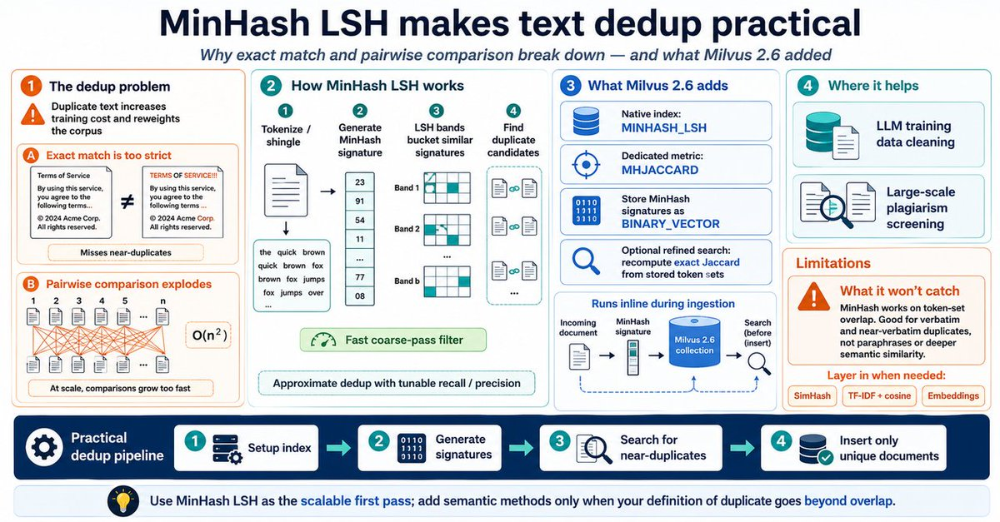

#### 1. Milvus 2.6 Capability Overview

**1.1 Cost Reduction and Efficiency Improvement**

- **RaBitQ Quantization Index**
  - Main index vectors with 1-bit quantization, reducing memory footprint to approximately 1/32 of the original.
  - Combined with SQ8 refinement, overall memory usage is approximately 28%.
  - QPS increases by approximately 4x, while recall rate remains at ~95%.

- **Sparse-BM25**
  - Compared to ElasticSearch: retrieval speed is 3–4x faster (up to 7x on some datasets).
  - Index size is approximately 1/3 of the original data size, significantly reducing memory and storage costs.

- **JSON Path & JSON Shredding Index**
  - Supports indexing specific paths in dynamic JSON fields.
  - Filter by JSON path first, then accelerate vector/scalar retrieval.
  - Filter latency reduced from average 140ms (P99 480ms) to approximately 1.5ms (P99 10ms), suitable for complex metadata filtering scenarios.

- **New Data Types**
  - `int8` vectors: Suitable for cost-effective model inference scenarios (quantized feature vector storage).
  - `Geometry`: Supports storing/retrieving spatial shapes such as POINT, LINESTRING, POLYGON, applicable for geofencing, navigation, and mapping applications.
  - `Struct Array`: Suitable for multi-level nested data modeling with rich attributes, simplifying schema design and enhancing query capabilities for metadata-rich scenarios.

- **Partial Upsert Capability**
  - Supports updating only specific fields in a record without rewriting the entire record.

**1.2 Search and Functional Enhancements**

- **Text Processing Upgrades**
  - New tokenizers: Lindera / ICU (supporting Japanese, Korean, and multilingual).
  - Jieba tokenizer supports custom dictionaries.
  - New `Run Analyzer` syntax for observable debugging of analyzer configurations.
  - Supports multilingual analyzers.

- **Exact Match Capabilities**
  - New Phrase Match (phrase matching) with `slop` parameter to control word order tolerance, suitable for legal documents, intelligent Q&A, and other high-precision scenarios.
  - New NGRAM Index:
    - Accelerates `LIKE` queries on `VARCHAR` fields.
    - Can also accelerate `LIKE` queries on specific JSON paths within `JSON` fields.

- **Dynamic Sorting (Reranking)**
  - Introduced Decay Function for time-based reranking:
    - Supports three decay functions: exponential, linear, and Gaussian.
    - Used to improve result timeliness (more recent = higher score).
  - Introduced boost reranker:
    - Supports matching candidate results with filter conditions and weighted scoring for fusion ranking.

- **Simplified Model Integration**
  - Built-in integration with OpenAI, Hugging Face, and other third-party models.
  - Automatically vectorizes text during insertion/query without requiring the business side to generate vectors separately.

- **Online Scalar Field Addition**
  - Supports adding fields to a Collection without downtime.
  - No need to rebuild schema/Collection, directly add fields to existing Collections.

- **MinHash Capability**
  - Accelerates large-scale document near-duplicate detection and similar content identification through MinHash.

**1.3 Architecture and Storage Optimization**

- **Tiered Storage (Hot/Cold Separation)**
  - Hot data stored on SSD, cold data moved to object storage.
  - Supports lazy loading and partial loading.
  - Overall resource usage reduced by nearly half, with significantly improved collection loading speed.

- **Real-time Stream Processing (Streaming Service)**
  - New `Streaming Node`:
    - Interfaces with Kafka / Pulsar and other MQ systems.
    - Responsible for real-time data ingestion, instant indexing, and querying.
    - Higher write throughput and faster fault recovery compared to traditional MQ solutions.

- **Other Architecture Enhancements**
  - Supports 100k+ Collections, suitable for massive multi-tenancy and business isolation.
  - Upgraded cloud-native logging system Woodpecker (Zero-disk WAL), reducing disk dependencies.
  - Storage v2: Optimized IOPS and memory usage.
  - Coord Merge: Improved cluster stability.

---

#### 2. Architecture Component Changes: 2.5 → 2.6

**2.1 2.5 Architecture Issues (Stream-Batch Coupling)**

- Stream and batch processing coupled in Worker Nodes:
  - `QueryNode`: Handles both incremental data retrieval and historical data queries.
  - `DataNode`: Handles both incremental data flushing to disk and historical data compaction.
- Problems:
  - Batch processing capabilities cannot be centrally pooled.
  - Stream processing state scattered across different roles, with delays in state alignment.

**2.2 2.6 Architecture Optimization (Stream-Batch Separation + Role Consolidation)**

- **Stream-Batch Separation**
  - New `StreamingNode`:
    - Dedicated to stream data consumption, writing, and processing.
    - Replaces 2.5 responsibilities including:
      - DataNode consuming data and persisting to object storage.
      - QueryNode incremental data retrieval.
      - Proxy writing data to message streams.
  - `DataNode` and `QueryNode` in 2.6 focus more on batch data processing (historical data).

- **Role Consolidation**
  - Multiple Coordinators:
    - `RootCoord` / `QueryCoord` / `DataCoord`
    - Merged into a single `MixCoord` component.
  - `IndexNode` and (old) `DataNode` capabilities merged into a unified `DataNode` component.

Summary of changes:

- Stream-batch separation with consolidated scattered roles.
- New `Streaming Node`.
- `MixCoord` replaces various Coordinators.
- `IndexNode` functionality merged into new `DataNode`, eventually deprecating standalone Index Node.

---

#### 3. Correct Upgrade Sequence: 2.5 → 2.6 (Cluster)

To maintain system availability as much as possible, strictly follow this rolling upgrade order:

1. **Pre-start Streaming Node**
   - Point the new Delegator (component in QueryNode responsible for stream data) to 2.6 Streaming Node.

2. **Upgrade MixCoord**
   - 2.6 MixCoord needs to be compatible with both old and new Worker Node versions, handling cross-version incompatibilities.

3. **Upgrade Query Node**
   - QueryNode upgrade is slower.
   - Keep 2.5 DataNode / IndexNode to handle Flush / Index tasks, reducing query pressure.

4. **Upgrade Data Node**
   - Note: When 2.5 DataNode goes offline, Flush will temporarily be unavailable.
   - Growing segments count will continue to increase until all DataNodes are upgraded to 2.6.

5. **Upgrade Proxy**
   - Note: Write operations on new 2.6 Proxy will be unavailable until all nodes are upgraded.

6. **Decommission Index Node**
   - Post-2.6, indexing capabilities are handled by DataNode.

**Overall Sequence:**

> Start Streaming Node
> → Upgrade MixCoord
> → Upgrade Query Node
> → Upgrade Data Node
> → Upgrade Proxy
> → Decommission Index Node

**Important Limitations:**

- From DataNode upgrade completion → All Proxies upgraded:
  - **Flush operations unavailable**.
- From first Proxy upgraded to 2.6 until all Proxies upgraded:
  - **Some write operations unavailable**.
- If upgrading directly from 2.5.x to **2.6.6**:
  - Due to DDL framework changes, **DDL operations unavailable during upgrade**.

---

#### 4. Upgrade Control Using Milvus-Operator (Cluster Mode)

**4.1 Milvus-Operator Overview**

- Repository: `github.com/zilliztech/milvus-operator`
- Purpose:
  - Deploy and manage Milvus service stack in Kubernetes in a scalable, highly available manner.
  - Manage Milvus components and dependencies (etcd, Pulsar, MinIO, etc.).
- Implementation:
  - Define `Milvus` CRD.
  - Use Operator pattern to continuously compare and align actual state with desired state.

**4.2 Milvus CR Example (Core Fields)**

```yaml
apiVersion: milvus.io/v1beta1
kind: Milvus
metadata:
  name: my-milvus-mansion
  namespace: dev
spec:
  mode: cluster    # cluster or standalone
  components:
    image: milvusdb/milvus:v2.6.5
    imageUpdateMode: rollingUpgrade
    proxy:
      replicas: 1
    mixCoord:
      replicas: 1
    dataNode:
      replicas: 1
    queryNode:
      replicas: 2
      resources:
        requests:
          cpu: "2"
          memory: "8Gi"
  dependencies:
    etcd:
      inCluster:
        values:
          replicaCount: 3
    storage:
      type: MinIO
      inCluster:
        values:
          mode: distributed
    msgStreamType: pulsar
    pulsar:
      inCluster:
        values:
          bookkeeper:
            replicas: 3
  config:
    dataCoord:
      enableActiveStandby: true
```

**4.3 Operator Adaptation Logic for 2.5 → 2.6 Rolling Upgrade**

- Version identification:
  - Determine if version is 2.6 through `spec.components.image` tag.
  - Or explicitly specify version through `spec.components.version`.
- Upgrade scenario identification:
  - Compare `status.currentImage` / `status.currentVersion`
  - With `spec.components.image` / `spec.components.version`,
  - Determine if in special 2.5 → 2.6 upgrade scenario.
- In rolling upgrade mode (`spec.components.imageUpdateMode: rollingUpgrade`, default):
  - Automatically execute in the following order:
    - Start `Streaming Node`
    - Upgrade `MixCoord`
    - Upgrade `Query Node`
    - Upgrade `Data Node`
    - Upgrade `Proxy`
    - Decommission `Index Node`
- Coords consolidation handling:
  - If `spec.components.mixCoord` is configured:
    - After MixCoord starts, Operator automatically decommissions other Coordinators (Root/Query/DataCoordinators).

**4.4 Specific Upgrade Steps Using Operator**

a. **Upgrade Milvus-Operator itself** (e.g., upgrade to v1.3.3)

```bash
# Option 1: Using Helm
helm upgrade --install milvus-operator \
  -n milvus-operator --create-namespace \
  https://github.com/zilliztech/milvus-operator/releases/download/v1.3.3/milvus-operator-1.3.3.tgz

# Option 2: Using kubectl + native manifests
kubectl apply -f https://raw.githubusercontent.com/zilliztech/milvus-operator/v1.3.3/deploy/manifests/deployment.yaml
```

b. **Merge Coords into MixCoord** (skip if already using MixCoord deployment)

```bash
kubectl patch milvus my-release -n demo-operator \
  --type=merge -p '{
    "spec": {
      "components": {
        "mixCoord": {
          "replicas": 1
        }
      }
    }
  }'
```

c. **First upgrade to 2.5.16+ (e.g., 2.5.22) to ensure upgrade prerequisites**

```bash
kubectl patch milvus my-release -n demo-operator \
  --type=merge -p '{
    "spec": {
      "components": {
        "image": "milvusdb/milvus:v2.5.22"
      }
    }
  }'

# Wait for upgrade completion
kubectl wait milvus my-release -n demo-operator \
  --for=condition=milvusupdated --timeout=1h
```

d. **Then upgrade to 2.6 (e.g., 2.6.5)**

```bash
kubectl patch milvus my-release -n demo-operator \
  --type=merge -p '{
    "spec": {
      "components": {
        "image": "milvusdb/milvus:v2.6.5"
      }
    }
  }'

# Wait for upgrade completion
kubectl wait milvus my-release -n demo-operator \
  --for=condition=milvusupdated --timeout=1h
```

---

#### 5. Upgrade Control Using Helm (Cluster Mode)

> Note: In Helm, each Deployment updates concurrently by default without strict order control; Milvus-Operator is recommended for production environments.

**Prerequisites**

- Helm ≥ 3.14.0
- Kubernetes ≥ 1.20.0

**Step 1: Upgrade Helm Chart to latest version (example: 5.0.7)**

```bash
helm repo add zilliztech https://zilliztech.github.io/milvus-helm
helm repo update
```

**Step 2: In multi-Coords scenario, first upgrade to 2.5.16+ and enable mixCoordinator**

```bash
helm upgrade -i my-release zilliztech/milvus \
  --namespace=helm-demo \
  --set image.all.tag="v2.5.22" \
  --set mixCoordinator.enabled=true \
  --set rootCoordinator.enabled=false \
  --set indexCoordinator.enabled=false \
  --set queryCoordinator.enabled=false \
  --set dataCoordinator.enabled=false \
  --set streaming.enabled=false \
  --set indexNode.enabled=true \
  --reset-then-reuse-values \
  --version=5.0.7 \
  --wait --timeout 1h
```

**Step 3: Upgrade to 2.6 (enable Streaming, disable IndexNode)**

```bash
helm upgrade my-release zilliztech/milvus \
  --namespace=helm-demo \
  --set image.all.tag="v2.6.5" \
  --set streaming.enabled=true \
  --set indexNode.enabled=false \
  --reset-then-reuse-values \
  --version=5.0.7 \
  --wait --timeout 1h
```

---

#### 6. Common Issues Highlights

- **Helm vs Milvus-Operator**
  - Production environments should prioritize Milvus-Operator (has order control, automatic upgrade scenario recognition, etc.).
  - See Milvus-Operator repository Readme for comparison details.

- **Message Queue Selection**
  - standalone:
    - Cost-sensitive scenarios can use `RocksMQ`.
  - cluster:
    - `Pulsar`: Supports multi-tenancy, large-scale instance sharing, good scalability.
    - `Kafka`: Mature deployment and maintenance, major cloud providers offer managed services.
  - **2.6 new Woodpecker:**
    - Zero external MQ dependency, low cost, simple maintenance.
    - Currently supports embedded mode, lightweight.
    - Recommendation:
      - 2.6 standalone: Prioritize Woodpecker.
      - 2.6 cluster production: Recommend waiting for Woodpecker cluster mode release.

- **Can MQ be switched during upgrade?**
  - Currently not supported during upgrade.
  - Planning to support smooth switching between Pulsar / Kafka / Woodpecker / RocksMQ through management API.

- **Do 2.6 rate limiting configurations need adjustment?**
  - No.
  - Existing rate limiting configurations will automatically apply to StreamingNode.

- **Monitoring and configuration changes after MixCoord consolidation?**
  - Monitoring role names still use original: `rootcoord`, `querycoord`, `datacoord`.
  - Configuration items unchanged, but new additions:
    - `mixCoord.enableActiveStandby`
    - If not configured, falls back to `rootcoord.enableActiveStandby`.

- **Recommended resource specs for Streaming Node?**
  - Small real-time writes or lightweight "write-while-query" scenarios: approximately `2C 8G`.
  - High throughput real-time write/query: can reference QueryNode equivalent configuration.

- **Docker Compose standalone upgrade**
  - Simply modify Milvus image tag in `docker-compose.yaml` to complete version upgrade.
  - Refer to official standalone Docker upgrade documentation for details.

---

#### 7. Official Upgrade Documentation Reference

- Cluster + Operator: `upgrade_milvus_cluster-operator.md`
- standalone + Operator: `upgrade_milvus_standalone-operator.md`
- Cluster + Helm: `upgrade_milvus_cluster-helm.md`
- standalone + Helm: `upgrade_milvus_standalone-helm.md`
- https://milvus.io/blog/how-to-safely-upgrade-from-milvu-2-5-x-to-milvus-2-6-x.md

### MinHash LSH

Duplicate text in your LLM pre-training corpus drives up training cost and reweights parts of the training data. 𝗠𝗶𝗻𝗛𝗮𝘀𝗵 𝗟𝗦𝗛 𝗺𝗮𝗸𝗲𝘀 𝘀𝗰𝗮𝗹𝗮𝗯𝗹𝗲 𝗱𝗲𝗱𝘂𝗽 𝗽𝗿𝗮𝗰𝘁𝗶𝗰𝗮𝗹, 𝗮𝗻𝗱 𝗠𝗶𝗹𝘃𝘂𝘀 𝟮.𝟲 𝗮𝗱𝗱𝗲𝗱 𝗶𝘁 𝗮𝘀 𝗮 𝗻𝗮𝘁𝗶𝘃𝗲 𝗶𝗻𝗱𝗲𝘅 𝘁𝘆𝗽𝗲.

The usual dedup options break down quickly:
- 𝗘𝘅𝗮𝗰𝘁 𝗺𝗮𝘁𝗰𝗵𝗶𝗻𝗴 is too strict for text dedup. Near-identical documents often differ by boilerplate, formatting, punctuation, or minor edits, and exact comparison misses all of them.
- 𝗣𝗮𝗶𝗿𝘄𝗶𝘀𝗲 𝗰𝗼𝗺𝗽𝗮𝗿𝗶𝘀𝗼𝗻 catches more, but the computation explodes with data volume. At millions of documents, it's infeasible.

𝗠𝗶𝗻𝗛𝗮𝘀𝗵 𝗟𝗦𝗛 works well as a coarse-pass filter. It's approximate deduplication with a tunable recall/precision tradeoff, fast enough to run inline during ingestion to check candidates before storing redundant content.

𝗠𝗶𝗹𝘃𝘂𝘀 𝟮.𝟲 𝗮𝗱𝗱𝗲𝗱 𝗻𝗮𝘁𝗶𝘃𝗲 𝗠𝗶𝗻𝗛𝗮𝘀𝗵 𝗟𝗦𝗛 𝗶𝗻𝗱𝗲𝘅𝗶𝗻𝗴 𝘄𝗶𝘁𝗵 𝗮 𝗱𝗲𝗱𝗶𝗰𝗮𝘁𝗲𝗱 𝗺𝗲𝘁𝗿𝗶𝗰 𝘁𝘆𝗽𝗲, 𝗹𝗲𝘁𝘁𝗶𝗻𝗴 𝘁𝗲𝗮𝗺𝘀 𝗶𝗻𝗱𝗲𝘅 𝗮𝗻𝗱 𝘀𝗲𝗮𝗿𝗰𝗵 𝗠𝗶𝗻𝗛𝗮𝘀𝗵 𝘀𝗶𝗴𝗻𝗮𝘁𝘂𝗿𝗲𝘀 𝗳𝗼𝗿 𝗱𝘂𝗽𝗹𝗶𝗰𝗮𝘁𝗲 𝗮𝗻𝗱 𝗻𝗲𝗮𝗿-𝗱𝘂𝗽𝗹𝗶𝗰𝗮𝘁𝗲 𝗱𝗲𝘁𝗲𝗰𝘁𝗶𝗼𝗻 𝗮𝘁 𝗰𝗼𝗹𝗹𝗲𝗰𝘁𝗶𝗼𝗻 𝘀𝗰𝗮𝗹𝗲.

𝗪𝗵𝗲𝗿𝗲 𝘁𝗵𝗶𝘀 𝗵𝗲𝗹𝗽𝘀:
- 𝗟𝗟𝗠 𝘁𝗿𝗮𝗶𝗻𝗶𝗻𝗴 𝗱𝗮𝘁𝗮 𝗰𝗹𝗲𝗮𝗻𝗶𝗻𝗴: removing duplicate text from crawled corpora before training begins
- 𝗟𝗮𝗿𝗴𝗲-𝘀𝗰𝗮𝗹𝗲 𝗽𝗹𝗮𝗴𝗶𝗮𝗿𝗶𝘀𝗺 𝘀𝗰𝗿𝗲𝗲𝗻𝗶𝗻𝗴: detecting substantial text overlap in academic or content pipelines as a coarse-pass filter

𝗟𝗶𝗺𝗶𝘁𝗮𝘁𝗶𝗼𝗻: MinHash operates on token-set overlap, not word order or semantics. It catches verbatim and near-verbatim duplication but won't flag paraphrases. For semantic or paraphrase-level deduplication, teams layer in SimHash, TF-IDF with cosine similarity, or embedding-based methods.

In Milvus, MinHash signatures are stored as 𝗯𝗶𝗻𝗮𝗿𝘆 𝘃𝗲𝗰𝘁𝗼𝗿𝘀 approximating 𝗝𝗮𝗰𝗰𝗮𝗿𝗱 𝘀𝗶𝗺𝗶𝗹𝗮𝗿𝗶𝘁𝘆 between document token sets. Standard metrics like Jaccard, L2, or cosine can't be applied directly to these signatures, so Milvus introduced a dedicated metric called 𝗠𝗛𝗝𝗔𝗖𝗖𝗔𝗥𝗗. For higher accuracy, Milvus also supports a refined search mode that recomputes exact Jaccard using stored token sets, reducing false positives.

The dedup pipeline:
- 𝗦𝗲𝘁𝘂𝗽: Create a collection with a 𝗠𝗜𝗡𝗛𝗔𝗦𝗛_𝗟𝗦𝗛 index, using the MHJACCARD metric and configurable LSH parameters (e.g., band count)
- 𝗦𝗶𝗴𝗻𝗮𝘁𝘂𝗿𝗲 𝗴𝗲𝗻𝗲𝗿𝗮𝘁𝗶𝗼𝗻: For each incoming document, tokenize or shingle it and generate a MinHash signature (e.g., using datasketch)
- 𝗗𝘂𝗽𝗹𝗶𝗰𝗮𝘁𝗲 𝗰𝗵𝗲𝗰𝗸: Search the collection with the new signature to find existing near-duplicates
- 𝗜𝗻𝘀𝗲𝗿𝘁: Store only documents that don't exceed your similarity threshold, alongside metadata




```

```


```

```


